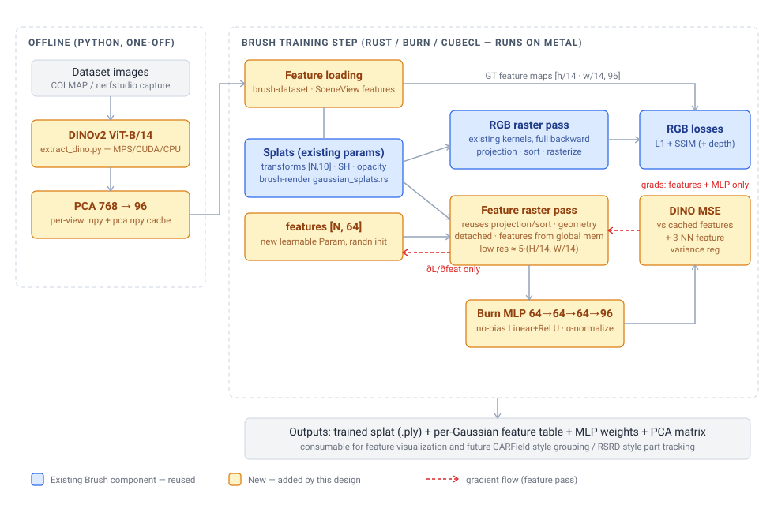

# DIG in Brush -- porting DINO-embedded Gaussians to Rust/Burn/Metal

**Status:** Proposed
**Last updated:** 2026-07-01 (file:line citations verified against `main` @ `6b190ca7` and `kerrj/dig` @ HEAD)
**Goal:** Reimplement the DiG model (the DINO-feature Gaussian splat from *Robot See Robot Do*, CoRL 2024) natively in Brush, so feature-embedded splats can be trained on macOS/Metal without the CUDA-only nerfstudio/gsplat/tiny-cuda-nn/cuML stack.

> **TL;DR** — DiG is Splatfacto plus a learnable 64-dim feature vector per Gaussian, rasterized as "colors" and supervised with MSE against cached DINOv2 feature maps through a small shared MLP. Critically, the reference implementation **detaches all geometry in the feature pass**, so feature-rasterization gradients flow only to the feature table and the MLP. That lets us add one focused custom op to Brush (a feature rasterizer that reuses the existing projection/sort pipeline) instead of touching the existing hand-written backward. Everything CUDA-specific in the reference has a straightforward Metal-compatible replacement.

## 1. Scope and the key decision

### Where this sits in the R2R2R Mac migration

The Real2Render2Real pipeline has two CUDA-bound stages, and this doc covers only the first:

1. **Feature/segmentation training (this doc):** GARField + DiG on nerfstudio/gsplat/tiny-cuda-nn/cuML. The companion mesh-pipeline plan (`docs/mesh-pipeline-mac/mesh-pipeline-mac-plan.md`, sibling branch `connorsoohoo/mesh-pipeline-design-doc`) flags this stage as its "segmentation stage still CUDA" open risk — this port is that answer.
2. **3DGS-to-mesh (SuGaR + Inria rasterizer + nvdiffrast):** covered by the mesh-pipeline plan (brush depth sweep → Open3D TSDF → xatlas → projection bake).

The licensing pressure differs between the stages: the mesh stack is non-commercially licensed (Inria/NVIDIA), whereas **DiG and GARField are MIT** and DINOv2 is Apache-2.0 — so for this stage the forcing function is purely the **CUDA-only dependency stack** (gsplat kernels, tiny-cuda-nn, cuML), not licensing. This port reimplements the method in Apache-2.0 Brush regardless, so nothing non-permissive is inherited. Both docs assume the same trainer: Brush is the Metal-native gsplat-equivalent, and the depth-supervision work this fork already carries serves both stages (fusable depth for TSDF meshing; consistent geometry for feature supervision).

### In scope

| Piece | Reference (NVIDIA-only) | Brush replacement |
|---|---|---|
| Per-Gaussian 64-d feature table | `torch.nn.Parameter`, `dig.py:46` | New `Param<Tensor<2>>` owned by the trainer (kept off `Splats` so viewer/FFI/export surfaces stay untouched) |
| Feature rasterization (fwd + bwd) | gsplat `rasterization()` with 64-d colors, `dig.py:260-278` | New CubeCL kernel pair + Burn custom op |
| Shared MLP decoder 64→64→64→96 | `torch.nn.Sequential`, `dig.py:53-61` | Burn `nn::Linear` modules (no bias) |
| DINO MSE loss + α-normalization | `dig.py:281-298` | Plain Burn tensor ops in the train step |
| 3-NN feature-variance regularizer | cuML `NearestNeighbors`, `dig.py:299-307` | CPU grid-hash kNN (no new deps), recomputed on refine |
| GT DINOv2 feature extraction | `dino_dataloader.py` (CUDA) | Offline Python script (`torch` MPS/CUDA/CPU), same cache format |
| Feature-aware densify/prune | gsplat `DefaultStrategy` (generic over params) | Extend Brush's `refine_splats` |
| Export | nerfstudio checkpoint | `.ply` + sidecar feature table + MLP weights |

### Out of scope (future work)

- **GARField** (the scale-conditioned affinity field): a NeRF — nerfacto + tiny-cuda-nn hashgrids. Not portable as-is; the Brush-native path is to attach a second per-Gaussian affinity latent and reuse this design's feature rasterizer. This port is the prerequisite.
- **Interactive segmentation viewer** (click-to-group, scale slider, HDBSCAN clustering): depends on GARField affinities.
- **Camera pose optimization** (`SO3xR3` in DiG) and **RSRD part tracking** (differentiable pose through the feature rasterizer).
- A debug "PCA feature → RGB" view mode in the Brush app is cheap and useful, but optional; listed as a stretch in Phase 4.

### The key decision: how to rasterize 64 channels

Brush's rasterizer stages splats through workgroup shared memory at `TILE_SIZE × PROJECTED_LANES` floats (`crates/brush-render/src/kernels/rasterize.rs:52`, `helpers.rs:51` — 10 lanes today). 64 extra lanes would blow the 32 KiB Metal threadgroup budget. Options:

| Option | How | Verdict |
|---|---|---|
| **A. Chunked multi-pass** | Render features 8 at a time as degree-0 SH "colors" through the existing pipeline (8 passes) | Reuses everything, but re-runs projection+sort per pass, and the rasterizer clamps colors to ≥0 (`rasterize.rs:147-149`) — DINO features are signed. Requires a kernel flag anyway. |
| **B. Dedicated feature kernel (recommended)** | One new kernel: spatial lanes (xy, conic, alpha) staged in shared memory exactly as today; the 64-d feature vector read **from global memory** only for splats that actually contribute to a pixel | Single pass, no clamp, no shared-memory pressure, and the backward is trivial because geometry is detached (see below). |

**Recommendation: B.** The bandwidth cost of global-memory feature reads is bounded because DiG renders features at low resolution — `dino_rescale_factor · (H/14, W/14)` ≈ 330×450 for a typical capture (`dig.py:252-257`) — and only contributing splats (post alpha-test, pre-saturation) pay the 64-float read. On Apple-silicon bandwidth this is well under a millisecond-scale cost per step.

The `/14` here is not a free constant: it is DINOv2's ViT patch size, fixed by the chosen feature extractor (all DINOv2 variants use 14; DINO v1 uses 8 or 16). It is configurable indirectly — the extraction script takes a `--model` flag and records the patch size in `meta.json` — and nothing in Brush assumes 14: the trainer reads each GT feature map's actual dimensions from the cache and renders at `dino_rescale_factor ×` those dimensions (the rescale factor itself is a CLI flag, default 5).

**Why the backward is small:** the reference detaches means/quats/scales/opacities in the feature pass (`dig.py:261-264`). So the new backward kernel computes only `∂L/∂feat[g] = Σ_pixels vis(g, pix) · ∂L/∂feat_pix` — a re-walk of the per-tile splat list accumulating into `[N, 64]` with atomic adds. Brush already abstracts f32 atomic accumulation for exactly this pattern (`AtomicAddF32` with native/CAS impls, `crates/brush-render-bwd/src/kernels/rasterize_backwards.rs:62-99`); Metal takes the CAS path where native f32 atomics are unavailable. No changes to the existing RGB backward.

α-normalization (`feat / α.detach()`), the MLP decode, and the MSE all happen in ordinary Burn tensor ops on the autodiff backend — no custom kernels.

## 2. Background: what DiG actually is

From the reference source (`kerrj/dig`, ~1.5 k lines total):

- **Model** (`dig.py`): subclasses Splatfacto. Adds `dino_feats` `[N, 64]` (randn init) and a no-bias MLP `64→64→64→64→96` with ReLU. Per step it renders RGB normally, then renders the raw features in a second gsplat pass with geometry detached, divides by detached alpha, decodes with the MLP, and takes `mse_loss(rendered, gt)` (`dig.py:293-298`). After step 1000 it adds `0.01 · Var(features of 3 nearest neighbors)` (`dig.py:299-307`). 8000 iterations total.
- **GT features** (`dino_dataloader.py`): DINOv2 ViT-B/14, images resized so max dim = 1260 (multiple of 14), `get_intermediate_layers(...)/10`, PCA-lowrank 768→96, cached to `dino.npy` `[n_imgs, H/14, W/14, 96]` f32 + `pca.npy` `[768, 96]` + `dino.info` (config JSON). Verified against the trained artifacts in `~/Documents/robotics_research/real2render2real/outputs/tiger/` (130 × 66 × 90 × 96).
- **Optimizers** (`dig_config.py:62-75`): `dino_feats` and the MLP both use Adam, LR 1e-2 → 1e-3 exponential decay over 6000 steps. Standard Splatfacto LRs otherwise.
- **Densification**: gsplat's strategy duplicates/splits *all* entries of the param dict, so `dino_feats` is grown implicitly. Brush must do this explicitly (§3.4).

### CUDA dependencies and their Metal story

| Reference dependency | Used for | Metal-compatible replacement |
|---|---|---|
| gsplat (CUDA) | RGB + feature rasterization | Brush's CubeCL/wgpu kernels (already run on Metal) |
| tiny-cuda-nn | imported in `dig.py:17` but **never used** by DiG (GARField-only) | nothing needed |
| cuML `NearestNeighbors` | 3-NN for the regularizer | CPU k-d tree; N ≈ 10⁵–10⁶ points, recomputed only when N changes |
| CUDA PyTorch | DINOv2 inference | offline script, `torch` on MPS (or any machine); output is a portable cache |
| nerfstudio viewer (viser) | training visualization | Brush's egui app (RGB view unchanged; feature view is a stretch goal) |

## 3. Design

### 3.1 Data: GT feature extraction and loading

**Offline script** `scripts/extract_dino_features.py` (torch + torchvision only):
- Input: a Brush-compatible dataset dir (COLMAP / nerfstudio layout).
- Output, next to the images: `dino_features/<image_stem>.npy` (`[H/14, W/14, 96]` f32, one per view), `dino_features/pca.npy`, `dino_features/meta.json` (model id, PCA dim, `/10` scaling, source image shape).
- Same math as the reference (`dino_dataloader.py:46-53`): resize to max-dim 1260 rounded to /14, normalize, `get_intermediate_layers`, `/10`, PCA to 96. Per-view files instead of one monolithic `dino.npy` so brush-dataset can stream them per view, matching how depth maps load today.
- The reference values (model `dinov2_vitb14`, max-dim 1260, PCA dim 96, `/10` scale) are **defaults, not constants**: the script exposes `--model`, `--max-size`, and `--pca-dim` flags and writes whatever was used into `meta.json`. Brush derives feature-map and channel dimensions from the `.npy` files themselves, so alternative extractors/dims flow through without Rust changes.

**Rust loading**: mirror the depth path — `SceneView.depth: Option<LoadDepth>` (`crates/brush-dataset/src/scene.rs:21`) gains a sibling `features: Option<LoadFeatures>`, surfaced on `SceneBatch` like `depth: Option<TensorData>` (`scene.rs:170`). NPY parsing via the `npyz` crate (pure Rust). A `--features-dir` CLI arg follows the recently added configurable depth-dir pattern.

### 3.2 Kernel: the feature rasterizer

New files in `brush-render` (+ backward in `brush-render-bwd`):

- **Forward** `rasterize_features_kernel`: clone of `rasterize_kernel`'s structure (`rasterize.rs:26-197`) — same tile loop, same shared staging of the 10 spatial lanes, same alpha math — but in the contributing branch it reads `features[global_gid * D .. +D]` from global memory and accumulates `feat_pix += feat[g] · vis`, writing an `[h, w, D+1]` output (features + alpha). `D` is a comptime constant (64). No `max(0)` clamp, no background blend, no SH.
- **Backward** `rasterize_features_backwards_kernel`: same walk; recomputes `vis` per contributing splat and does `AtomicAddF32` scatter of `v_out[pix] · vis` into `v_features [N, D]`. No gradients for geometry (inputs arrive detached, matching the reference).
- **Reuse**: projection, visibility/culling, and tile sorting run once via the existing kernels (`project_forward.rs`, `project_visible.rs`, `map_gaussians.rs`); the feature pass consumes their outputs. The feature render happens at its own (lower) resolution, so it is a second `render`-style entry point, not a new `RasterizationMode` on the RGB pass.
- **Burn wiring**: one new op on the `SplatOps`/`SplatBwdOps` traits with a hand-rolled `Backward` (pattern: `crates/brush-render-bwd/src/burn_glue.rs:117-176`), but with a single differentiable input (the feature tensor) instead of the RGB op's multi-arg state — substantially simpler than `RenderBackwards`.

### 3.3 Training integration

In `SplatTrainer::step` (`crates/brush-train/src/train.rs:157`), gated on `batch.features.is_some() && cfg.dino_loss_weight > 0`:

1. Render features at `feat_h × feat_w` (from the loaded GT map's shape) with geometry detached — mirrors the depth-loss insertion at `train.rs:269-276`.
2. `feats = rendered / alpha.detach().clamp_min(1e-10)` where α > 0, else 0.
3. Decode with the Burn MLP; `loss += mse(decoded, gt) * dino_loss_weight`.
4. After step 1000, add the 3-NN variance regularizer (weight 0.01). Neighbor indices are computed CPU-side from means and cached; invalidated whenever refine changes the splat count.

**Optimizer**: the feature table joins the per-param Adam steps (pattern: `train.rs:369-380`); the MLP params get their own Adam. Both use LR 1e-2 → 1e-3 exp decay over 6000 steps, per the reference config.

**Config** (`crates/brush-train/src/config.rs`): `dino_loss_weight` (0 disables), `dino_feature_dim` (default 64, comptime-matched to the kernel), `dino_lr` knobs.

### 3.4 Refine (densify/prune) support

Brush's `refine_splats` (`train.rs:674`) and its param-mapping helper (`train.rs:830-850`) explicitly `cat`/`scatter` each param and its optimizer state. Add the feature table with split/dup semantics matching gsplat's strategy: children copy the parent's feature vector; new-splat optimizer state zeroed; pruning masks rows. This is mechanical but must not be forgotten — it is the one place the reference gets behavior "for free" that Brush does not.

### 3.5 Export

`--export-features` writes, next to the exported `.ply`: `features.npy` `[N, 64]` (row order = PLY order), `mlp.safetensors` (or JSON for the 4 small matrices), and a copy of `pca.npy`. This is the minimal artifact for downstream grouping/tracking work; matching RSRD's nerfstudio `state.pt` format is explicitly out of scope.

## 4. Phases and verification

| Phase | Work | Verify |
|---|---|---|
| 1. Data | extraction script; `LoadFeatures`; `SceneBatch.features`; CLI arg | script output byte-comparable (shape/dtype/stats) to the reference `tiger` cache; Rust loader round-trips a generated `.npy` |
| 2. Kernel | feature raster fwd/bwd; `SplatOps` op; Burn glue | (a) with D=3 and features preset to RGB-equivalents, forward matches the RGB path within clamp differences; (b) finite-difference gradient check on a tiny scene (Brush has this test style in `brush-bench-test`) |
| 3. Training | MLP; losses; optimizer; refine support; config | `cargo test`; short train run on `tiger`: dino MSE decreases; splat count changes exercise refine without shape panics |
| 4. Export (+ stretch: viewer PCA view) | sidecar export; optional egui feature-PCA render mode | exported `features.npy` reloads; PCA visualization shows part-coherent coloring comparable to reference renders |

**Success criterion for the port as a whole:** on the `tiger` capture (already on disk with its reference cache), a Brush-trained DiG reaches a comparable dino MSE to the reference implementation's training curve and produces qualitatively part-consistent feature maps under PCA visualization.

### Risks

- **CAS-atomic contention** in the feature backward (64 atomics per contributing splat-pixel): mitigated by the low feature resolution; if it bites, accumulate per-tile in registers/shared and flush once per splat batch (the existing RGB backward already does per-splat register accumulation — same trick applies).
  - *Does per-thread register accumulation cost performance?* It trades occupancy for atomic traffic: a 64-float accumulator is 256 B of registers per thread, which can reduce how many workgroups the GPU keeps resident. The forward feature kernel already carries the same 64-float per-pixel accumulator and its cost is bounded by the small feature-pass resolution (~330×450 vs. the full-res RGB pass), so the pass stays a minor slice of step time either way. The escape hatch if profiling ever disagrees is chunking the feature dim (e.g. 2×32) — halving register pressure at the cost of a second walk.
- **Comptime feature dim**: the kernel takes D as a CubeCL comptime parameter, so each distinct dim compiles its own shader variant on first use — no code change needed for other dims, just a one-off compile. The stored dim is a CLI flag (default 64, matching the reference).
- **MPS DINOv2 throughput** on large captures: ~130 images ≈ minutes on an M-series GPU; acceptable for a one-off preprocessing step.

## 5. Glossary

- **DiG (DINO-embedded Gaussians)** — the model from *Robot See Robot Do* (Kerr et al., CoRL 2024, [arXiv:2409.18121](https://arxiv.org/abs/2409.18121)): a Gaussian splat where each Gaussian carries a learnable 64-d feature distilled from DINOv2, enabling feature-space rendering for part tracking. "DIG" and "DiG" are the same thing.
- **GARField** — *Group Anything with Radiance Fields* (CVPR 2024, [arXiv:2401.09419](https://arxiv.org/abs/2401.09419)): a NeRF-based, scale-conditioned affinity field trained from SAM masks. In the RSRD stack it provides grouping; DiG provides trackable features. Out of scope here.
- **RSRD / 4D-DPM** — Robot See Robot Do's "4D Differentiable Part Model" ([arXiv:2409.18121](https://arxiv.org/abs/2409.18121)): GARField (grouping) + DiG (features) + per-part pose optimization against video.
- **DINOv2** — Meta's self-supervised vision transformer ([arXiv:2304.07193](https://arxiv.org/abs/2304.07193)); its patch features (14×14-pixel patches) are stable across views, which is why they supervise the splat features.
- **PCA cache** — the reference reduces DINOv2's 768-d patch features to 96-d by PCA once per dataset and stores the projection (`pca.npy`); all supervision happens in the 96-d space.
- **Splatfacto / gsplat** — nerfstudio's 3DGS model ([nerfstudio, arXiv:2302.04264](https://arxiv.org/abs/2302.04264)) and its CUDA rasterization library ([gsplat, arXiv:2409.06765](https://arxiv.org/abs/2409.06765)); what DiG subclasses upstream, and what Brush replaces wholesale.
- **Burn / CubeCL / wgpu** — Brush's stack: Burn is the Rust ML framework (autodiff, optimizers); CubeCL compiles Rust-DSL GPU kernels to WGSL/SPIR-V/Metal via wgpu. This is why Brush already runs on Metal.
- **Comptime (CubeCL)** — compile-time kernel parameters (like the feature dim D) that specialize the generated shader.
- **`AtomicAddF32`** — Brush's abstraction over native f32 atomic add vs. a compare-and-swap fallback; how the backward kernels scatter per-splat gradients on devices (like some Metal configurations) without native float atomics.
- **Refine / densification** — 3DGS's periodic split/duplicate/prune of Gaussians during training; any per-Gaussian tensor must be grown/shrunk in lockstep.

## 6. Sources & references

**Brush (this repo, verified 2026-07-01 @ `6b190ca7`):**
- Splat params: `crates/brush-render/src/gaussian_splats.rs:79-92`
- Rasterizer + lane layout: `crates/brush-render/src/kernels/rasterize.rs:26-197`, `crates/brush-render/src/kernels/helpers.rs:51`
- Backward atomics: `crates/brush-render-bwd/src/kernels/rasterize_backwards.rs:62-99`
- Autodiff glue pattern: `crates/brush-render-bwd/src/burn_glue.rs:117-176`
- Train step / depth-loss insertion / per-param optimizer / refine: `crates/brush-train/src/train.rs:157,269-276,369-380,674`
- Dataset views & batches: `crates/brush-dataset/src/scene.rs:18-23,162-171`

**Papers:**
- Robot See Robot Do (DiG / RSRD / 4D-DPM), Kerr et al., CoRL 2024 — <https://arxiv.org/abs/2409.18121>
- GARField: Group Anything with Radiance Fields, Kim et al., CVPR 2024 — <https://arxiv.org/abs/2401.09419>
- DINOv2: Learning Robust Visual Features without Supervision, Oquab et al. — <https://arxiv.org/abs/2304.07193>
- Segment Anything (SAM, GARField's mask source), Kirillov et al. — <https://arxiv.org/abs/2304.02643>
- 3D Gaussian Splatting, Kerbl et al., SIGGRAPH 2023 — <https://arxiv.org/abs/2308.04079>
- Mip-Splatting (Brush's 3D filter), Yu et al., CVPR 2024 — <https://arxiv.org/abs/2311.16493>
- Nerfstudio, Tancik et al., SIGGRAPH 2023 — <https://arxiv.org/abs/2302.04264>
- gsplat library paper, Ye et al. — <https://arxiv.org/abs/2409.06765>

**Reference implementations:**
- DiG: <https://github.com/kerrj/dig> — `dig/dig.py` (model, losses, detached feature pass), `dig/dig_config.py` (LRs), `dig/data/utils/dino_dataloader.py` (feature cache)
- GARField: <https://github.com/chungmin99/garfield>
- RSRD: <https://github.com/kerrj/rsrd> · project page: <https://robot-see-robot-do.github.io/> · paper: <https://arxiv.org/abs/2409.18121>
- Local trained reference artifacts: `~/Documents/robotics_research/real2render2real/outputs/tiger/` (`dino.npy`, `pca.npy`, `dino.info`, `state*.pt`)
- gsplat rasterization API (what the feature pass replaces): <https://github.com/nerfstudio-project/gsplat>
