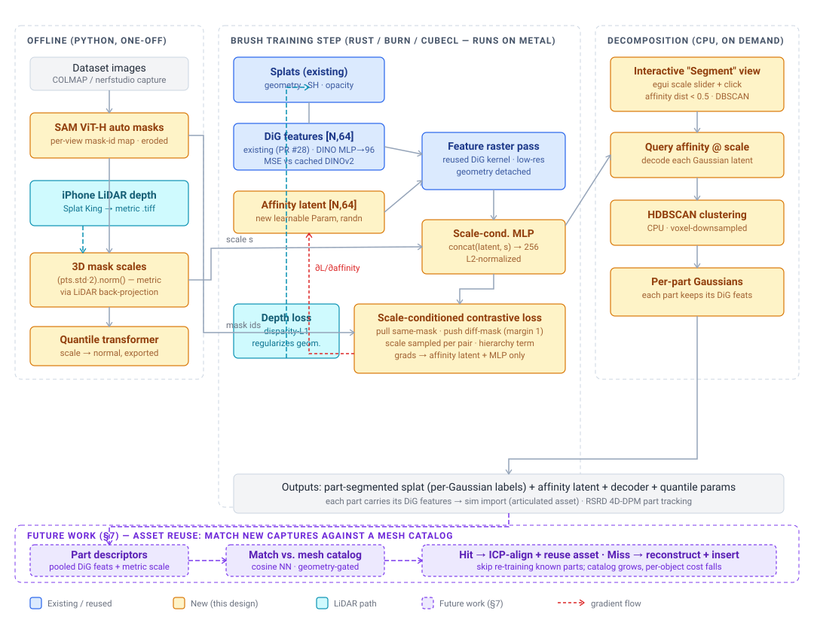
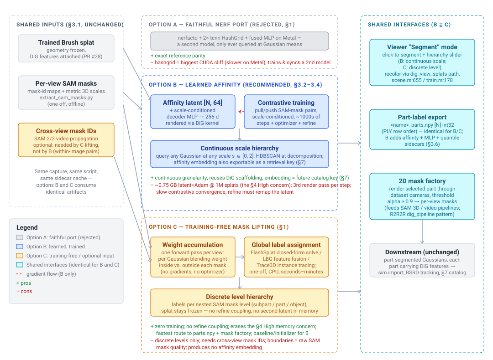

# GARField in Brush -- porting scale-conditioned affinity grouping to Gaussian-native Rust/Burn/Metal

**Status:** Accepted — implementation started
**Last updated:** 2026-07-12 (added Option C: training-free mask lifting; 2026-07-10: live training-monitoring requirement, §3.5. Brush citations verified 2026-07-02 against `main` @ `2569af5f`; reference citations against `chungmin99/garfield` and `kerrj/dig` @ HEAD)
**Goal:** Add GARField-style hierarchical, scale-conditioned grouping to Brush so a trained splat can be decomposed into parts on macOS/Metal — without the CUDA-only nerfacto + tiny-cuda-nn hashgrid stack. This is the segmentation half of the DiG feature stage ([dig-port-plan.md](../dig-port/dig-port-plan.md)); together they turn a scan into part-decomposed, feature-carrying Gaussians for downstream sim / RSRD part tracking.

> **TL;DR** — GARField learns a per-point *affinity* embedding conditioned on a continuous *scale*: two points that fall in the same SAM mask at scale `s` are pulled together, different masks pushed apart, and grouping at scale `s` implies grouping at every larger scale. In the reference this is a **separate NeRF** (nerfacto + two tiny-cuda-nn hashgrids) that is later *queried at each Gaussian's mean* and HDBSCAN-clustered into parts. Because the affinity field is only ever sampled at Gaussian means, we skip the NeRF entirely: attach a **per-Gaussian affinity latent** and a **shared scale-conditioned decoder MLP**, render it through the DiG feature kernel we already built, and supervise with the same SAM-mask contrastive loss. That removes the one hard CUDA dependency (the hashgrid) and reuses DiG's kernel, refine, optimizer, and export scaffolding wholesale.

## 1. Scope and the key decision

### Where this sits

The R2R2R Mac migration's feature/segmentation stage has two models. DiG (per-Gaussian DINO features, [PR #28](https://github.com/connorsoohoo/brush/pull/28), merged) gives each Gaussian a trackable semantic embedding. GARField (this doc) gives the *grouping* — which Gaussians form a part at a chosen granularity. RSRD composes them: GARField segments the scan into parts; each part carries its DiG features into 4D-DPM video tracking. DiG was the explicit prerequisite, and it is now in.

### In scope

| Piece | Reference (CUDA) | Brush replacement |
|---|---|---|
| Affinity field | nerfacto + 2× tcnn `HashGrid` + fused MLP (`garfield_field.py:37-112`) | Per-Gaussian latent `[N, 64]` + shared scale-conditioned decoder MLP → 256-d, L2-normalized |
| Feature rasterization | gsplat / nerfacto volume render | The DiG feature kernel already in `brush-render` (`render_splat_features`, geometry detached) |
| Scale-conditioned decode | `MLP(concat(hash(x), s))` (`garfield_field.py:148-152`) | `MLP(concat(latent[g], s))` — same idea, latent replaces the coordinate hashgrid |
| Contrastive loss | pull/push over SAM-mask pixel pairs, margin 1 (`garfield_model.py:162-245`) | Same loss in Burn tensor ops on the rendered affinity image |
| SAM masks + 3D scale | SAM ViT-H auto masks; scale = back-projected `(pts.std·2).norm()` (`garfield_datamanager.py:224`) | Offline Python script; **metric scale from iPhone LiDAR depth** (see §3.1) |
| Scale normalization | sklearn `QuantileTransformer` (`garfield_pipeline.py:176-186`) | Same — CPU, portable; params exported |
| Densify/prune of the latent | gsplat strategy grows the param dict | Extend Brush's refine, exactly as DiG's feature table (`train.rs:690,786`) |
| Decomposition | per-Gaussian query + cuML HDBSCAN (`garfield_gaussian_pipeline.py:461,495`) | Same query (trivial — latents are already per-Gaussian) + CPU HDBSCAN, once |
| Interactive viewer | viser scale slider + click-to-segment | egui "Segment" mode next to the DiG feature toggle (`scene.rs:655`), plus a **live affinity view during training** (§3.5) |

### Out of scope (future work)

- **Camera-pose optimization** (`SO3xR3`) and **RSRD 4D-DPM part tracking** (differentiable part-pose through the feature rasterizer) — GARField only produces the *static* part segmentation; tracking is a separate stage.
- **GPU clustering.** Clustering runs once at decomposition time on ≤10⁶ points after voxel downsampling; CPU HDBSCAN/DBSCAN is acceptable. No Metal clustering kernel.
- **A faithful nerfacto affinity NeRF** — rejected below.
- **Mesh-catalog matching / asset reuse.** The most expensive thing here is re-training a splat per scanned object. Once we have a catalog of already-reconstructed part meshes, a new capture should first be *matched* against that catalog and the existing asset reused (or fine-tuned) instead of reconstructed from scratch. The Gaussian-native fields this doc adds are the natural retrieval keys: each decomposed part carries mean-pooled **DiG features** (a scene-invariant DINO descriptor) plus cheap geometry descriptors (part 3D scale from §3.1, oriented-bbox aspect ratios). Retrieval is then a cosine/`L2` nearest-neighbor of a query part's descriptor against the catalog, gated by a match threshold: hit → drop in the catalog mesh (optionally ICP-align + rescale to the query's metric LiDAR extent); miss → run the full pipeline and *add* the new part to the catalog. This turns the pipeline incremental — the catalog grows and per-object cost falls over time — and dovetails with the mesh-pipeline plan (`docs/mesh-pipeline-mac/`), which is what populates the catalog. Out of scope here (needs the mesh stage first), but the affinity/DiG exports in §3.6 are deliberately catalog-ready. See [§7 note](#7-future-work-mesh-catalog-matching).

### The key decision: separate NeRF vs. Gaussian-native affinity

The reference's structural fact (verified in `garfield_gaussian_pipeline.py`): GARField is trained as its own nerfacto model, then at decomposition its checkpoint is loaded and the affinity MLP is **queried at each Gaussian's mean position** (`:461`), never anywhere else. Features are *not* stored per-Gaussian. Two ways to reproduce this on Metal:

| Option | How | Verdict |
|---|---|---|
| **A. Faithful port** | Reimplement a multi-resolution hash-grid encoder (24 levels, 8 feats/level, `2^19` table) + fused MLP + nerfacto density on Metal/wgpu; train a second model; query at Gaussian means | The hashgrid is the single largest CUDA dependency in the whole stack, and this trains and keeps consistent a *second* model. All of it exists only to be sampled at Gaussian means. Rejected. |
| **B. Gaussian-native affinity (recommended)** | Per-Gaussian latent `[N, 64]` + a shared decoder `MLP(concat(latent[g], s)) → 256`, L2-normalized; render the latent through the existing DiG feature kernel; contrastive loss on the rendered affinity image | No hashgrid, no NeRF, one model. Reuses DiG's kernel, refine remapping, per-param optimizer, sidecar export, and viewer plumbing. Scale-conditioning relocates from a coordinate-hashgrid input to an MLP input on the latent. |
| **C. Training-free mask lifting** | Keep the trained splat **frozen**; accumulate each Gaussian's blending-weight contribution inside vs. outside every SAM mask per view, then run one global label assignment (FlashSplat-style closed-form solve / LBG-style fusion / Trace3D-style instance tracing). No new learnable parameters. | No training, no optimizer, no refine coupling — seconds–minutes on a done splat instead of a second training run. Hierarchy becomes **discrete** (nested mask levels, not a continuous scale), and multi-object labeling wants cross-view mask IDs (SAM 2/3 video propagation). Kept as the fast path for part *extraction*; see [Option C below](#option-c-training-free-mask-lifting-same-interfaces-no-training). |

#### Pros and cons at a glance

| Option | Pros | Cons |
|---|---|---|
| **A. Faithful NeRF port** (rejected) | Exact reference parity — no re-derivation risk; every published GARField result applies directly. | The multi-res hashgrid is the single largest CUDA dependency in the stack with no good Metal equivalent (would be *slower*, not just more code); trains and keeps consistent a **second model**; all of that machinery only ever gets sampled at Gaussian means. |
| **B. Gaussian-native affinity** (recommended) | One model, no NeRF/hashgrid; reuses DiG's kernel, refine remap, optimizer, export, and viewer plumbing wholesale; **continuous** scale hierarchy (query any Gaussian at any `s`); affinity embedding exportable as a future §7 retrieval key. | Second per-Gaussian latent + Adam state (~0.75 GB @ N≈1M — §4's one **High** concern on unified memory); a third render pass per training step; contrastive convergence is slow (warmup + more steps); refine must remap the latent in lockstep. |
| **C. Training-free mask lifting** (fast path) | Zero training — seconds–minutes on the frozen splat; no optimizer, no refine coupling, no resident second latent (erases §4's High concern for the segmentation role); simplest route to `parts.npy` + the 2D mask factory; doubles as a baseline/initializer for B. | Hierarchy is **discrete** (quantized to nested SAM mask levels — no continuous scale slider); multi-object labeling needs cross-view mask IDs (SAM 2/3 propagation) or an inconsistency-tolerant solve; part boundaries inherit raw SAM mask quality (no learned smoothing); produces no affinity embedding. |

**Recommendation: B.** The reference's coordinate hashgrid `hash(x)` exists to give a continuous field over 3D space, but it is only ever evaluated at Gaussian means (`:461`) — so a *learned per-Gaussian latent* is a strict generalization of "hashgrid sampled at `x_g`": more capacity, no interpolation smoothing, and defined exactly where (and only where) it is used. The same latent decoded at different `s` yields different affinity vectors, reproducing scale-dependent grouping the same way the reference's `MLP(concat(hash, s))` does. This is precisely the extension DiG's design doc anticipated ("attach a second per-Gaussian affinity latent and reuse this design's feature rasterizer").

**Geometry regularization (LiDAR).** The fork already consumes iPhone LiDAR (Splat King) as depth supervision: `scripts/convert_lidar_depth_tiff.py` → per-view metric `.tiff` → the disparity-L1 depth loss (`train.rs:314-321`, `brush-loss/src/lib.rs:1122`). This matters twice for GARField. (1) Cleaner geometry → cleaner part boundaries: floaters and depth ambiguity smear the affinity supervision, and the depth loss tightens the Gaussians the affinity rides on. (2) **Metric scale** (§3.1): computing a SAM mask's 3D scale requires back-projecting its pixels to 3D, and metric LiDAR depth makes that scale axis real meters rather than arbitrary COLMAP units — grounding the scale slider and the mask-scale sampling without per-scene renormalization.

### Option C: training-free mask lifting (same interfaces, no training)

*Added 2026-07-12. B remains the recommendation for full GARField parity; this section documents the post-GARField family of "lift 2D masks directly onto a trained splat" methods, and how they would slot into this design without changing any interface in §3.5–§3.6.*

**Premise.** Everything downstream of GARField in this pipeline consumes only two artifacts: per-Gaussian **part labels** (`parts.npy`) and the parts' **DiG features** (which come from DiG, not GARField). RSRD tracking does not consume the affinity embedding itself (§ Out of scope — GARField supplies the *static* segmentation only), and the §7 catalog keys are DiG features + metric geometry. So the learned affinity field is load-bearing for exactly one thing: the *continuous* scale hierarchy in the interactive viewer. If discrete granularity levels are acceptable, the whole training stage (§3.2–§3.4) can be replaced by a one-off assignment on the frozen splat.

**The methods** (all consume: a trained 3DGS scene + per-view SAM masks — i.e. exactly the §3.1 artifacts plus the splat we already have):

| Method | Core idea | Training | Hierarchy | Cross-view mask IDs |
|---|---|---|---|---|
| **FlashSplat** ([arXiv:2409.08270](https://arxiv.org/abs/2409.08270), ECCV 2024) | Per-Gaussian blending weights accumulated inside vs. outside each mask; global 2D→3D label assignment solved in closed form (per-Gaussian integer argmax). ~30 s/scene, robust to mask noise. | None | Discrete | Tolerant for binary per-object solves; multi-object wants consistent IDs |
| **Lifting by Gaussians (LBG)** ([arXiv:2502.00173](https://arxiv.org/abs/2502.00173), WACV 2025) | Fuse per-view SAM masks (+ optional CLIP/DINO features) onto Gaussians by rendered contribution weights; segment-then-lift, per-scene, no optimization. | None | Discrete (object + part levels) | Needs association (video propagation or feature matching) |
| **Gaussian Grouping** ([arXiv:2312.00732](https://arxiv.org/abs/2312.00732), ECCV 2024) | 16-d per-Gaussian identity encoding trained by rendering; cross-view IDs from a zero-shot video tracker (DEVA). The lightweight-training middle ground; adds editing ops (delete/inpaint). | Light (minutes) | Discrete | Provided by the tracker |
| **Trace3D** ([arXiv:2508.03227](https://arxiv.org/abs/2508.03227), 2025) | Gaussian Instance Tracing: per-Gaussian instance-weight matrix across views; detects and *corrects* inconsistent 2D masks; hierarchical segmentation + clean object extraction. | None (optimization, not SGD training) | Hierarchical | Recovered/corrected by the tracing itself |

**What Brush would implement** (FlashSplat-flavored, the simplest):
1. **Weight accumulation pass** — for each view, one forward render of the frozen splat that scatter-adds each Gaussian's blending weight into per-(Gaussian, mask-id) accumulators, using the §3.1 mask-id maps. Same CAS-atomic scatter shape as the DiG feature backward (`render_features.rs`), but forward-only and run **once per view**, not per training step.
2. **Global assignment** — CPU: per Gaussian, argmax of accumulated weight over mask labels (with FlashSplat's inside/outside softening for noise). Nested SAM mask levels (the §3.1 per-pixel ordered mask lists) yield one label array per granularity level → a stepped hierarchy.
3. **Write `parts.npy`** — same artifact, same PLY row order as §3.6.

What disappears relative to Option B: the second latent and its Adam state (§4's one **High**-severity memory concern), the third render pass per training step, the contrastive-convergence risk, and all refine coupling (§3.4 — labels are computed after training on a frozen splat, so densify/prune never touches them).

**The cross-view ID question.** GARField dodges SAM's view inconsistency by supervising only within-image pairs and letting 3D consistency emerge; lifting methods must instead *have* consistent mask identities across views. Two practical sources: (a) **SAM 2/3 video propagation** over the capture sequence — natural for SplatKing captures, which are videos; (b) FlashSplat's per-object binary solves or Trace3D's inconsistency correction, which tolerate imperfect IDs. This is the one genuinely new preprocessing requirement, and it is confined to the offline Python side (`extract_sam_masks.py` gains a `--propagate` mode).

**Interfaces preserved** (the point of this section):
- **Viewer "Segment" mode (§3.5):** click-to-segment becomes an O(1) label lookup on the picked Gaussian + the same `dig_view_splats` recolor path (`train.rs:178`); the scale slider becomes a **level** slider stepping through the nested label arrays — the same UX shape as the reference's precomputed 30-scale `keep_list` (`garfield_gaussian_pipeline.py:279`), just with fewer, data-defined steps.
- **Exports (§3.6):** `<name>_parts.npy` `[N]` int32 identical. The affinity/MLP/quantile sidecars simply don't exist under C (nothing downstream requires them today).
- **2D mask factory:** rendering a selected part through the dataset cameras and thresholding alpha (the R2R2R `dig_pipeline.save_rendered_images` pattern) is backend-agnostic — it only needs labels.
- **§7 mesh-catalog matching:** unaffected; retrieval keys are pooled DiG features + metric scale, both independent of how labels were obtained.

**What C gives up:** the continuous scale axis (granularity is quantized to SAM's nested mask levels); learned smoothing of ragged mask boundaries (mitigable with a 3-NN label-smoothing pass, mirroring the DiG feature-variance regularizer); and the affinity embedding as a future retrieval key. **When to prefer which:** if the near-term goal is discrete part extraction feeding the mesh stage (e.g. segment a scan, render per-view masks, reconstruct each part with SAM 3D), C delivers that with no second training run and should be the first milestone; B is the target when RSRD-grade continuous granularity control in the viewer is worth a DiG-sized training increment. The two are not exclusive — C's accumulation pass is also a cheap initializer/sanity baseline for B's learned field.

## 2. Background: what GARField actually is

From the reference (`chungmin99/garfield`, verified @ HEAD):

- **Affinity field.** Output is a **256-d** embedding (`garfield_field.py:37`, `n_instance_dims = 256`) **L2-normalized to the unit hypersphere** (`:145-155`). Built as nerfacto + two concatenated tcnn `HashGrid`s (24 levels total, 8 feats/level, `log2_hashmap_size = 19`) → a 4×256 ReLU MLP (`:38-43,79-89`).
- **Scale-conditioning.** A single scalar scale is concatenated to the (rendered, normalized) hashgrid feature before the MLP (`:148-152`). Scale is normalized by a `QuantileTransformer(output_distribution="normal")` fit on the empirical 3D-scale distribution (`garfield_pipeline.py:176-186`). Slider range 0–2 (`garfield_model.py:68`).
- **3D mask scale.** For each SAM mask, scale = `(points.std(0) · 2).norm()` over the mask's back-projected 3D points — roughly the 2σ diagonal extent (`garfield_datamanager.py:224`). Masks with scale ≥ `max_scale = 2.0` are dropped (`:165,225`). During training each pixel's scale is drawn continuously by interpolating between its mask's scale and the next-smaller mask's (`:318-331`).
- **Contrastive loss** (`garfield_model.py:162-245`), **margin = 1.0** (`:168`), pairs formed **only within one image** (SAM masks have no cross-view correspondence, `:187-190`):
  - **Pull** same-mask pairs together at their own scale (`:211-216`), *and* at a larger sampled scale `s' = s + U(0,1)·(max_scale − s)` — the containment/hierarchy term (`:219-231`).
  - **Push** different-mask pairs apart with `ReLU(margin − ‖F_A − F_B‖)` (`:234-241`).
  - Grouping supervision starts only after 2000 base steps; the field uses the top-24 highest-weight ray samples (`:49,108`).
- **SAM masks** (`img_group_model.py`): SAM **ViT-H** auto mask generator, `points_per_side = 32`, `pred_iou_thresh = 0.90`, `stability_score_thresh = 0.90`; masks eroded 3×3, sampled with a CDF biased toward smaller masks (`garfield_datamanager.py:211-216,242-259`).
- **Decomposition** (`garfield_gaussian_pipeline.py`): query affinity at every Gaussian mean at the slider scale (`:461`), voxel-downsample (`0.01·scale`), **HDBSCAN** (`cluster_selection_epsilon=0.1, min_samples=30, min_cluster_size=30`, `:495-500`), propagate labels to the full set by 3D nearest-neighbor. Click-to-segment sweeps scale over `linspace(0, 1.5, 30)`, keeps Gaussians with affinity distance `< 0.5` to the clicked point, tightens spatially with DBSCAN (`eps=0.02`), and exposes the 30 nested scales as a hierarchy slider (`:246-363`).

### CUDA dependencies and their Metal story

| Reference dependency | Used for | Metal-compatible replacement |
|---|---|---|
| tcnn `HashGrid` ×2 | the affinity field's spatial encoding | **eliminated** — per-Gaussian latent (Option B) |
| tcnn `CutlassMLP` | fused 4×256 decoder | plain Burn `nn::Linear` stack (perf-only in the reference) |
| cuML HDBSCAN / open3d DBSCAN | decomposition clustering | CPU `hdbscan`/`sklearn` (or a Rust k-d-tree DBSCAN); runs once |
| nerfacto density + ray sampling | the NeRF the field rode on | **eliminated** — we render the per-Gaussian latent through Brush's splat rasterizer |
| SAM ViT-H (CUDA PyTorch) | mask generation | offline script, `torch` MPS/CPU; portable per-view cache |
| `QuantileTransformer` | scale normalization | sklearn, CPU — already framework-agnostic |

## 3. Design

### 3.1 Data: SAM masks + metric 3D scales

**Offline script** `scripts/extract_sam_masks.py` (torch + segment-anything), mirroring `extract_dino_features.py`:
- Input: a Brush dataset dir (COLMAP/nerfstudio) + its LiDAR depth dir (the `.tiff`s from `convert_lidar_depth_tiff.py`).
- Per view: run SAM ViT-H automatic mask generation (reference thresholds are defaults, exposed as flags), erode 3×3, sort by area, and write a `[H, W]` int32 **mask-id map** (finest containing mask per pixel; `-1` for none) plus the ordered mask list per pixel.
- **Per-mask 3D scale:** back-project each mask's pixels using the **LiDAR depth** + intrinsics to metric 3D points, compute `(pts.std(0)·2).norm()`. Where LiDAR is missing/low-confidence, fall back to rendered-splat depth from a quick RGB pretrain (or COLMAP sparse points), and record which source was used.
- Fit the `QuantileTransformer` on all masks' scales; write `sam_masks/<stem>.npy`, `sam_masks/scales.npy`, `sam_masks/quantile.json`, `sam_masks/meta.json` (SAM model, thresholds, scale source, `max_scale`).

**Rust loading:** mirror the DiG feature path — `SceneView` gains `groups: Option<LoadGroups>` beside `features`, surfaced on `SceneBatch` (`brush-dataset/src/scene.rs`, `load_features.rs` is the template for the int32 npy reader). A `--sam-dir-name` CLI arg follows `--features-dir-name`.

### 3.2 The affinity module (reuses the DiG kernel)

A new `GarfieldModule` beside `DigModule` (`brush-train/src/dig.rs` is the pattern):
- Per-Gaussian latent `affinity: Param<Tensor<2>>` `[N, 64]` (randn init), kept off `Splats` like the DiG features so viewer/FFI/export stay untouched.
- Shared decoder: `Linear(64+1 → 256) → ReLU → Linear(256→256) → ReLU → Linear(256→256)` (widths follow the reference's 4×256; the `+1` is the scale scalar), output **L2-normalized**. No bias, matching DiG's decoder convention.
- **Rendering:** call the existing `render_splat_features` (`train.rs:354`, geometry detached, low-res) on the affinity latent to get a `[h, w, 64]` alpha-normalized affinity image — *no new kernel*. Decode per pixel with the scale-conditioned MLP at that pixel's sampled scale, then L2-normalize.

### 3.3 Contrastive loss + scale sampling

In `SplatTrainer::step`, gated on `batch.groups.is_some() && cfg.garfield_loss_weight > 0`, after step 2000 (reference warmup):
1. Render the affinity image (§3.2). Sample a set of pixel pairs within the view (both pixels in some mask).
2. For each sampled pixel, draw a continuous scale between its finest mask's scale and the next-smaller mask's (`datamanager:318-331`), quantile-normalize, decode + L2-normalize.
3. **Pull** same-mask pairs (`‖F_A−F_B‖`) at their scale and again at a larger sampled scale (hierarchy); **push** different-mask pairs (`ReLU(1 − ‖F_A−F_B‖)`). Normalize by pair count. `loss += garfield_loss_weight · contrastive`.

Geometry and the DiG features are detached in this pass; gradients flow only to the affinity latent and its decoder — the same single-differentiable-input shape as DiG, so the autodiff glue is DiG's, unchanged.

**Optimizer:** the affinity latent + decoder join the per-param Adam steps beside the DiG params (`train.rs:517-530`); Adam with an exp-decay schedule (defaults exposed as flags, seeded from the reference LRs).

### 3.4 Refine (densify/prune)

The affinity latent grows/prunes in lockstep with the splats exactly as the DiG feature table does today (`prune_points(..., self.dig.as_mut())` at `train.rs:690`; refine remap + `invalidate_neighbors` at `:786`). Children copy the parent latent; new-splat optimizer state zeroed; pruning masks rows. This is the one place the reference gets behavior "for free" (its field is coordinate-based, not per-Gaussian) that Brush must do explicitly — but the DiG port already established the pattern.

### 3.5 Decomposition + interactive viewer

**Live training monitoring (requirement).** GARField training must be observable in realtime, mirroring DiG's live feature view (the "DINO feature view" checkbox / `--dino-view`, refreshed every 50 steps): when the GARField loss is active, an **"Affinity view"** toggle appears in the scene controls beside the DINO feature toggle, together with the **scale slider** (active during training, not only at decomposition). It recolors splats by their decoded affinity at the slider scale — decode each Gaussian's latent at scale `s`, L2-normalize, map the top-3 PCA channels to RGB — through the same `dig_view_splats` recolor path (`train.rs:178`). A `--garfield-view` flag starts the viewer in this mode. Early in training the view is noise; parts should visibly separate into coherent colors as the contrastive loss drops, and moving the scale slider should coarsen/refine the grouping live. This is the go/no-go check that affinity is converging *before* paying for decomposition or downstream RSRD tracking.

**Offline decomposition** (`--segment` export, or a viewer action): decode every Gaussian's latent at a chosen scale, L2-normalize, voxel-downsample, **CPU HDBSCAN** (reference params), propagate labels by 3D nearest-neighbor → a `[N]` int32 part-label array written next to the PLY. Each part is the subset of Gaussians with that label; each part carries its DiG features unchanged.

**Interactive "Segment" view** in the egui app, beside the DiG feature toggle (`scene.rs:655`): a **scale slider** and click-to-segment. On click, ray-pick the front Gaussian, compute affinity distance to all Gaussians at the slider scale, threshold `< 0.5`, tighten with DBSCAN, and recolor the selected group — reusing the `dig_view_splats` recolor path (`train.rs:178`) that already swaps per-Gaussian colors in the viewer. All CPU-side, computed on demand.

### 3.6 Export

Beside the DiG sidecars: `<name>_garfield_affinity.npy` `[N, 64]` (PLY row order), `<name>_garfield_mlp.json` (decoder weights), `<name>_garfield_quantile.json` (scale transformer), and, when decomposition is run, `<name>_parts.npy` `[N]` int32 labels. Minimal artifact for downstream sim import / RSRD tracking.

## 4. Performance and cost

The Gaussian-native design deliberately sidesteps the one hard cliff — there is **no tiny-cuda-nn hashgrid**, the single op with no good Metal equivalent — so the faithful port (Option A) would have been *slower* on Metal, not just more code. What remains is a roughly DiG-sized increment (a second per-Gaussian latent and one more render pass) plus one-off SAM. Concerns and mitigations:

| Concern | Cost | Severity | Mitigation |
|---|---|---|---|
| **Extra render pass per step** | A 3rd rasterization each step (RGB + DiG feature + affinity). The affinity pass reuses the DiG low-res, geometry-detached kernel. | Low–moderate | Render RGB once and drive **both** detached feature passes off its projection/sort outputs (the kernel already separates projection from rasterize, `render_features.rs`); share the sort. |
| **Second per-Gaussian latent + Adam state** | `[N,64]` latent + 2× Adam moments ≈ `3·N·64·4` B — ~0.75 GB at N≈1M, *on top of* DiG's. Apple unified memory gets tight on large scans. | **High** (the real one) | Cap `--max-splats`; lower `--dino-feature-dim` (shared with affinity dim); train affinity in a **second pass after DiG converges** so both latents' optimizer state aren't resident at once; free DiG optimizer state once its LR floors. |
| **SAM ViT-H preprocessing** | Heavy per image on MPS/CPU — minutes for ~130 images. | Low | One-off, cached like DINOv2; can down-swap to SAM ViT-L/`MobileSAM` via the script's `--sam-model` flag if throughput bites. |
| **Contrastive convergence** | Contrastive losses converge slowly; reference delays grouping to step 2000 then trains alongside → more total steps. | Moderate | Warm-start after DiG/geometry settle; sample enough pixel pairs per view (§3.3); the metric-LiDAR scale (§3.1) removes one source of scale noise, tightening supervision. |
| **CAS-atomic backward on Metal** | The affinity backward reuses DiG's compare-and-swap atomic scatter (some Metal configs lack native f32 atomics). | Low | Bounded by the low feature-render resolution, same as DiG; escape hatch is chunking the feature dim (the DiG doc's §Risks trick). |
| **CPU HDBSCAN at decomposition** | ≤10⁶ Gaussians clustered on CPU. | Low | Voxel-downsample (`0.01·scale`) before clustering as the reference does, then propagate labels by 3D nearest-neighbor; runs once at export, not per step. |

**Net:** budget GARField as ≈ a second DiG on top of RGB training — dominated by the memory of the extra latent and the added pass, both mitigable by training the two fields sequentially rather than jointly. No component has hashgrid-class cost.

## 5. Phases and verification

| Phase | Work | Verify |
|---|---|---|
| 1. Data | `extract_sam_masks.py` (SAM + metric-LiDAR 3D scale + quantile fit); `LoadGroups`; `SceneBatch.groups`; CLI | mask-id maps + scales reproduce the reference recipe on `tiger`; Rust loader round-trips a generated `.npy`; scales are metric where LiDAR covers |
| 2. Affinity field | `GarfieldModule` (latent + scale-cond decoder); render via existing feature kernel; refine remapping | renders a `[h,w,64]` affinity image; split/prune changes splat count without shape panics; decoded vectors are unit-norm |
| 3. Contrastive training | pair sampling; scale sampling + quantile; pull/push loss; optimizer; **live affinity view + in-training scale slider (§3.5)** | loss decreases; on held-out pairs, mean same-mask distance < mean different-mask distance by ≳ the margin; the live affinity view shows parts separating into coherent colors as the loss drops |
| 4. Decompose + viewer | CPU HDBSCAN decomposition; click-to-segment + scale slider; part export | on `tiger`, the scale slider yields a coherent coarse→fine hierarchy (whole object → major parts); click isolates a part comparable to the reference render |

**Success criterion:** on the `tiger` capture (already on disk with its DiG cache), the scale slider produces a sensible grouping hierarchy and click-to-segment isolates semantically coherent parts, each retaining its DiG features — matching the reference's qualitative decomposition without any hashgrid/NeRF/CUDA dependency.

### Risks (correctness / quality; performance is §4)

- **No hashgrid interpolation.** A per-Gaussian latent has no built-in spatial smoothness, so under-reconstructed regions can carry noisy affinity. Mitigations: reuse DiG's 3-NN feature-variance regularizer on the latent; lean on the LiDAR depth loss for cleaner geometry; optionally add a light 3-NN affinity smoothness term.
- **Scale metric grounding depends on LiDAR coverage.** Partial/low-confidence LiDAR falls back to rendered-splat depth; the `meta.json` records the source so a scan with no LiDAR still trains (just non-metric scale, like the reference).

## 6. Glossary

- **GARField** — *Group Anything with Radiance Fields* (Kim et al., CVPR 2024, [arXiv:2401.09419](https://arxiv.org/abs/2401.09419)): a scale-conditioned **affinity field** trained from SAM masks that lets you group a scene at any granularity. Here it is ported as a per-Gaussian affinity latent rather than a NeRF.
- **Affinity / instance embedding** — the 256-d, L2-normalized vector GARField assigns to a point at a given scale; points close in this space at that scale belong to the same group. Distances (not classes) define grouping.
- **Scale-conditioning** — feeding a scalar "how big a group" value into the decoder so the *same* point yields different affinities at different granularities; grouping at scale `s` is trained to imply grouping at all larger scales (hierarchy).
- **3D mask scale** — the physical extent (`2σ` diagonal) of a SAM mask's back-projected 3D points; the scale value a mask supervises at. **Metric** when computed from iPhone LiDAR depth.
- **Contrastive loss (pull/push)** — pulls same-mask point pairs together and pushes different-mask pairs apart up to a margin (1.0), all conditioned on scale.
- **SAM (Segment Anything Model)** — Meta's promptable segmentation model ([arXiv:2304.02643](https://arxiv.org/abs/2304.02643)); GARField uses its ViT-H automatic mask generator as the source of 2D grouping supervision.
- **HDBSCAN / DBSCAN** — density-based clustering; HDBSCAN groups the queried per-Gaussian affinities into parts at decomposition, DBSCAN spatially tightens an interactive click selection.
- **QuantileTransformer** — maps the empirical 3D-scale distribution to a normal distribution so the scale input to the decoder is well-conditioned across scenes.
- **Multi-resolution hashgrid (tiny-cuda-nn)** — the CUDA spatial encoding the reference field is built on ([Instant-NGP, arXiv:2201.05989](https://arxiv.org/abs/2201.05989)); the main dependency Option B eliminates.
- **nerfacto** — nerfstudio's default NeRF; the model GARField's affinity head rode on in the reference. Not ported.
- **DiG (DINO-embedded Gaussians)** — the companion model ([dig-port-plan.md](../dig-port/dig-port-plan.md)): per-Gaussian DINOv2 features for tracking. GARField groups; DiG describes. RSRD uses both.
- **RSRD / 4D-DPM** — *Robot See Robot Do* ([arXiv:2409.18121](https://arxiv.org/abs/2409.18121)): GARField (grouping) + DiG (features) + per-part SE(3) tracking against a demo video. GARField supplies the static part segmentation only.
- **Refine / densification** — 3DGS's periodic split/duplicate/prune; any per-Gaussian tensor (here the affinity latent) must grow/shrink in lockstep. Only relevant to Option B — Option C labels a frozen splat after training.
- **Mask lifting (training-free)** — assigning 2D segmentation masks directly to the Gaussians of an already-trained splat via their rendered contribution weights, instead of training a field to absorb the masks. The Option C family.
- **Blending weight** — a Gaussian's alpha-composited contribution to a rendered pixel; summing these per mask tells you how much each Gaussian "belongs" to that mask, the raw signal all Option C methods share.
- **FlashSplat** — training-free lifting via a globally optimal closed-form label solve over accumulated blending weights ([arXiv:2409.08270](https://arxiv.org/abs/2409.08270)); the simplest Option C backend and the one sketched for Brush.
- **Lifting by Gaussians (LBG)** — training-free fusion of per-view SAM masks and 2D foundation features (CLIP/DINO) onto 3DGS ([arXiv:2502.00173](https://arxiv.org/abs/2502.00173)).
- **Gaussian Grouping** — lightweight-training alternative: per-Gaussian 16-d identity encodings supervised with video-tracker-associated masks ([arXiv:2312.00732](https://arxiv.org/abs/2312.00732)); middle ground between B and C.
- **Trace3D / Gaussian Instance Tracing** — training-free lifting that additionally detects and corrects view-inconsistent 2D masks via a per-Gaussian instance-weight matrix ([arXiv:2508.03227](https://arxiv.org/abs/2508.03227)).
- **SAM 2/3 video propagation** — prompting SAM 2 (or SAM 3) once and tracking the mask through the capture video, yielding the cross-view-consistent mask IDs that Option C's multi-object assignment wants and Option B never needed.

## 7. Future work: mesh-catalog matching

*Depends on the mesh stage (`docs/mesh-pipeline-mac/`) existing; out of scope for the port itself, but the exports in §3.6 are designed to enable it.*

**Motivation.** Per §2's cost model, the expensive step is re-optimizing a splat (RGB + DiG + affinity) per scanned object. If we keep a growing **catalog** of previously reconstructed part meshes, a new capture should first try to *reuse* a catalog asset before paying to reconstruct it — turning the pipeline incremental so per-object cost falls as the catalog grows. This is a retrieval problem, and the fields this doc adds are the retrieval keys.

**Part descriptor (the catalog key).** For each decomposed part, store a compact descriptor built from artifacts we already export:
- **Semantic:** mean- (and max-) pooled **DiG features** over the part's Gaussians, projected to the 96-d DINO space via the exported MLP + `pca.npy`. DINOv2 features are view- and instance-stable, so this is a scene-invariant "what is this part" embedding — the primary key.
- **Geometric:** the part's **metric 3D scale** (§3.1, real meters thanks to LiDAR) + oriented-bounding-box aspect ratios + Gaussian count. A cheap, rotation-tolerant "how big / what shape" key that disambiguates semantically-similar parts (a small vs. large drawer).

**Retrieval + reuse.**
1. Query the catalog by cosine NN on the semantic descriptor, re-ranked/gated by geometric agreement (metric scale within a tolerance).
2. **Hit** (score ≥ threshold) → drop in the catalog mesh; ICP-align the catalog part to the query part's Gaussians and rescale to the query's metric extent. No reconstruction.
3. **Miss** → run the full splat→segment→mesh pipeline for that part and **insert** it (mesh + descriptor) into the catalog.

**What this buys.** A scene that is mostly known parts (e.g. a re-scan of a previously captured object, or a new arrangement of catalogued objects) reconstructs only its *novel* parts. The catalog also becomes a clean-up point for canonical, sim-ready articulated assets.

**Open questions.** Match threshold calibration (false-reuse of a wrong-but-similar part is worse than a miss); whether to fine-tune a near-miss catalog mesh against the new capture vs. reconstruct fresh; catalog dedup/versioning as the same object is re-scanned; and whether retrieval keys should live per-part or per-object (an articulated object is a *set* of part descriptors + a joint graph). These are design work for a follow-up doc once the mesh stage lands.

## 8. Sources & references

**Brush (this repo, verified 2026-07-02 @ `2569af5f`):**
- DiG feature kernel to reuse: `crates/brush-render/src/render_features.rs`, invoked at `crates/brush-train/src/train.rs:354`
- DiG module / decoder pattern: `crates/brush-train/src/dig.rs`
- Train step / per-param optimizer / refine remap: `crates/brush-train/src/train.rs:202,517-530,690,786`
- Feature (int-npy) dataset loader template: `crates/brush-dataset/src/load_features.rs`; views/batches `crates/brush-dataset/src/scene.rs`
- Depth-loss regularization (LiDAR): `crates/brush-train/src/train.rs:314-321`, `crates/brush-loss/src/lib.rs:1122`
- LiDAR ingestion: `scripts/convert_lidar_depth_tiff.py`
- Viewer feature toggle / recolor path: `apps/brush-app/src/ui/scene.rs:655`, `crates/brush-train/src/train.rs:178`

**Reference implementations (verified @ HEAD by research pass 2026-07-02):**
- GARField: <https://github.com/chungmin99/garfield> — `garfield/garfield_field.py` (256-d field, hashgrid, scale-cond MLP), `garfield_model.py` (contrastive loss, margin 1), `garfield_datamanager.py` (SAM→3D scale, scale sampling), `img_group_model.py` (SAM ViT-H config), `garfield_gaussian_pipeline.py` (per-Gaussian query + HDBSCAN + click-to-segment), `garfield_pipeline.py` (QuantileTransformer)
- DiG: <https://github.com/kerrj/dig> — `dig/dig.py`, `dig/data/utils/dino_dataloader.py`
- RSRD: <https://github.com/kerrj/rsrd> · project page <https://robot-see-robot-do.github.io/>

**Papers:**
- GARField, Kim et al., CVPR 2024 — <https://arxiv.org/abs/2401.09419>
- Robot See Robot Do (RSRD / DiG / 4D-DPM), Kerr et al., CoRL 2024 — <https://arxiv.org/abs/2409.18121>
- Segment Anything (SAM), Kirillov et al. — <https://arxiv.org/abs/2304.02643>
- Instant-NGP (multi-resolution hashgrid), Müller et al. — <https://arxiv.org/abs/2201.05989>
- 3D Gaussian Splatting, Kerbl et al., SIGGRAPH 2023 — <https://arxiv.org/abs/2308.04079>

**Option C (training-free mask lifting), added 2026-07-12:**
- FlashSplat: 2D to 3D Gaussian Splatting Segmentation Solved Optimally, Shen et al., ECCV 2024 — <https://arxiv.org/abs/2409.08270>
- Lifting by Gaussians: fast, training-free 3DGS instance segmentation, WACV 2025 — <https://arxiv.org/abs/2502.00173>
- Gaussian Grouping: Segment and Edit Anything in 3D Scenes, Ye et al., ECCV 2024 — <https://arxiv.org/abs/2312.00732>
- Trace3D: Consistent Segmentation Lifting via Gaussian Instance Tracing, 2025 — <https://arxiv.org/abs/2508.03227>
- Survey: 3D Gaussian Splatting Applications — Segmentation, Editing, Generation, 2025 — <https://arxiv.org/abs/2508.09977>
