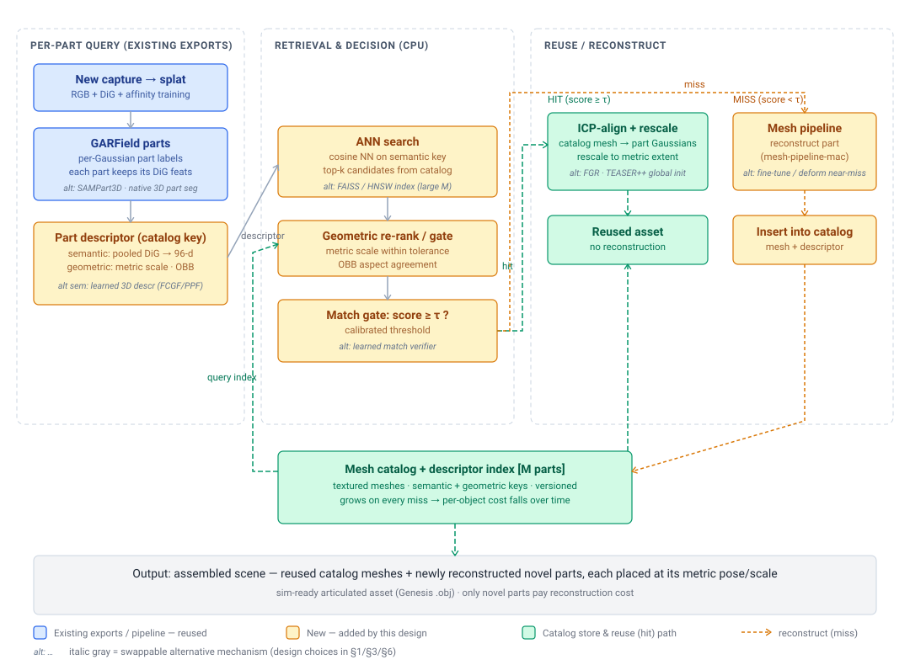

# Mesh-catalog matching — retrieval-based asset reuse for the R2R2R Mac pipeline

**Status:** Proposed
**Last updated:** 2026-07-02 (Brush/DiG/GARField citations verified against `main` @ `2569af5f` and the two companion design docs; external references verified via web search 2026-07-02)
**Goal:** Make the R2R2R Mac pipeline *incremental*. Instead of re-optimizing a splat and re-meshing every part of every new capture, keep a growing **catalog** of previously reconstructed part meshes and, for each part of a new scan, first try to **retrieve and reuse** a catalog asset. Only genuinely novel parts pay the full reconstruction cost, so per-object cost falls as the catalog grows.

> **TL;DR** — Reconstruction (RGB + DiG + GARField training, then meshing) is the expensive step; retrieval is cheap. This doc promotes the [garfield-port §7 future-work note](../garfield-port/garfield-port-plan.md#7-future-work-mesh-catalog-matching) into its own design. The key realization: the fields the DiG and GARField ports already export **are** the retrieval keys. For each GARField part we build a compact **descriptor** — mean/max-pooled **DiG DINO features** (a scene-invariant *semantic* key) plus **metric 3D scale + oriented-bbox aspect** (a cheap *geometric* key) — and query a catalog by cosine nearest-neighbor gated by geometric agreement. **Hit** → ICP-align the catalog mesh to the part's Gaussians and rescale to its metric extent; **miss** → run the mesh pipeline and insert the new mesh + descriptor. This is the well-trodden *retrieve-and-align* pattern (Scan2CAD / ROCA / Mask2CAD), specialized to a self-populating catalog keyed by features we already have. **No new network is trained** — the descriptor is assembled from existing exports.



## 1. Scope and the key decision

### Where this sits

The R2R2R Mac migration is a three-stage pipeline (see [r2r2r context](../dig-port/dig-port-plan.md)):

1. **Feature / segmentation** — DiG (per-Gaussian DINO features, [PR #28](https://github.com/connorsoohoo/brush/pull/28), merged) + GARField (scale-conditioned part grouping, [garfield-port-plan.md](../garfield-port/garfield-port-plan.md)). Output: part-segmented Gaussians, each part carrying DiG features and a metric 3D scale.
2. **Mesh** — 3DGS → textured mesh (`docs/mesh-pipeline-mac/`: depth sweep → Open3D TSDF → xatlas → projection bake). Output: a textured `.obj` per part/object.
3. **Sim** — Genesis consumes plain textured `.obj`.

Mesh-catalog matching is a **retrieval layer that wraps stages 1→2**: given the stage-1 part decomposition, decide *per part* whether to invoke stage 2 (reconstruct) or reuse a catalog mesh. It is strictly downstream of both companion ports and **depends on the mesh stage existing** — the catalog is populated by stage-2 meshes.

### In scope

| Piece | What it is | Built from |
|---|---|---|
| **Catalog store** | On-disk set of textured part meshes + a descriptor index, versioned | new (this doc) |
| **Part descriptor** | Per-part `(semantic, geometric)` key | pooled DiG features (§3.2) + GARField metric scale/OBB — **existing exports** |
| **Retrieval** | Cosine ANN on the semantic key, re-ranked/gated by geometric agreement against a threshold `τ` | new; CPU |
| **Hit path** | ICP-align the catalog mesh to the query part's Gaussians + rescale to metric extent | Open3D ICP (already a stage-2 dep) |
| **Miss path** | Run the mesh pipeline for that part, insert mesh + descriptor | stage-2 pipeline + a catalog write |
| **Assembly** | Place reused + reconstructed part meshes at their metric poses into one scene | new; trivial |

### Out of scope (future work)

- **Training a dedicated 3D shape-descriptor network** (FCGF / PPF-FoldNet / GeoTransformer-style learned features). Rejected as the primary key below — we start from features we already export. A learned geometric descriptor is a natural upgrade if pooled-DINO retrieval proves insufficient (§6).
- **Articulation / joint inference.** The catalog stores rigid part meshes; recovering the joint graph that links an object's parts (revolute/prismatic axes) is a separate problem. We store enough to *enable* it (per-part descriptors + relative poses) but don't solve it here (§3.6, §6).
- **Cross-capture pose/scene graph optimization.** We assume stage-1 gives each part a metric pose in the capture frame; global multi-capture bundle adjustment is out of scope.
- **Non-rigid / deformable matching.** Retrieval + rigid ICP only. Soft bodies, cloth, etc. are not handled.
- **Learned match-acceptance.** The `τ` gate is a calibrated threshold, not a learned verifier (§6 open question).

### The key decision: reuse existing exports as the descriptor vs. train a dedicated 3D descriptor

The load-bearing choice is **what keys the catalog**. Two options:

| Option | How | Verdict |
|---|---|---|
| **A. Learned 3D descriptor** | Train/adapt a geometric descriptor network (FCGF-style sparse-conv, or a PointNet/PPF encoder) on the part point clouds; retrieve in that learned space | Strong for pure-geometry matching under partial overlap, but: needs a training pipeline + a Metal-friendly sparse-conv (FCGF is MinkowskiEngine/CUDA), needs labeled or self-supervised part correspondences, and ignores the semantic signal we already have. Heavy for a v1. **Deferred.** |
| **B. Descriptor from existing exports (recommended)** | Semantic key = pooled DiG DINO features (already per-Gaussian, projected to the 96-d DINO space); geometric key = GARField's metric 3D scale + OBB aspect + Gaussian count. Retrieve by cosine NN on the semantic key, gate by geometric agreement | **Zero new training.** DINOv2 features are view- and instance-stable, so pooled part features are a scene-invariant "what is this part" key — exactly what retrieval needs. The geometric key is nearly free and disambiguates semantically-similar-but-differently-sized parts. Reuses the DiG/GARField exports the two ports already produce. |

**Recommendation: B.** The whole point of the feature stage was to attach scene-invariant semantics to geometry; retrieval is the first consumer that *reuses* that investment rather than re-deriving it. Pooled DINO features are a well-established retrieval key (they underpin DINO-based instance retrieval and the feature-field literature), and the geometric key is a handful of floats we already compute for GARField's scale slider. Option A is the fallback if B's recall is inadequate on parts where geometry matters more than appearance (§6) — and the two compose: a learned geometric descriptor can slot in as a second re-ranking key without changing the pipeline shape.

## 2. Background: the retrieve-and-align pattern, and why our keys are ready

### Prior art

"Match a new observation to a database of clean 3D models, then align the retrieved model to the observation" is a mature line of work. The closest analog is the **Scan2CAD family**, which retrieves CAD models from ShapeNet and aligns them (9-DoF) to scanned/RGB input:

| Work | Input → catalog | Relevance |
|---|---|---|
| **Scan2CAD** (Avetisyan et al., CVPR 2019) | RGB-D scan → ShapeNet, learned keypoint correspondences + alignment | The canonical "retrieve + 9-DoF align a database mesh to a noisy scan." Our hit path is a lightweight version of this. |
| **End-to-End CAD Retrieval & 9DoF Alignment** (Avetisyan et al., CVPR 2019) | scan → ShapeNet, joint retrieval + alignment | Shows retrieval and alignment reinforce each other — informs coupling `τ` to alignment residual (§3.4). |
| **Mask2CAD / Patch2CAD** (Kuo et al., ECCV 2020 / ICCV 2021) | single image → CAD, learned *embedding* retrieval (patch-level in Patch2CAD) | Embedding-space retrieval of shapes — directly analogous to our semantic-key NN; patch-level ≈ our per-*part* keys. |
| **ROCA** (Gümeli et al., CVPR 2022) | single image → CAD, differentiable Procrustes alignment via dense 2D-3D correspondences | Retrieval-aware alignment; the alignment residual feeds back into which model to pick. |
| **Vid2CAD / FastCAD** (Maninis et al. 2020 / Langer et al., ECCV 2024) | video → CAD, multi-view constraints; FastCAD is real-time | Multi-view / real-time variants — our input is a full multi-view splat, the richest case. |

The difference in our setting: the catalog is **self-populating** (misses insert new assets) rather than a fixed external database like ShapeNet, and the retrieval key is **multi-modal** (pooled foundation-model features + metric geometry) rather than image- or CAD-geometry-only. The geometric side of the key and the align step draw on classic **3D descriptors and registration** (3DMatch, FCGF, Predator, GeoTransformer for descriptors; FGR, TEASER++, ICP for alignment) and the semantic side on **feature-field / lifted-DINO** work (Distilled Feature Fields, LERF, Feature-3DGS). Full citations in §9.

### What we already export (so the descriptor is nearly free)

- **Per-Gaussian DiG features** `[N, 64]`, decoded by a shared MLP `64→64→64→96` to the 96-d DINO space, with `pca.npy` `[768, 96]` (`dig-port-plan.md` §Export, `dig.py:53-61,293-298`). Exported as `features.npy` + `mlp` + `pca.npy`.
- **Per-Gaussian part labels** `parts.npy` `[N]` int32 from GARField decomposition (`garfield-port-plan.md` §3.6).
- **Per-part metric 3D scale** — GARField computes each SAM mask's 3D scale from **iPhone LiDAR** back-projection in real meters (`garfield-port-plan.md` §3.1); the same machinery gives a part its metric extent.
- **Per-part Gaussians** — geometry (means, covariance) to compute an oriented bounding box and to be the ICP target.

The descriptor (§3.2) is a pooling + a bbox over these. No new model, no new training pass.

### Swappable mechanisms (the diagram's *alt* labels)

Every stage of the diagram picks a default but is deliberately modular; the italic-gray *alt* labels mark the drop-in alternatives, each discussed at its stage:

| Stage | Default (recommended) | Alternative(s) | Where |
|---|---|---|---|
| **Parts source** | GARField per-Gaussian decomposition | **SAMPart3D** / other native 3D part segmentation (feed the same per-part Gaussians downstream) | §1, [SAMPart3D](https://arxiv.org/abs/2411.07184) |
| **Semantic key** | pooled DiG DINO features | learned 3D descriptor (**FCGF / PPF-FoldNet**) as a second re-ranking key | §1 key decision, §3.2, §6 |
| **ANN search** | brute-force cosine over `vectors.npy` | **FAISS / HNSW** index once `M` grows past ~10⁵ | §3.1, §3.3 |
| **Match gate** | calibrated threshold `τ` + geometric gate | **learned match verifier** (classifier over semantic + geometric + residual) | §3.3, §6 |
| **Hit alignment** | point-to-plane similarity ICP | **FGR / TEASER++** global-registration init for symmetric/ambiguous parts | §3.4 |
| **Miss handling** | full mesh-pipeline reconstruction | **fine-tune / deform** a near-miss catalog mesh instead of reconstructing | §3.5, §6 |

The pipeline *shape* (retrieve → gate → hit/miss → self-populate) is invariant to these swaps — each is a component choice, not an architecture change. That modularity is why the parts source is only lightly coupled: any segmenter that yields per-part Gaussians (or point sets) with a scale plugs into the same descriptor/retrieval path.

## 3. Design

### 3.1 The catalog store

A directory `catalog/` holding, per catalog entry:

```
catalog/
  index.parquet          # one row per part: id, semantic[96] (or a ref), scale, obb_aspect[3],
                          #   n_gauss, source_capture, version, mesh_path, created_at
  vectors.npy            # [M, 96] float32, row i = entry i's semantic key (memmap-friendly)
  meshes/<id>.obj        # textured mesh (stage-2 output), + <id>.png texture
  meta/<id>.json         # provenance: source capture, alignment used at insert, dedup group
```

- **Semantic vectors** live in a single contiguous `vectors.npy` so retrieval is one BLAS `matmul` (`M` is small — thousands, not millions — so brute-force cosine is fine; swap to a FAISS/HNSW index only if `M` grows past ~10⁵).
- **`index.parquet`** is the metadata/geometric side, queried with pandas/polars.
- Meshes are plain textured `.obj` — the same format stage 3 (Genesis) consumes, so a catalog hit produces a directly sim-ready asset.
- **Versioning:** entries are append-only; a re-scan of a known object inserts a new version linked by a `dedup group` (§6 open question on merge policy).

This is deliberately a flat, boring store — no database server. The catalog is expected to be O(10³–10⁴) parts for a while.

### 3.2 Part descriptor (the key)

For each part `p` (the Gaussians with a given GARField label):

**Semantic key** `s_p ∈ ℝ⁹⁶`:
- Take each part-Gaussian's DiG feature, decode with the exported MLP to the 96-d DINO space (or pool the 64-d latents and decode once — cheaper, and the MLP is affine-ish enough that pooled-then-decoded ≈ decoded-then-pooled for a coarse key; **decode-then-pool** is the safe default).
- **Mean-pool** over the part's Gaussians for the primary key; also store **max-pool** as a secondary (mean captures the part's dominant appearance, max captures salient sub-features). L2-normalize.
- Optionally weight the pool by Gaussian opacity/size so dominant surfaces count more.

**Geometric key** `g_p`:
- **Metric 3D scale** — the part's LiDAR-grounded extent (real meters), the same quantity GARField's scale slider uses (`garfield-port-plan.md` §3.1). Rotation-invariant.
- **OBB aspect ratios** — fit an oriented bounding box (PCA on the part-Gaussian means), store the sorted side-length ratios `(a:b:c)` normalized so the longest = 1. Rotation-tolerant "shape signature."
- **Gaussian count** (log-scaled) — a crude complexity prior; cheap tie-breaker.

The descriptor is `(s_p, g_p)`. All components come from existing exports; assembling it is a few hundred lines of Python at export time, written next to `parts.npy`.

### 3.3 Retrieval (ANN + geometric gate)

Given a query part descriptor `(s_q, g_q)`:

1. **Semantic ANN.** Cosine similarity `s_q · vectors.T` → top-`k` candidates (`k` ~ 10). One matmul.
2. **Geometric gate + re-rank.** For each candidate `c`, require **metric-scale agreement** `|log(scale_q / scale_c)| < ε_scale` (scale is metric on both sides thanks to LiDAR, so this is a real physical tolerance, e.g. ±15%) and **OBB-aspect agreement** (L2 on the normalized aspect vector `< ε_obb`). Compute a combined score
   `score = w_s · cos(s_q, s_c) − w_g · d_geom(g_q, g_c)`.
3. **Match gate.** Accept the top candidate iff `score ≥ τ` **and** it passes the geometric gate. Otherwise → miss.

The geometric gate is what makes semantic retrieval safe: DINO features happily rate "small drawer" and "large drawer" as near-identical; metric scale separates them. Because scale is metric (not arbitrary COLMAP units), `ε_scale` is a meaningful physical tolerance rather than a per-scene-tuned knob — one of the concrete payoffs of the LiDAR grounding.

### 3.4 Hit path: ICP-align + rescale

On a hit, we have a catalog mesh and the query part's Gaussians. Produce a placed, correctly-scaled instance:

1. **Coarse init from descriptors.** Use the OBB principal axes of query vs. catalog part to get a coarse rotation (4-fold / sign ambiguity resolved by ICP scoring the candidates), and the metric-scale ratio for an initial isotropic scale.
2. **Global registration (optional, robustness).** If coarse init is unreliable (near-symmetric parts), run feature-based **FGR** or **TEASER++** on sampled surface points for an outlier-robust initial pose before ICP. Skip when OBB init already agrees.
3. **Point-to-plane ICP** (Open3D — already a stage-2 dependency) aligns the catalog mesh's sampled surface to the query part-Gaussian means/surface. Solve for a **similarity** transform (rotation, translation, **one isotropic scale**) so the metric rescale and the pose come out jointly.
4. **Acceptance by residual.** If the final ICP RMSE (in metric meters) exceeds a tolerance, **reject the hit and fall through to reconstruct** — cheap insurance against a semantically-plausible but geometrically-wrong reuse (the Scan2CAD/ROCA lesson that alignment residual should feed acceptance).

Output: the catalog mesh, transformed into the capture frame at the part's metric pose and scale.

### 3.5 Miss path: reconstruct + insert

On a miss (or a rejected hit):

1. Run the **mesh pipeline** (`docs/mesh-pipeline-mac/`) for that part's Gaussians → textured `.obj`.
2. **Insert** into the catalog: append the mesh, append `s_p` to `vectors.npy`, append the metadata row to `index.parquet`, write provenance. The part's descriptor is exactly the query descriptor we already computed.
3. Assign a **dedup group**: if the miss was a *rejected near-hit* (passed semantic ANN but failed the geometric/ICP gate), link it to that near-neighbor's group as a sibling variant for later merge review (§6).

Assembly then places every part — reused and reconstructed — at its metric pose into the output scene. Only the missed parts paid reconstruction cost.

### 3.6 Per-part vs. per-object keys (articulated objects)

An articulated object (R2R2R's target) is a **set of part descriptors + a relative-pose graph**, not one key. We support both granularities:

- **Per-part** retrieval (the default above) lets a new arrangement of known parts reuse each part independently — the common incremental case.
- **Per-object** retrieval matches the *multiset* of a capture's part descriptors against catalog objects (e.g. a bipartite match between query parts and a catalog object's parts, scored by summed part similarity + relative-pose consistency). A hit reuses the whole articulated asset and only needs a global pose + per-joint state fit.

v1 implements **per-part** and stores, per object, the list of its part ids + their relative poses (cheap, from stage 1). Per-object matching is a thin layer on top (a matching problem over already-computed part keys) and is where articulation reuse eventually lives — but joint inference itself is out of scope (§1).

### 3.7 Exports / integration

Everything is Python at/after stage-1 export — **no Rust/Brush changes**. New scripts, mirroring the existing `scripts/extract_*.py` convention:

- `scripts/build_part_descriptors.py` — reads `features.npy` + `mlp` + `pca.npy` + `parts.npy` + part scales → writes `descriptors.parquet` (semantic + geometric per part) next to the export.
- `scripts/catalog_query.py` — descriptor(s) → retrieval result (hit id + pose, or miss) against a `catalog/` dir.
- `scripts/catalog_insert.py` — mesh + descriptor → append to `catalog/`.

The Brush/DiG/GARField side is untouched; the catalog consumes their sidecar exports (`dig-port-plan.md` §Export, `garfield-port-plan.md` §3.6), which those docs already flagged as "catalog-ready."

## 4. Performance and cost

The point of the whole layer is cost *reduction*, so the accounting is the design.

| Item | Cost | Notes |
|---|---|---|
| **Descriptor build** | O(N) pooling + one OBB per part, once at export | negligible vs. training |
| **Retrieval** | one `[k]=matmul(s_q, vectors[M,96])` + a metadata filter, per part | brute-force cosine is fine to `M ≈ 10⁵`; sub-millisecond at expected `M` |
| **Hit (ICP-align)** | seconds of CPU ICP on sampled surface points | vs. **minutes–hours** to retrain a splat + mesh a part |
| **Miss (reconstruct)** | full stage-1+2 cost for that part | unavoidable — but paid once, then cached forever |
| **Catalog storage** | one textured `.obj` (~MB) + 96 floats per part | grows linearly; trivial |

**The win:** per-object cost `≈ (fraction of novel parts) × reconstruction cost + (small) retrieval/align cost`. A re-scan of a catalogued object, or a rearrangement of known parts, collapses toward pure retrieval + ICP. The catalog is a one-time-per-asset amortization of the expensive stage.

**The risk direction** (mirror image of the win): a **false reuse** — accepting a wrong-but-similar catalog mesh — is worse than a miss, because a miss just costs compute whereas a false reuse silently corrupts the output asset. Hence the two independent gates (§3.3 geometric gate, §3.4 ICP-residual acceptance) and the conservative bias: **when in doubt, reconstruct.** Reconstruction is the safe default the catalog is trying to *avoid*, not *replace* — a miss is never wrong, only slow.

## 5. Phases and verification

| Phase | Work | Verify |
|---|---|---|
| 1. Descriptor | `build_part_descriptors.py`: pooled DiG semantic key + metric-scale/OBB geometric key; parquet schema | on `tiger`, each GARField part yields a stable descriptor; re-running on a second view of the same object gives cosine similarity ≳ 0.9 between the same part's semantic keys (scene-invariance check) |
| 2. Catalog + retrieval | `catalog/` store; `catalog_insert.py`; `catalog_query.py` (ANN + geometric gate + `τ`) | insert a part, re-query with the *same* part → hit at rank 1; query a semantically-similar-but-different-scale part → geometric gate rejects (no false hit) |
| 3. Hit path | OBB coarse init → (optional FGR/TEASER++) → point-to-plane similarity ICP → residual acceptance | catalog mesh aligns to a held-out re-scan of the same object with metric ICP RMSE below tolerance; deliberately-wrong catalog entry is rejected by the residual gate |
| 4. Incremental loop | miss→reconstruct→insert; assembly of reused + novel parts at metric poses | on a two-capture sequence where capture 2 shares parts with capture 1, capture 2 reconstructs only its novel parts and the assembled scene matches a from-scratch reconstruction within tolerance |

**Success criterion:** on a two-capture experiment (a captured object, then a re-scan or a rearrangement), the second capture reuses its shared parts via retrieval + ICP — reconstructing only novel parts — and the assembled result is qualitatively and metrically comparable to reconstructing everything from scratch, at a fraction of the compute. **Calibration criterion:** across a labeled set of query/catalog part pairs, the `(τ, ε_scale, ICP-residual)` gates achieve high precision (few false reuses) even at the expense of recall — precision is the safety-critical metric.

### Risks (correctness / quality; cost is §4)

- **Pooled-DINO loses within-part detail.** Mean-pooling a part to one 96-d vector discards spatial layout; two parts that differ only in fine structure may collide. Mitigation: the geometric gate (scale + OBB) catches gross confusions; max-pool secondary key catches some salient differences; the ICP-residual gate is the final backstop. If recall/precision is still poor on geometry-dominated parts, add a learned geometric key (Option A, §6).
- **Semantic drift across captures.** DINOv2 is view-stable but not perfectly instance-canonical under large appearance/lighting change; the same part could retrieve weakly. Mitigation: store multiple views' pooled keys per catalog entry (a small set), match to the best; the metric geometric key anchors retrieval when appearance drifts.
- **ICP init failure on symmetric parts.** Near-symmetric parts (boxes, cylinders) give ambiguous OBB axes. Mitigation: the optional FGR/TEASER++ global-registration step (§3.4) and scoring all OBB axis-flip candidates by ICP residual.
- **LiDAR-coverage dependence.** Metric scale (and thus `ε_scale`'s physical meaning) needs LiDAR coverage on the part; partial coverage falls back to rendered-splat depth (non-metric), degrading the geometric gate to a per-scene-relative one. Recorded in provenance so degraded entries are known.

## 6. Open questions

- **Threshold calibration.** How to set `(τ, ε_scale, ε_obb, ICP-residual)` so precision stays high? Likely a small labeled calibration set + a precision-target sweep; possibly per-category thresholds. A **learned match verifier** (a classifier over the candidate pair's semantic + geometric + alignment-residual features) is the eventual upgrade over hand-set thresholds — deferred until we have enough catalog data to train one.
- **Fine-tune a near-miss vs. reconstruct fresh.** When a hit is *rejected* only by ICP residual (right semantics + scale, imperfect geometry), is it cheaper to briefly fine-tune/deform the catalog mesh against the new capture than to reconstruct from scratch? Non-rigid ICP or a short splat-refinement seeded from the catalog mesh is a candidate middle path.
- **Learned geometric descriptor (Option A).** If pooled-DINO + OBB recall is inadequate on geometry-dominated parts, add an FCGF/PPF-FoldNet-style learned key as a second re-ranking stage. Open: training data (self-supervised from the catalog itself?) and a Metal-friendly sparse-conv backend.
- **Catalog dedup / versioning.** The same object re-scanned should not spawn unbounded near-duplicate entries. Merge policy (keep-best-quality? average descriptors? cluster into a canonical per group?) and how re-meshing quality is compared are open.
- **Per-part vs. per-object retrieval keys.** For articulated objects, when to match parts independently vs. match the whole part-set + joint graph (§3.6). The bipartite per-object matcher and its relative-pose consistency term need design once articulation lands.

## 7. Glossary

- **Mesh catalog** — the growing on-disk store of previously reconstructed, textured **part meshes** plus a searchable **descriptor index**. Self-populating: every reconstruction (miss) inserts a new entry.
- **Part descriptor** — the retrieval key for one part: a **semantic** component (pooled DiG DINO features) + a **geometric** component (metric 3D scale, OBB aspect, Gaussian count).
- **Semantic key** — mean/max-pooled, L2-normalized **DiG** DINO feature over a part's Gaussians. View- and instance-stable ("what is this part"), so it survives across captures — the primary retrieval key.
- **Geometric key** — cheap, rotation-tolerant shape/size signature: **metric 3D scale** + **OBB aspect ratios** + Gaussian count. Disambiguates semantically-similar-but-differently-sized/shaped parts.
- **DiG (DINO-embedded Gaussians)** — companion model ([dig-port-plan.md](../dig-port/dig-port-plan.md)): per-Gaussian DINOv2 features, exported as `features.npy` + decoder MLP + `pca.npy`. Source of the semantic key.
- **GARField** — companion model ([garfield-port-plan.md](../garfield-port/garfield-port-plan.md)): scale-conditioned affinity field that decomposes a splat into parts and gives each a **metric 3D scale**. Source of the parts and the geometric key.
- **Metric scale** — a part's physical extent in **real meters**, grounded by iPhone LiDAR back-projection (vs. arbitrary COLMAP units). Makes `ε_scale` a real physical tolerance.
- **OBB (oriented bounding box)** — the box fit to a part's points via PCA; its sorted, normalized side-length ratios form the rotation-tolerant shape signature in the geometric key.
- **Retrieve-and-align** — the pattern of matching an observation to a database model, then registering the model to the observation. Established in the **Scan2CAD / ROCA / Mask2CAD** line for CAD-from-scan/image.
- **ICP (Iterative Closest Point)** — local registration refining a transform (here a **similarity** transform: rotation + translation + isotropic scale) by iterated closest-point correspondences. The align step; its residual also gates hit acceptance.
- **FGR / TEASER++** — outlier-robust **global** registration (feature-matching + robust estimation) used to initialize ICP when the coarse OBB init is unreliable (symmetric parts).
- **ANN (approximate nearest neighbor)** — the semantic-key search. Brute-force cosine at our catalog size; an HNSW/FAISS index only if the catalog grows large.
- **Hit / miss** — a query whose best candidate clears the gates (`τ` + geometric + ICP residual) is a **hit** (reuse); otherwise a **miss** (reconstruct + insert). *A miss is never wrong, only slow; a false hit corrupts the asset.*
- **Dedup group** — catalog entries believed to be the same underlying part/object (e.g. re-scans, rejected near-hits) linked for later merge/versioning.

## 8. Sources & references

**This project (verified 2026-07-02):**
- Companion feature stage — DiG: [dig-port-plan.md](../dig-port/dig-port-plan.md) (`features.npy`/MLP/`pca.npy` export; `dig.py:53-61,293-298`). GARField: [garfield-port-plan.md](../garfield-port/garfield-port-plan.md) (`parts.npy`, metric 3D scale §3.1, §3.6 exports). This doc promotes [garfield-port §7](../garfield-port/garfield-port-plan.md#7-future-work-mesh-catalog-matching).
- Mesh stage (catalog populator): `docs/mesh-pipeline-mac/` (referenced; branch `connorsoohoo/mesh-pipeline-design-doc`).
- Brush `main` @ `2569af5f`.

**Retrieve-and-align (CAD-from-scan/image) — the closest pattern:**
- Scan2CAD: Learning CAD Model Alignment in RGB-D Scans, Avetisyan et al., CVPR 2019 — <https://arxiv.org/abs/1811.11187> · <https://github.com/skanti/Scan2CAD>
- End-to-End CAD Model Retrieval and 9DoF Alignment in 3D Scans, Avetisyan et al., ICCV 2019 — <https://arxiv.org/abs/1906.04201>
- Mask2CAD: 3D Shape Prediction by Learning to Segment and Retrieve, Kuo et al., ECCV 2020 — <https://arxiv.org/abs/2007.13034>
- Patch2CAD: Patchwise Embedding Learning for In-the-Wild Shape Retrieval, Kuo et al., ICCV 2021 — <https://arxiv.org/abs/2108.09368>
- ROCA: Robust CAD Model Retrieval and Alignment from a Single Image, Gümeli et al., CVPR 2022 — <https://arxiv.org/abs/2112.01988> · <https://github.com/cangumeli/ROCA>
- Vid2CAD: CAD Model Alignment using Multi-View Constraints from Videos, Maninis et al., TPAMI 2022 — <https://arxiv.org/abs/2012.04641>
- FastCAD: Real-Time CAD Retrieval and Alignment from Scans and Videos, Langer et al., ECCV 2024 — <https://arxiv.org/abs/2403.15161>

**3D descriptors & registration (the align step + a possible learned geometric key):**
- 3DMatch: Learning Local Geometric Descriptors from RGB-D Reconstructions, Zeng et al., CVPR 2017 — <https://arxiv.org/abs/1603.08182> · <https://github.com/andyzeng/3dmatch-toolbox>
- Fully Convolutional Geometric Features (FCGF), Choy et al., ICCV 2019 — <https://arxiv.org/abs/1909.09709> · <https://github.com/chrischoy/FCGF>
- PPF-FoldNet: Unsupervised Learning of Rotation Invariant 3D Local Descriptors, Deng et al., ECCV 2018 — <https://arxiv.org/abs/1808.10322>
- PREDATOR: Registration of 3D Point Clouds with Low Overlap, Huang et al., CVPR 2021 — <https://arxiv.org/abs/2011.13005> · <https://github.com/prs-eth/OverlapPredator>
- GeoTransformer: Geometric Transformer for Fast and Robust Point Cloud Registration, Qin et al., CVPR 2022 — <https://arxiv.org/abs/2202.06688> · <https://github.com/qinzheng93/GeoTransformer>
- Fast Global Registration (FGR), Zhou et al., ECCV 2016 — <https://vladlen.info/papers/fast-global-registration.pdf>
- TEASER: Fast and Certifiable Point Cloud Registration, Yang et al., T-RO 2021 — <https://arxiv.org/abs/2001.07715> · <https://github.com/MIT-SPARK/TEASER-plusplus>

**Part segmentation (parts source + alternatives to GARField):**
- GARField: Group Anything with Radiance Fields, Kim et al., CVPR 2024 — <https://arxiv.org/abs/2401.09419> · [garfield-port-plan.md](../garfield-port/garfield-port-plan.md) (the default parts source)
- SAMPart3D: Segment Any Part in 3D Objects, Yang et al., 2024 — <https://arxiv.org/abs/2411.07184> (zero-shot, multi-granularity native 3D part segmentation — the main GARField alternative)
- SAMPro3D: Locating SAM Prompts in 3D for Zero-Shot Instance Segmentation, Xu et al., 2023 — <https://arxiv.org/abs/2311.17707>

**Semantic features lifted to 3D (the semantic key's lineage):**
- Segment Anything (SAM), Kirillov et al., ICCV 2023 — <https://arxiv.org/abs/2304.02643>
- DINOv2: Learning Robust Visual Features without Supervision, Oquab et al., 2023 — <https://arxiv.org/abs/2304.07193>
- Decomposing NeRF for Editing via Feature Field Distillation (DFF), Kobayashi et al., NeurIPS 2022 — <https://arxiv.org/abs/2205.15585>
- LERF: Language Embedded Radiance Fields, Kerr et al., ICCV 2023 — <https://arxiv.org/abs/2303.09553>
- Feature 3DGS: Distilled Feature Fields for Gaussian Splatting, Zhou et al., CVPR 2024 — <https://arxiv.org/abs/2312.03203>

**Asset/part databases (the catalog analog) & classic shape retrieval:**
- ShapeNet: An Information-Rich 3D Model Repository, Chang et al., 2015 — <https://arxiv.org/abs/1512.03012> · <https://shapenet.org>
- PartNet: A Large-Scale Benchmark for Fine-Grained and Hierarchical Part-Level 3D Object Understanding, Mo et al., CVPR 2019 — <https://arxiv.org/abs/1812.02713>
- Objaverse: A Universe of Annotated 3D Objects, Deitke et al., CVPR 2023 — <https://arxiv.org/abs/2212.08051>
- Google Scanned Objects, Downs et al., ICRA 2022 — <https://arxiv.org/abs/2204.11918>
- On Visual Similarity Based 3D Model Retrieval (Light Field Descriptor), Chen et al., Eurographics 2003 — <https://diglib.eg.org/handle/10.1111/1467-8659.00669>
- SHREC (3D Shape Retrieval Contest) — ongoing benchmark series — <https://www.shrec.net/>

**Foundational (Gaussian Splatting):**
- 3D Gaussian Splatting for Real-Time Radiance Field Rendering, Kerbl et al., SIGGRAPH 2023 — <https://arxiv.org/abs/2308.04079>
