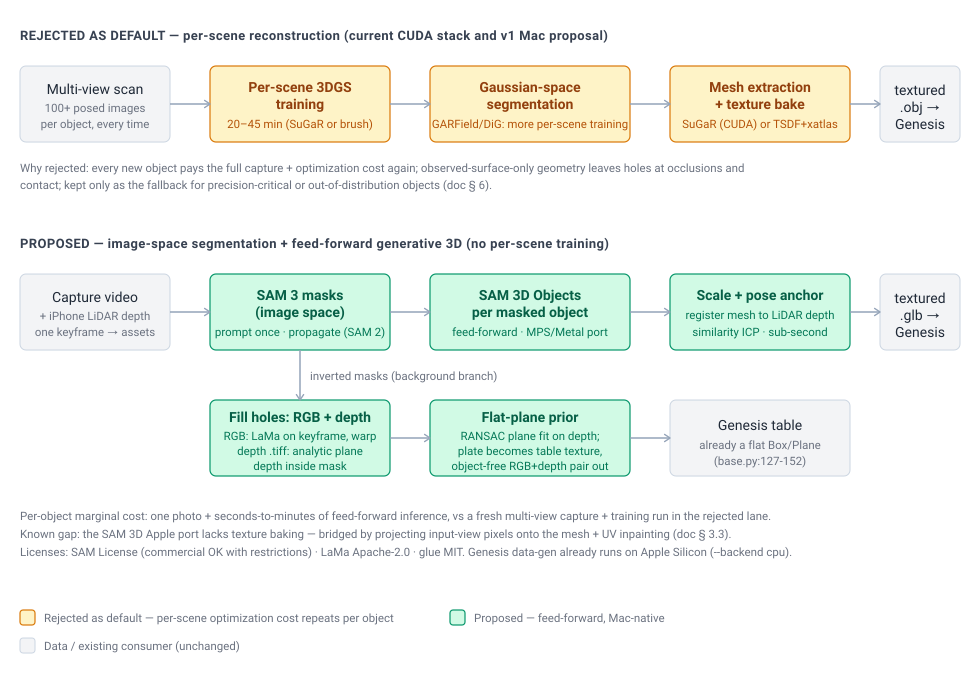
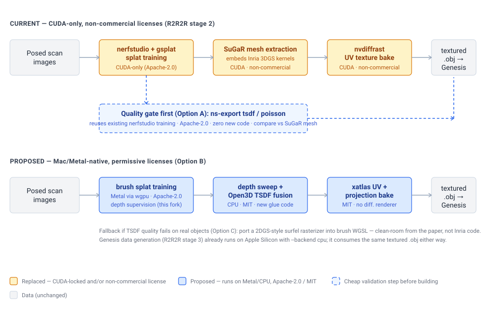

# Mac mesh pipeline v2: image-space segmentation + generative 3D (SAM 3 / SAM 3D), not per-scene gaussian reconstruction

**Status:** Draft v2 for review — supersedes the v1 reconstruction-first draft (kept in § 6 as the alternative)
**Last updated:** 2026-07-12 (addressed PR #29 review: port status re-verified against the Sam3D-Objects-MLX fork at HEAD — video pipeline, pose track, SLAT cache; tracking-boundary note vs the GARField port; § 3.2.1/§ 3.4 hardening; SAM 2.1 license row; Option C splat-mask route; `family_room` named as default test scene. Original file:line citations verified 2026-07-04)
**Goal:** Replace the CUDA-only, non-commercially-licensed "gaussian splats → textured mesh" stage of Real2Render2Real (R2R2R) with a Mac-native (Apple Silicon) path — and do it without paying a per-scene reconstruction cost for every new object.

> **TL;DR** — The v1 draft of this doc framed the problem as *"how do we reconstruct a mesh from per-scene gaussian training on a Mac."* That framing keeps the worst property of the current pipeline: every new object costs a full multi-view capture, tens of minutes of 3DGS optimization, per-scene feature-field training for segmentation in *gaussian space*, and a fragile mesh-extraction/texture-bake chain. This revision inverts it: **segment in image space** with SAM 3, reconstruct each object with **SAM 3D Objects** — a feed-forward generative model that turns one masked image into a posed, textured 3D asset in seconds-to-minutes, with a working Apple Silicon port — anchor metric scale/pose against the capture's LiDAR depth, and handle the background with **inpainting (LaMa) plus a flat-plane prior**, which is exactly the geometry Genesis already assumes for the table. Per-scene training is eliminated from the asset path entirely. The v1 reconstruction pipeline (brush → depth TSDF → xatlas bake) is retained as the fallback for objects where generative fidelity is insufficient (§ 6).

## 1. Scope and the key decision

In scope: the R2R2R **object-asset stage** — everything between "scan of a real scene" and "textured `.obj`/`.glb` per manipulated object, plus a background surface, consumed by Genesis." Out of scope: 4D trajectory tracking (DiG/GARField still serve that, separately — [garfield-port-plan.md](../garfield-port/garfield-port-plan.md), Accepted, implementation started) and IsaacLab rendering (NVIDIA-only regardless; Genesis already runs on a Mac with `--backend cpu`).

One boundary note on tracking, so this doc and the GARField port don't plan divergent stacks: the SAM 3D port's video pipeline already emits a per-frame 7-DoF pose track (`poses.json`, § 3.3) by registering the canonical mesh against every frame's pointmap — for **rigid** objects that is the same trajectory 4D-DPM extracts in R2R2R. If it validates on real captures (§ 5), rigid tasks may not need the gaussian-space tracker at all; articulated objects still do.

The decision, with the options compared:

| Option | Per-object marginal cost | Runs on Mac | License posture | Geometry character | Verdict |
|---|---|---|---|---|---|
| **A. Generative (this doc): SAM 3 masks → SAM 3D Objects → depth-anchored scale/pose; LaMa inpaint + flat plane for background** | One RGB(-D) frame; seconds–minutes of feed-forward inference | **Yes** — community MPS/Metal ports of both SAM 3 and SAM 3D (with known gaps, § 3.3) | SAM License (commercial use permitted with restrictions); LaMa Apache-2.0 | Amodally *complete* (plausible backside, watertight-ish), not metrologically measured | **Recommended** |
| **B. Reconstruction (v1 of this doc): brush 3DGS on Metal → depth TSDF → xatlas + projection bake** | Full multi-view capture + 20–45 min splat training + fusion/bake, *every object, every time* | Yes | Apache-2.0 / MIT throughout | Measured where observed; holes at occlusions/contact; thin-structure artifacts; combination unproven end-to-end | **Fallback** (§ 6) |
| **C. Status quo: SuGaR + Inria 3DGS on a CUDA box** | Same per-scene training cost as B, plus CUDA hardware | No | **Non-commercial** (Inria/MPII) | SuGaR-level | Rejected on both axes |

**Recommendation: A, with B held as the quality fallback.** A is the only option whose marginal cost per new object is a photo instead of a training run — and it also dissolves the segmentation problem (§ 3.2) and the background-geometry problem (§ 3.5) that B/C have to solve with more per-scene optimization.

## 2. Background: what this stage actually has to produce

R2R2R's data-generation consumer is narrower than "reconstruct the scene":

1. **Per manipulated object:** a textured mesh, loaded directly via `gs.morphs.Mesh` (`real2render2real/genesis_viser/base.py:131,225`). Today it expects the canonical SuGaR filename (`real2render2real/genesis_viser/configs/scene_configs/genesis_base_cfg.py:29-32`).
2. **The supporting surface:** Genesis already models it as a **flat primitive** — a `gs.morphs.Box` table (or optional table mesh) plus an optional `gs.morphs.Plane` ground (`real2render2real/genesis_viser/base.py:127-152`). Nothing downstream consumes reconstructed background geometry.

Point 2 is the license for the flat-surface prior: the sim consumer *already assumes* the background is a plane. Reconstructing tabletop geometry from gaussians — a large part of what per-scene training pays for — produces information the pipeline throws away. What the background actually needs is an object-free **appearance** (texture), which is an image inpainting problem, not a 3D reconstruction problem.

Also relevant: this R2R2R fork already dropped nvdiffrast for licensing reasons (`env_3dgs_to_mesh.sh:9-12` — intentionally not installed, PyTorch3D fallback), and this brush fork already ingests iPhone LiDAR depth (`crates/brush-dataset/src/load_depth.rs`, plus the LiDAR depth-to-TIFF conversion script landed in PR #30). So metric depth for scale anchoring (§ 3.4) is already flowing through the capture path.

## 3. The proposed pipeline

All stages feed-forward — no per-scene optimization anywhere:

### 3.1 Capture: a video sweep; one keyframe drives the asset path

The capture is a short video of the scene (the existing flow), plus the iPhone LiDAR depth that already accompanies it. The *asset* path needs only **one well-framed keyframe** from that video — object reconstruction (§ 3.3) and the background plate (§ 3.5) are single-image operations. The rest of the frames are still used: mask propagation across the video (§ 3.2) supplies per-frame masks for tracking and for background recovery, and held-out frames serve verification (§ 5) and the fallback path (§ 6).

### 3.2 Segment in image space (SAM 3), not gaussian space

SAM 3 produces per-object instance masks from text or point prompts directly on the photo. This replaces gaussian-space grouping (GARField/DiG) *for asset extraction* — and that matters because gaussian-space segmentation is not a free lookup: it requires a trained splat plus a per-scene feature-field/grouping-field optimization before you can query it. In image space the masks exist in seconds, before any 3D representation exists at all.

An Apple Silicon port exists: [`mlx-community/sam3-image`](https://huggingface.co/mlx-community/sam3-image) (MLX, text/box prompts). DiG/GARField are *not* deleted from the project — they remain the tool for 4D part tracking during demonstrations — but they exit the asset-creation critical path.

**Video: prompt once, propagate — don't re-segment per frame.** Running image segmentation independently on every frame flickers: instance identities swap and mask boundaries jitter. SAM 3 is natively a video model — one prompt on the keyframe yields *masklets* (masks with consistent instance IDs) propagated across the whole video by its memory-bank tracker. The Mac complication: the MLX port above is image-only, and upstream SAM 3 currently blocks on Triton kernels on Apple Silicon. Plan, in order:

1. **Near-term (works today):** SAM 3 image port for the *initial* text-prompted keyframe mask, then **SAM 2.1 video propagation** on PyTorch-MPS for the remaining frames. SAM 2's propagation is mature, runs on Apple Silicon, and identity consistency comes from the prompt being issued exactly once.
2. **Medium-term (only if 1 falls short):** port SAM 3's video tracker to MPS in **our own fork of the SAM 3 port** — the same replace-Triton-with-Metal exercise the Sam3D-Objects-MLX author already did for sparse conv and flash attention, so it is proven feasible, just not free.

Note the separation deliberately mirrors upstream: video mask propagation is a *segmentation-model* concern (SAM 3 / SAM 2), **not** a feature to add to the Sam3D-Objects-MLX fork. That fork's video pipeline (`main_video.py`, § 3.3) does consume every frame — per-frame pointmaps, keyframe selection, per-frame pose registration — but it **consumes** per-frame masks; it never produces them. Mask propagation stays on the segmentation side. We fork both, for different reasons (§ 3.7).

### 3.2.1 Repeated segmentation + diffusion over a video

For the "segment out of every frame and inpaint" workflow (object-free background across the whole video), the trap is running diffusion per-frame: each frame hallucinates a slightly different background and the result flickers. The flat-surface prior collapses the problem:

- **Inpaint once, warp everywhere.** The background is a plane, and a plane's appearance across camera views is an exact homography. Inpaint **one keyframe** (LaMa), then warp that single clean plate into every other frame using the known poses + fitted table plane (§ 3.5). One hallucination event → zero temporal flicker by construction. Diffusion cost is per-scene, not per-frame. Two practical caveats: the homography is exact only in **undistorted** image space — apply the COLMAP distortion model around the warp or the plate seams at its boundary — and **specular highlights** on the table are view-dependent, so the warp freezes them into the texture at one view's position. Both acceptable for a sim table texture; neither should be discovered at integration time.
- **Propagate before you generate.** If the object moves during the video, most pixels it hides at frame *t* are *observed* at some other frame — that is a lookup, not an inpainting problem. A temporal median across frames (masked pixels excluded) often recovers the clean plate outright; flow-based video inpainters (e.g. ProPainter) formalize this by propagating real pixels and generating only never-seen regions. What is truly never seen on a tabletop is usually just the object's resting footprint — small and flat, LaMa's best case.
- Per-frame full video-diffusion inpainting is the last resort: expensive, stochastic, and unnecessary when the background is planar.

Pipeline per capture: SAM 3 prompt on keyframe → masklet propagation over the video → dilate masks slightly (kill halo pixels) → temporal median / keyframe LaMa clean plate → homography-warp to all frames — and in parallel, fill each frame's depth `.tiff` inside the masks with the analytic table-plane depth (§ 3.5), so every frame ends with a consistent object-free RGB + depth pair.

### 3.3 Per-object generative reconstruction (SAM 3D Objects)

For each mask, SAM 3D Objects (Meta, Nov 2025, arXiv:2511.16624) predicts **geometry, texture, and scene layout/pose from the single image**, and is explicitly built for occlusion and clutter — it amodally completes the unseen backside and the contact region against the table, which are exactly the places multi-view reconstruction leaves holes. Checkpoints and code are public (`facebookresearch/sam-3d-objects`); it also has a multi-object mode that reconstructs the full scene layout jointly.

**The Apple port:** [`ZimengXiong/Sam3D-Objects-MLX`](https://github.com/ZimengXiong/Sam3D-Objects-MLX), consumed via the local fork (sibling clone at `~/Documents/robotics_research/Sam3D-Objects-MLX`), runs the pipeline on PyTorch-MPS with custom Metal compute kernels replacing the CUDA sparse-conv (`spconv`) and flash-attention dependencies; outputs GLB/STL. **Status re-verified 2026-07-12 against the fork at HEAD** — it has moved well past the 4-commit snapshot this doc first reviewed: a full **video pipeline** (`main_video.py`: per-frame MoGe pointmaps, temporal depth regularization, best-of-N keyframe selection via `--keyframes`, per-frame registration emitting a 7-DoF `poses.json` pose track), a `--load-slat` decode-only gate, a Metal buffer-readback **correctness** fix (garbage reads → NaN SLAT/segfaults), and Phase A2 GPU acceleration (cached conv neighbor maps, on-device sparse conv by default). The remaining honest caveat: **it does not yet support the gaussian-splat output or color/texture baking** — geometry works, textures are the gap. Mitigations, in preference order: (a) bake texture ourselves by projecting the segmented input-view pixels onto the mesh (known camera, z-buffer visibility) and inpainting the unseen UV regions — small, permissively-licensed code on top of xatlas/Open3D utilities we'd already scoped in v1; and with the video pipeline's `poses.json` the projection can draw from **every registered frame**, not just the keyframe, shrinking UV inpainting to genuinely-never-seen surface (typically the resting footprint); (b) contribute the color-bake stage to the port; (c) interim only: run the official texture stage on a CUDA box (license-clean, unlike SuGaR).

Findings from the local clone that shape the integration (§ 3.7):

- It is a **proper installable package**, not a script pile: `pyproject.toml` builds a `sam3d_objects` wheel (hatchling), and `main.py` is a thin CLI over an importable `InferencePipelineLowMemory` class (`main.py:137-205`) — so R2R2R can eventually hold the pipeline resident in-process instead of shelling out.
- **Latent caching:** `--cache-dir` caches intermediate SLAT outputs so stages 0–2 skip on re-runs of the same image/mask — useful when iterating on diffusion steps (`--steps`, default 12) or mesh simplification for one scene.
- **Metal specifics:** custom Metal compute shaders for sparse convolution and flash attention via PyObjC (`sam3d_objects/model/backbone/tdfy_dit/modules/sparse/`), selected by `SPARSE_BACKEND=metal` / `SPARSE_ATTN_BACKEND=metal_fa`, plus `PYTORCH_MPS_HIGH_WATERMARK_RATIO=0.0`; models load sequentially to fit ~48 GB RAM.
- **Heavy build-time deps:** `pytorch3d` and `MoGe` (pinned commit) install from git — the pytorch3d source build is the slow/fragile install step (the port pre-configures uv `extra-build-dependencies` for it).
- **Fork-worthy nits:** `main_video.py` exposes `--config` (default `checkpoints/hf/pipeline.yaml`) but `main.py` still pins it, and checkpoints are a manual Hugging Face download. Both argue for pinning our own fork (§ 3.7) — which already exists (the sibling clone is the `connorsoohoo` fork, `upstream` remote retained) — rather than tracking upstream. Remaining patch list: `main.py --config` parity, HF checkpoint auto-download, the color-bake stage (§ 3.3 mitigation b).

### 3.4 Metric scale and pose anchoring

A single-image generative reconstruction is scale-ambiguous and lives in the model's canonical frame. Anchor it with data the capture already has: back-project the LiDAR depth inside the object's mask into a metric point cloud, then solve the similarity transform (scale + rotation + translation) registering the SAM 3D mesh to it — standard ICP-with-scale over a few thousand points, CPU, sub-second. Sanity constraints: object rests on the detected table plane; mask silhouette re-projects correctly. SAM 3D's own layout estimate provides the initialization.

Two hardening details: **erode the mask** before back-projection — silhouette-straddling pixels hit background depth and skew the registration (GARField's datamanager applies a 3×3 erosion for exactly this reason) — and remember iPhone LiDAR is native **256×192** upsampled, so a small object's mask may contain only dozens of genuine samples. Use the **median ratio of LiDAR depth to the pipeline's own MoGe pointmap** inside the eroded mask as the scale initializer and sanity bound for ICP. Where LiDAR coverage inside the mask is poor (shiny/dark objects), the DA3 fork's float32 TIFF depth export provides a denser second depth source for the same frames.

### 3.5 Background: inpainting + flat-surface prior

Split appearance from geometry:

- **Geometry:** a plane. Fit the dominant plane to the LiDAR depth (RANSAC) to get table height and extent; Genesis consumes this as its existing `Box`/`Plane` table (§ 2). No 3D inference at all — this *is* the strong prior, and it is exactly correct for tabletop manipulation scenes.
- **Appearance:** inpaint the object pixels out of the frame to get a clean, object-free background plate, then use it as the table texture. Default tool: **LaMa** (Apache-2.0, fast on CPU/MPS, and its characteristically *smooth* fills are a feature here — a flat surface wants low-frequency completion, and smooth inpainting avoids hallucinated texture detail that would never be multi-view-consistent). Escape hatch for very large masked regions: a diffusion inpainter (e.g. Stable Diffusion inpainting on MPS) prompted toward flat-surface continuation — more powerful prior, heavier and stochastic, so it is the exception not the default.

- **Depth, not just RGB.** Removing the object leaves a hole in **two** modalities: the RGB frame *and* the LiDAR depth `.tiff` that rides alongside it (the pair this fork's tooling produces and consumes — `crates/brush-dataset/src/load_depth.rs`, PR #30). If only the RGB is inpainted, the depth map still contains the object's surface, and every downstream consumer of the pair — plane fitting, scale-anchoring sanity checks, brush depth supervision on the fallback path — sees a contradiction. The fix is cheaper than the RGB side: inside the mask the true depth *is the table plane*, so fill the masked depth pixels **analytically** with the fitted plane's depth along each pixel ray (§ geometry bullet above). No generative model, deterministic, exact under the flat-surface prior. The same fill also patches the LiDAR sensor's own dropouts (shiny/dark spots) wherever they fall on the table region. Output of this stage is therefore a consistent **object-free RGB + depth pair**, not an RGB plate alone.

The inpainting runs **once per scene, on the keyframe** — per-frame backgrounds across the capture video come from warping this single plate (§ 3.2.1), never from re-running the inpainter. Per-frame *depth* fills don't even need the warp: the plane equation evaluates analytically in every frame's camera.

### 3.6 Export and integration

Write each anchored object as `.glb`/`.obj` into the existing `outputs/<task>/...` layout and generalize the hard-coded SuGaR filename expectation (`genesis_base_cfg.py:29-32`) to accept the new assets. Genesis-side changes are limited to that config seam.

### 3.7 Vendoring the ports into R2R2R

R2R2R already has two dependency conventions; the SAM 3D port fits the second:

1. **`dependencies/` git submodules** — pinned user forks installed editable by per-stage env scripts (`.gitmodules`: `rsrd`, `SuGaR`, `openpi`, `tinydp`, `trajgen`).
2. **Sibling checkout + env-var override** — how `env_data_gen.sh` handles Genesis: resolve `GENESIS_DIR="${GENESIS_DIR:-../Genesis}"` relative to the repo, validate it exists, `uv pip install -e` from the local fork (`env_data_gen.sh:28-36`).

The plan, following the Genesis precedent:

- **Fork first, then pin — the fork already exists** (`connorsoohoo/Sam3D-Objects-MLX`, the sibling clone, with the `upstream` remote retained), and we need patches regardless: `main.py --config` parity, HF checkpoint auto-download, and eventually the color-bake stage (§ 3.3 mitigation b). Keep the existing sibling-checkout layout (`robotics_research/Sam3D-Objects-MLX`) with a `SAM3D_DIR` override, or add it as `dependencies/sam3d-objects-mlx` if submodule pinning is preferred. **One fork per model:** the SAM 3 segmentation port (and any future video-tracker port, § 3.2 step 2) is a *separate* fork — video propagation is a segmentation concern and does not belong in the 3D-reconstruction repo.
- **New stage script `env_asset_gen.sh`** — the successor to `env_3dgs_to_mesh.sh`, mirroring `env_data_gen.sh`'s structure: `set -e`; resolve and validate `SAM3D_DIR`; `uv venv --python 3.11` (the port needs ≥ 3.11 while R2R2R pins < 3.12 — a separate per-stage venv is already the repo convention); `uv pip install -e "$SAM3D_DIR"`; `hf download facebook/sam-3d-objects --local-dir "$SAM3D_DIR/checkpoints/hf"` (requires accepting the SAM License on Hugging Face once); export `SPARSE_BACKEND=metal`, `SPARSE_ATTN_BACKEND=metal_fa`, `PYTORCH_MPS_HIGH_WATERMARK_RATIO=0.0`.
- **Integrate at the CLI seam first, the Python seam second.** Step one: the asset stage shells out to `uv run python main.py --image <keyframe> --mask-dir <sam3-masks> --mesh --output outputs/<task>/<object>.glb` — lowest coupling, the same black-box treatment `env_3dgs_to_mesh.sh` gave SuGaR. Step two, when batching many objects per scene matters: import `InferencePipelineLowMemory` from the installed `sam3d_objects` package and keep it resident across objects (weights load once; construction shown in `main.py:179-205`), with `--cache-dir` latent caching on top.
- **Expected install friction**, documented in the script the way `env_data_gen.sh` documents its jax pinning: the pytorch3d-from-git source build (long compile, needs Xcode CLT) and the pinned MoGe commit.

## 4. Licensing

| Component | License | Commercial use |
|---|---|---|
| SAM 3 / SAM 3D Objects (code + checkpoints) | **SAM License** (Meta) | **Yes, with restrictions** — no military/weapons use, trade-control compliance, no reverse-engineering, patent-retaliation clause; redistribution must carry the license |
| Sam3D-Objects-MLX port / mlx-community SAM 3 port | Port code permissive; weights inherit SAM License | Same as above |
| SAM 2.1 (video mask propagation, § 3.2 step 1) | **Apache-2.0** (code *and* checkpoints) | Yes — the least-encumbered model in the stack; the whole video-propagation leg is unrestricted |
| LaMa | Apache-2.0 | Yes |
| Open3D / xatlas (texture-bake glue, § 3.3a) | MIT | Yes |
| brush (fallback path, verifier) | Apache-2.0 | Yes |
| SuGaR + Inria 3DGS + nvdiffrast (replaced) | Non-commercial (Inria/MPII, NVIDIA) | **No** |

The SAM License is a real improvement over the Inria non-commercial license but it is **not** Apache-2.0 — if a future commercial posture requires fully unencumbered weights, that is a risk to track (§ 7), and the v1 Apache/MIT-only fallback (§ 6) is the hedge.

## 5. Verification plan

**Default test scene: `splats/family_room`** — 168 COLMAP-posed frames, per-frame LiDAR depth + confidence, DA3 depth TIFFs (`da3_dense_raw/`), and two trained splats already on disk. It exercises steps 2, 4, 5, and 6 with zero new capture, and its trained splat doubles as the § 6 ground-truth novel-view reference. (Step 1's SuGaR side-by-side still needs a legacy scan that has one.)

1. **Geometry bake-off (no new code):** run `Sam3D-Objects-MLX` on one frame of an existing scan that already has a SuGaR mesh → verify: side-by-side in the Genesis viewer against the SuGaR asset — silhouette accuracy, backside plausibility, watertightness for collision.
2. **Scale anchoring:** register that mesh to the scan's LiDAR depth → verify: dimensional error vs caliper/known-object measurements within a few percent; object rests on the fitted table plane in Genesis without penetration.
3. **Texture:** input-view projection bake + UV inpaint → verify: textured `.glb` loads via `gs.morphs.Mesh` and renders comparably to the SuGaR asset in a smoke-test rollout.
4. **Background (RGB + depth):** LaMa-inpainted plate applied to the Genesis table → verify: rendered frames show no object ghosting or seam at the object's former footprint; and the paired depth `.tiff` is filled with plane depth inside the former mask → verify: no object residue (depth inside the mask deviates from the fitted plane by less than sensor noise).
5. **Video masks:** SAM 3 keyframe prompt + SAM 2.1 propagation over a full capture video on MPS → verify: instance IDs stable across all frames, no identity swaps; mask IoU against a handful of hand-checked frames.
6. **Video background:** homography-warped keyframe plate across the video → verify: no temporal flicker (frame-to-frame plate difference near zero in background regions) and no seams where the warp meets unmasked pixels.
7. **End-to-end:** new object, one capture, zero CUDA, Mac only → verify: asset generated and consumed by a Genesis data-gen run; wall-clock minutes, not hours.

## 6. Alternative considered (v1 of this doc): per-scene reconstruction — and why not

The previous revision of this doc recommended a phased reconstruction pipeline, preserved here at high level as the fallback (v1 diagram kept as-is below):

- **v1-A:** nerfstudio `ns-export` TSDF/Poisson on the existing CUDA training stack — zero new code, Apache-2.0, as a quality gate.
- **v1-B (main path):** brush splat training on Metal (this repo — Apache-2.0, depth-supervised, per-pixel depth rendering already in place) → depth-map sweep → Open3D TSDF fusion → xatlas UV unwrap → projection texture bake.
- **v1-C (insurance):** clean-room port of a 2DGS-style surfel rasterizer into brush's WGSL kernels for best-in-class surface geometry.

This remains technically sound, fully Mac-native, and Apache/MIT-clean — brush's depth supervision and Metal hardening make it credible. **We are not doing it as the default path because:**

1. **It pays a per-scene training tax on every object, forever.** Each new asset needs a full multi-view capture (a minute-plus of video, 100+ posed frames) and a 20–45-minute 3DGS optimization before mesh extraction even starts. SAM 3D amortized that optimization into Meta's training run; inference is seconds-to-minutes per object from one photo. For a pipeline whose purpose is scaling asset creation, the marginal-cost difference dominates every other consideration.
2. **Segmentation in gaussian space needs *more* per-scene training.** Grouping gaussians (GARField/DiG-style feature fields) requires optimizing a per-scene feature field on top of the splat before any object can be isolated. Image-space SAM 3 masks cost seconds and no training.
3. **Reconstruction only recovers observed surfaces.** Occluded backsides and the object–table contact patch come out as holes exactly where sim needs closed collision geometry; TSDF fusion also struggles on thin structures. SAM 3D's amodal completion targets precisely this failure mode.
4. **The combination was unproven.** v1's own honest flag: no public end-to-end 3DGS → textured mesh pipeline exists natively on Mac; brush-depth → TSDF → bake quality on our objects was a bet gated on an experiment. SAM 3D's single-image reconstruction quality is at least as uncertain per object — but it is testable in an afternoon *without building anything* (§ 5.1), whereas v1-B required building the pipeline to evaluate it.
5. **Most of what per-scene reconstruction computes is discarded.** Genesis wants per-object meshes plus a flat table (§ 2); reconstructing the full scene's radiance field to then carve objects out of it is the long way around.

**When the fallback is the right tool:** objects where generative fidelity fails (unusual shapes far from SAM 3D's training distribution, precision-critical geometry where hallucinated surfaces are unacceptable), scenes needing measured multi-object layout beyond what depth anchoring provides, or a future requirement for fully Apache/MIT-licensed weights. brush also keeps a second role regardless: a splat trained from the same capture is the ground-truth novel-view reference for *verifying* generated assets (§ 5.1's viewer comparison).

## 7. Risks and open questions

- **Generative geometry is plausible, not measured.** Backside and contact surfaces are hallucinated. Likely fine for rigid household-object manipulation; a real risk for precision grasps or tight tolerances — those objects route to the fallback (§ 6).
- **SAM License is not Apache-2.0.** Commercial use is permitted with restrictions (§ 4), but weights are encumbered; track against future licensing posture.
- **Port maturity.** Both Apple ports are community efforts weeks old; the SAM 3D port's missing texture bake is the single biggest integration gap (mitigation in § 3.3). Budget for contributing fixes upstream — and pin our own forks (§ 3.7) so upstream churn can't break the stage.
- **Video mask propagation on Mac is not settled.** SAM 3's video tracker blocks on Triton on Apple Silicon; the near-term SAM 3-prompt + SAM 2-propagate hybrid (§ 3.2) is believed workable but unbenchmarked on our captures, and the medium-term own-fork Metal port of SAM 3 video is real (if precedented) kernel work. A third route exists for captures that get splatted anyway (fallback/verification path): **training-free mask lifting on the splat** (FlashSplat/LBG — Option C in [garfield-port-plan.md](../garfield-port/garfield-port-plan.md)), then rendering the labeled object through the known cameras with an alpha threshold (the R2R2R `dig_pipeline.save_rendered_images` pattern) — per-frame masks that are **3D-consistent by construction**: no propagation, no identity swaps, occlusion-correct.
- **Scale-anchoring accuracy** depends on LiDAR depth quality inside the mask (shiny/dark objects degrade iPhone LiDAR). Sanity constraints in § 3.4 catch gross failures; fallback path catches the rest.
- **SAM 3D fidelity on our specific objects** is unvalidated — but § 5.1 answers it with zero code written, which was the same posture v1 took toward TSDF quality, at lower cost.
- **Multi-object contact scenes** (stacked/nested objects) stress both the amodal completion and the layout estimate; needs a test scan in § 5.

## 8. Glossary

- **SAM 3 (Segment Anything Model 3)** — Meta's promptable image/video segmentation model (text, point, or box prompts → instance masks). Used here for image-space object masks; the MLX port runs on Apple Silicon but is image-only.
- **SAM 2 / masklet / memory bank** — SAM 3's predecessor, whose video mode tracks a prompted mask across frames ("masklet" = one instance's mask sequence) using a memory bank of past-frame features. The near-term Mac route for video mask propagation (§ 3.2).
- **Clean plate** — an object-free image of the background; here produced once per scene by inpainting the keyframe (or temporal median across the video) and reused everywhere.
- **Homography warp** — the exact image-to-image mapping of a *plane* between two camera views; because the table is planar, one inpainted plate warps into every frame with no per-frame generation (§ 3.2.1).
- **ProPainter** — flow-based video inpainter that propagates real pixels from frames where a region is visible and generates only never-seen content; the middle option between plate-warping and full video diffusion.
- **SAM 3D Objects** — Meta's feed-forward generative model (Nov 2025): single image + object mask → 3D geometry, texture, and pose/layout. The core of the proposed pipeline. Distinct from SAM 3 (2D masks) and from SAM 3D Body (human mesh recovery).
- **Amodal completion** — inferring the full shape of a partially visible object, including occluded and unobserved regions; what generative reconstruction provides and multi-view reconstruction cannot.
- **Feed-forward vs per-scene optimization** — a feed-forward model produces output in one inference pass from amortized offline training; per-scene optimization (3DGS, NeRF, feature fields) re-runs gradient descent for every new scene. The central axis of this doc's decision.
- **Image-space vs gaussian-space segmentation** — masking pixels in a photo (SAM) vs grouping primitives of a trained 3D splat (GARField/DiG); the latter requires per-scene training before any query.
- **LaMa** — Apache-2.0 large-mask inpainting model (Fourier convolutions); fills removed-object regions with smooth, low-frequency content — well-suited to flat surfaces.
- **Flat-surface prior** — the assumption that the scene background is a plane; here not an approximation but the sim consumer's actual model (Genesis `Box`/`Plane` table).
- **LiDAR depth / scale anchoring** — iPhone LiDAR gives metric depth; registering a scale-ambiguous generated mesh to that depth (similarity-transform ICP) recovers real-world size and pose.
- **DA3 (Depth Anything 3)** — ByteDance's any-view depth/pose model; the local fork adds MPS support and float32 TIFF depth export, providing a dense secondary depth source alongside iPhone LiDAR (§ 3.4).
- **3DGS (3D Gaussian Splatting)** — per-scene scene representation of anisotropic gaussians trained from posed photos; the basis of the fallback path and of 4D tracking, no longer of asset creation.
- **brush** — this repo: Rust/Burn/wgpu 3DGS trainer, Apache-2.0, Metal-native. Roles here: fallback reconstruction path and verification renders.
- **TSDF fusion** — volumetric integration of per-view depth maps into a signed-distance grid, meshed by marching cubes; the v1 fallback's mesh extractor.
- **SuGaR / Inria 3DGS / nvdiffrast** — the CUDA-only, non-commercially-licensed mesh stack being replaced.
- **DiG / GARField** — DINO-embedded Gaussians / scale-conditioned gaussian grouping; retained for 4D part tracking, removed from the asset path.
- **R2R2R (Real2Render2Real)** — Berkeley pipeline (CoRL 2025) that scans real objects, meshes them, and replays tracked trajectories in sim (Genesis here) to generate robot training data.
- **Genesis** — physics/rendering engine consuming the assets; runs on Apple Silicon (`--backend cpu`); models the table as a flat primitive.
- **MPS / MLX** — Apple's Metal Performance Shaders (PyTorch's Metal backend) and Apple's ML array framework; the two routes by which the ports run on Apple Silicon.
- **xatlas / Open3D** — MIT-licensed UV-unwrap library and 3D-processing library; used in the texture-bake glue and the fallback path.

## 9. Sources & references

Verified locally (2026-07-04):
- R2R2R repo: `/Users/connorsoohoo/Documents/robotics_research/real2render2real` — `real2render2real/genesis_viser/base.py:127-152` (flat Box/Plane table, `gs.morphs.Mesh` at :131,:225), `real2render2real/genesis_viser/configs/scene_configs/genesis_base_cfg.py:29-32` (SuGaR filename expectation), `env_3dgs_to_mesh.sh:9-12` (nvdiffrast already dropped), `.gitmodules` (dependencies/ submodule-fork pattern), `env_data_gen.sh:28-36` (Genesis sibling-checkout + `GENESIS_DIR` override pattern mirrored by § 3.7).
- brush worktree (this repo) — `crates/brush-dataset/src/load_depth.rs` (LiDAR depth ingestion); LiDAR depth-to-TIFF script (PR #30).
- SAM 3D MLX/MPS port cloned at `~/Documents/robotics_research/Sam3D-Objects-MLX` (4 commits; GLB/STL out; no texture bake yet) — `pyproject.toml` (hatchling `sam3d_objects` wheel; pytorch3d + pinned-MoGe git deps; Python ≥ 3.11), `main.py:137-205` (CLI over importable `InferencePipelineLowMemory`, `--cache-dir` SLAT caching, hard-coded `checkpoints/hf/pipeline.yaml` at :182), Metal kernels under `sam3d_objects/model/backbone/tdfy_dit/modules/sparse/`.

External (fetched 2026-07-04):
- SAM 3D Objects — repo <https://github.com/facebookresearch/sam-3d-objects> · paper "SAM 3D: 3Dfy Anything in Images" <https://arxiv.org/abs/2511.16624> · Meta blog <https://ai.meta.com/blog/sam-3d/> · checkpoints <https://huggingface.co/facebook/sam-3d-objects> (released 2025-11-19)
- SAM License terms — <https://github.com/facebookresearch/sam-3d-objects/blob/main/LICENSE> (commercial use permitted; military/trade-control/reverse-engineering restrictions; patent-retaliation clause)
- Apple Silicon ports — SAM 3D: <https://github.com/ZimengXiong/Sam3D-Objects-MLX> (PyTorch-MPS + custom Metal kernels) · SAM 3: <https://huggingface.co/mlx-community/sam3-image>; note upstream SAM 3 blocks on Triton on Apple Silicon (<https://huggingface.co/facebook/sam3/discussions/11>) and upstream SAM 3D has an open MLX-support issue (facebookresearch/sam-3d-objects#32) — the community ports are currently the only Mac route
- SAM 2 (video mask propagation, near-term Mac route in § 3.2) — <https://github.com/facebookresearch/sam2>
- LaMa inpainting — <https://github.com/advimman/lama> (Apache-2.0, WACV 2022) · ProPainter (flow-based video inpainting) — <https://github.com/sczhou/ProPainter>
- Real2Render2Real — <https://real2render2real.com>, arXiv:2505.09601 · brush — <https://github.com/ArthurBrussee/brush> · Genesis — consumed via this fork
- v1 (superseded) references for the fallback path — SuGaR <https://github.com/Anttwo/SuGaR>, Inria 3DGS + license <https://github.com/graphdeco-inria/gaussian-splatting>, nvdiffrast <https://nvlabs.github.io/nvdiffrast/>, 2DGS <https://github.com/hbb1/2d-gaussian-splatting>, Open3D <https://www.open3d.org>, xatlas <https://github.com/jpcy/xatlas>, DN-Splatter (WACV 2025), AGS-Mesh (arXiv:2411.19271)

Caveats carried from research: SAM 3D inference-speed characterization ("seconds-to-minutes") is from Meta's positioning and community reports, not benchmarked here; the MLX port's output quality vs the official CUDA pipeline is unbenchmarked; both § 5.1 items. Note the fork's SLAT latent cache + `--load-slat` make post-first-run iteration decode-only (seconds), so the § 5 loops should not be budgeted as if every parameter tweak repays full diffusion.
