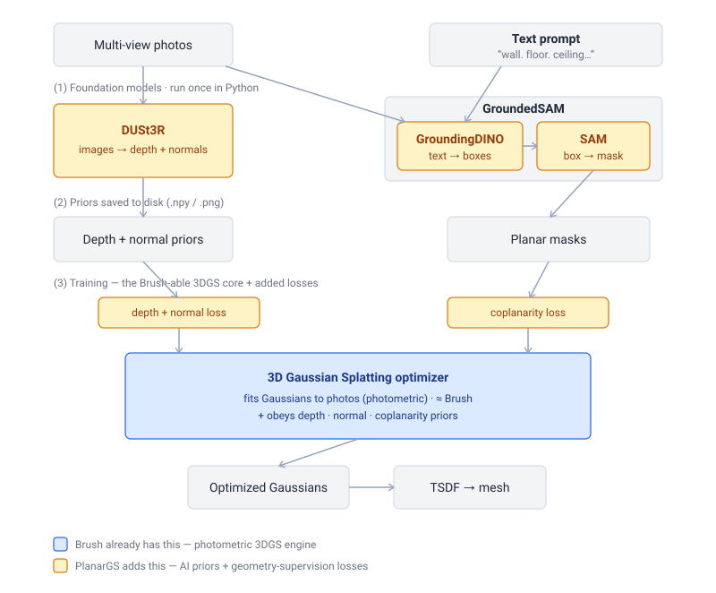

# Porting PlanarGS into Brush — Working Document

**Status:** Draft / planning
**Last updated:** 2026-06-23
**Goal:** Reproduce PlanarGS (NeurIPS 2025) indoor surface reconstruction on top of the Brush
Rust/WebGPU engine, instead of the original Python + CUDA stack.

> This is a living document. Effort numbers are estimates for **one strong engineer**
> comfortable with Rust, GPU kernels (WGSL / CubeCL / `burn`), and 3D Gaussian Splatting.
> Ranges are wide on purpose; the integration/parity work is the real unknown.
>
> ⚠️ **License gate:** the PGSR code this port draws from is **non-commercial** (Inria license);
> "internal use / not selling it" does **not** clear it. Read
> [§2 License & provenance](#2-license--provenance) before writing any code.
>
> **Sources:** all claims are backed by file:line citations and upstream URLs in
> [§13 Sources & references](#13-sources--references), derived from the local `../PlanarGS` and
> `brush` checkouts on 2026-06-23.

---

## 1. The one decision that drives everything

PlanarGS has three subsystems. Two of them are a great fit for Brush. The third is a trap.

1. **Trainer / renderer** — 3DGS optimization + PGSR geometric outputs. *Brush already does ~80% of this.*
2. **Planar + geometric regularization** — the actual PlanarGS novelty (plane-fit losses, prior losses, planar-guided densification). ~600 LOC of mostly linear algebra.
3. **Foundation-model preprocessing** — DUSt3R (geometric priors) and GroundedSAM = GroundingDINO + SAM (planar masks). Huge pretrained ViT models.

**Decision: do the foundation models (subsystem 3) also have to be Rust?**

| Scope | What you port | Estimate |
|---|---|---|
| **A (recommended)** | Subsystems 1 + 2. Keep 3 in Python as a one-time preprocessing step that writes priors to disk. | **~2–3 months** |
| B | A + reimplement DUSt3R + GroundingDINO + SAM in Rust (candle/burn) with weight loading. | **+6–12 months** |
| C | B + eval/TSDF/LPIPS fully in Rust. | B + ~1–2 months |

**This document plans Scope A.** Rationale: priors are computed once per scene (~1 hr) and
cached; there is almost no runtime benefit to having the foundation models in Rust, and porting
them is the highest-risk, lowest-reward work in the project (numerical-match risk, weight loading,
multi-month ViT/DETR ports). Revisit B only if a pure-Rust, dependency-free pipeline is a hard
product requirement.

---

## 2. License & provenance

**Resolve before any code — this is a gate, not a footnote.** The PGSR rasterizer math this port
draws from is under a **non-commercial** license, and "we're an internal tool / we don't sell it"
does **not** clear it. Settle the use-case question below during M0, before writing kernels.

### What each piece is licensed under

| Component | License | Implication |
|---|---|---|
| **Brush itself** | Apache-2.0 (`brush/Cargo.toml`, `brush/LICENSE`) | ✅ Permissive. Stock Brush is fine for any use — internal, commercial, distributed. |
| **`diff-plane-rasterization`** (the PGSR kernel you port from) | **Inria/MPII "Gaussian-Splatting License"** — research/eval **only** | ❌ Non-commercial. This is the constraint you inherit. (`../PlanarGS/submodules/diff-plane-rasterization/LICENSE.md`) |
| **PlanarGS Python** (`train.py`, `render.py`, `gaussian_renderer/`, `common_utils/graphics_utils.py`) | per-file **Inria GRAPHDECO** "non-commercial, research and evaluation" headers — *despite* the repo's MIT `LICENSE` | ⚠️ Internally contradictory; the restrictive per-file header likely controls those files. Confirm with the authors. |
| **DUSt3R** (geometric priors) | believed **non-commercial (CC BY-NC-SA) — VERIFY** | ⚠️ Would constrain even the Python preprocessing, not just the port. |
| **SAM**, **GroundingDINO** | Apache-2.0 | ✅ Fine. |

### Why "internal / not selling" is not a safe harbor

The Inria license restricts **use by purpose**, not distribution (clause numbers below are the
*license's* clauses, not this doc's sections):
- **License clause 5:** "THE USER CANNOT **USE**, EXPLOIT OR DISTRIBUTE THE SOFTWARE FOR COMMERCIAL
  PURPOSES WITHOUT PRIOR AND EXPLICIT CONSENT OF LICENSORS."
- **License clause 3:** the grant is "for **research and/or evaluation purposes only**" (open to
  "academic and industrial" research users).

It is an *allowlist* (research + evaluation), not "everything except sale." An internal production
tool that never leaves the building can still be "use for commercial purposes."

| Your use case | Likely status |
|---|---|
| Personal / academic / non-profit research | ✅ permitted |
| For-profit **evaluating / prototyping / benchmarking** the method | ✅ contemplated ("industrial research user") |
| For-profit **operational/production tool** whose outputs feed the business | ❌ commercial use — even with no sale or distribution |

The line is **purpose**, not distribution. Genuine R&D at a for-profit is contemplated by the
license's clause 3; it tips over when the tool starts supporting revenue/operations.

### Mitigation options (choose based on the use case above)

1. **Clean-room reimplementation (recommended if there is *any* commercial/operational intent).**
   Implement the PGSR depth/normal/gradient math in WGSL **from the equations in the PGSR / PlanarGS
   papers**, not by translating the `.cu`/`.py` files. Algorithms and math are not copyrightable;
   specific source code is. This keeps the result clean under Brush's Apache-2.0.
   *Caveat: this addresses copyright only, not patents — 3DGS is not known to be patent-encumbered,
   but that is not a guarantee.*
2. **Commercial license from Inria.** The license names a contact: `stip-sophia.transfert@inria.fr`.
   Inria does grant commercial licenses for 3DGS; lead time can be weeks.
3. **Stay research/eval-only.** A faithful port is within the grant *if* the tool is genuinely for
   research/evaluation — document that scope and don't let it drift into operations.
4. **Replace the non-commercial priors.** DUSt3R's NC license is independent of the rasterizer; for
   commercial use, swap to a permissively- or commercially-licensed depth/normal prior source.

### Rollout & mitigation plan (M0 — before writing kernels)

- [ ] **Confirm the end use** (research/eval vs. operational) with the stakeholder/counsel. This one
      answer determines whether clean-room is mandatory. *(owner: project lead)*
- [ ] **Verify DUSt3R + CroCo backbone licenses.** If NC and the use is commercial, plan a prior
      replacement (option 4). *(owner: ___)*
- [ ] **Resolve the PlanarGS MIT-vs-Inria-header conflict** — email the PlanarGS authors
      (SJTU-ViSYS) to confirm which license governs their Python files. *(owner: ___)*
- [ ] **Choose the porting mode** and record it here: *faithful translation* (research/eval only)
      **or** *clean-room from papers* (commercial-safe).
- [ ] **If clean-room → set up a provenance firewall:** the engineer writing the WGSL works from the
      papers + this doc's equations, **not** with the `.cu` files open. Keep commit notes showing
      independent derivation; do not copy comments, identifiers, or file structure.
- [ ] **If faithful translation + commercial → open the Inria license conversation early** (option 2).
- [ ] **Add a `NOTICE`/provenance header** to the new code stating its origin (clean-room from papers,
      or Inria research-only) so downstream users aren't misled.
- [ ] **Gate the merge:** do **not** merge ported kernels into the Apache-2.0 Brush tree until the mode
      is chosen and (for faithful translation) licensing is cleared — otherwise you risk contaminating
      Brush's permissive license.

> **Not legal advice.** "Commercial purposes" is fact- and jurisdiction-specific; for anything you
> rely on, confirm with counsel or Inria directly. This section is engineering risk-management, not a
> legal opinion.

---

## 3. TL;DR

- **Brush is, in effect, the hardest core of PlanarGS already written in Rust.** Forking it turns
  a ~1–2 person-year from-scratch port into a ~1 quarter project.
- The custom CUDA rasterizer `diff-plane-rasterization` is **~97% vanilla 3DGS** (which Brush has)
  and **~3% (~71 LOC) genuinely PGSR-specific**. That 3% is the crux of the port.
- The PlanarGS novelty (planar/geo priors + losses) is small, classical-math code — easy to port.
- Keep DUSt3R and GroundedSAM in Python. Define a **prior file contract** on disk (§9) so the Rust
  trainer never imports a neural net.
- **But first clear the license gate (§2)** — the math you port is non-commercial; internal use does
  not exempt you.

---

## 4. Background: the two codebases

### PlanarGS (`../PlanarGS`)
- Python (~5,245 project LOC) + CUDA. Built on 3DGS + **PGSR** (plane-based geometry).
- Renders not just RGB but **normal map, unbiased ray-plane depth, distance map**, plus an
  **abs-gradient** densification signal and a per-Gaussian **observation count**.
- Regularizes training with **planar priors** (segmentation masks → coplanarity loss) and
  **geometric priors** (DUSt3R depth + normal).
- Outputs a **mesh** via TSDF fusion (Open3D) and evaluates with Chamfer / F-score / ICP.
- NVIDIA/CUDA only.

### Brush (this repo)
- Pure Rust (edition 2024, v0.3.0), ~30k LOC, 19 crates under `crates/` + apps. `burn` (tensor +
  autodiff, git `main`), `wgpu` 29 / WebGPU, CubeCL → WGSL kernels, `egui` 0.34.3 viewer.
  Source: `Cargo.toml`; upstream `https://github.com/ArthurBrussee/brush`.
- Vanilla 3DGS + Mip-Splatting + MCMC-style training. Full forward **and** backward rasterization
  in CubeCL, GPU radix sort, densification, COLMAP + Nerfstudio loading, PLY export.
- Cross-platform: macOS / Windows / Linux / Android / Web (WASM). Runs on AMD/Intel/NVIDIA.
- Has a finite-difference gradient-validation harness (`brush-bench-test`) — **use this constantly**
  during the rasterizer port.

### Architecture at a glance

How the foundation models relate to the 3DGS core, and what Brush already has (blue) vs what
PlanarGS adds (amber). The model/term names are defined in [§14 Glossary](#14-glossary).



*DUSt3R and GroundedSAM run **once** in Python and emit prior files (depth, normals, planar masks);
the 3DGS optimizer — essentially Brush — then trains on the photos while **obeying** those priors.
Brush ≈ the blue core only; PlanarGS = the blue core + the amber additions.*

---

## 5. Gap analysis — what Brush is missing for PlanarGS

| PlanarGS needs | In Brush today? | Work |
|---|---|---|
| Vanilla 3DGS fwd/bwd rasterization | ✅ yes | reuse |
| Training loop, Adam, densify/prune, SH | ✅ yes | reuse |
| COLMAP loading, PLY export | ✅ yes | reuse (extend reader) |
| **Per-pixel normal + unbiased plane-depth + distance render** | ⚠️ partial? (`render_aux.rs` exists) | **investigate, then extend** |
| **Abs-gradient densification signal** (`means2D_abs`) | ❌ no | add to bwd kernel + stats |
| **Per-Gaussian observation count** (`out_observe`) | ❌ no | add to fwd kernel |
| **Planar coplanarity loss** (`co_planar`, per-segment least squares) | ❌ no | new |
| **Depth/normal prior losses** | ❌ no | new (extend loss crate) |
| **Planar-guided init densification** (`plane_initdensify`) | ❌ no | new |
| **Prior + mask loading** (depth/normal/conf/mask files) | ❌ no | new (extend dataset crate) |
| **TSDF mesh extraction + cleanup** | ❌ no (exports splats) | new, or keep in Python |
| **Mesh eval** (Chamfer/F-score/ICP) | ❌ no | new, or keep in Python |

> **Investigate first:** `crates/brush-render/src/render_aux.rs` and `render.rs` may already emit
> depth/alpha/normal auxiliaries. If so, the PGSR fwd extension shrinks substantially. Confirm before
> sizing M1.

---

## 6. Component → crate mapping

Where each piece of PlanarGS lands in Brush:

| PlanarGS source | Brush target |
|---|---|
| `submodules/diff-plane-rasterization` (fwd geo outputs) | `crates/brush-render/src/kernels/rasterize.rs`, `render.rs`, `render_aux.rs` |
| `diff-plane-rasterization` (bwd geo + abs-grad) | `crates/brush-render-bwd/src/kernels/rasterize_backwards.rs`, `render_bwd.rs` |
| Custom-op wiring for new outputs | `crates/brush-render/src/burn_glue.rs`, `crates/brush-render-bwd/src/burn_glue.rs` |
| `train.py` loss assembly | `crates/brush-train/src/train.rs` |
| `common_utils/loss_utils.py`, `planar/co_planar.py` | `crates/brush-loss/src/lib.rs` (+ a new `planar.rs`) |
| densification stats (incl. abs grad) | `crates/brush-train/src/stats.rs` |
| `gaussian_model.plane_initdensify` | `crates/brush-train/src/splat_init.rs` |
| prior/mask file loading | `crates/brush-dataset/src/{scene.rs,load_image.rs,formats/}` |
| top-level orchestration / flags | `crates/brush-process/src/{config.rs,train_stream.rs}` |
| `render.py` TSDF + `eval_*.py` | new `crates/brush-recon` (or stay Python — see §9) |
| `common_utils/graphics_utils.py` (NormalFromDepth, etc.) | `crates/brush-cube` (math) or a new util module |

> Note: you have local changes in `crates/brush-process/src/train_stream.rs` — the orchestration
> touches here. Reconcile before starting M4.

---

## 7. Phased plan

> **M0 includes the license gate (§2).** Do not start M1+ until the porting mode (faithful vs.
> clean-room) is chosen.

### M0 — Spike, contract & license gate (≈1 week)
- **Clear the license gate (§2):** confirm end use, choose porting mode, verify DUSt3R license.
- Read `render.rs` / `render_aux.rs` to learn exactly what aux outputs Brush already produces.
- Stand up the **prior file contract** (§9): a fixed on-disk format the Python side writes and the
  Rust side reads. Build a tiny synthetic scene + priors to test against.
- Run `brush-bench-test` to learn the finite-diff harness; you'll lean on it for M1–M2.
- **Deliverable:** porting-mode decision recorded in §2; render_aux reuse decision; frozen prior
  format; failing fixture test.

### M1 — PGSR forward outputs (≈1–2 weeks)
- Extend the rasterize kernel to blend a 5-channel `all_map` (normal xyz, alpha, distance) and emit:
  - `out_all_map` (normal/alpha/distance), `out_plane_depth` (ray-plane intersection,
    `depth = distance / -(n·ray)`), `out_observe` (atomic count where transmittance > 0.5).
- Plumb the per-Gaussian `all_map` input (local normal + distance) through the custom op.
- **Deliverable:** forward parity vs PlanarGS on the fixture (depth/normal maps match within tol).

### M2 — PGSR backward + abs-grad (≈1–2 weeks) ⚠️ riskiest
- Backprop plane-depth → `all_map` (chain rule through the ray-plane formula), blend `all_map`
  gradients, accumulate `dL_dmean2D_abs` (absolute screen-space gradient).
- Wire abs-grad into densification stats (`stats.rs`).
- **Validate every term with finite differences** before trusting it.
- **Deliverable:** gradient checks pass for all new outputs.

### M3 — Planar + prior losses & densification (≈2 weeks)
- `co_planar`: per-segment plane fit (`(PᵀP+εI)⁻¹Pᵀ1`) → reconstruct planar depth → L1 loss.
  *Dynamic per-plane shapes are awkward on GPU; a CPU/`burn`-host fallback per segment is acceptable
  at first.*
- Depth-prior L2 loss (canny × confidence mask), normal-prior losses (L1 + 1−cos), min-scale loss.
- `plane_initdensify` planar-guided initialization.
- **Deliverable:** full loss set assembled in `train.rs`, toggled by iteration thresholds.

### M4 — Data, orchestration, end-to-end train (≈2 weeks)
- Prior/mask loading in the dataset crate; intrinsics (`K`, `inv_K`) plumbing for planar math.
- Config flags (lambdas, iteration schedules) in `brush-process`.
- Train a real scene end-to-end; compare reconstruction to PlanarGS reference.
- **Deliverable:** a scene trains to a `.ply` with PGSR depth/normal regularization active.

### M5 — Mesh + eval (≈2–3 weeks, or defer to Python)
- TSDF fusion + mesh cleanup (port, or call Open3D from a thin Python step).
- Chamfer / F-score / normal-consistency / ICP alignment.
- LPIPS: skip in Rust; reuse Python for the NVS metric if needed.
- **Deliverable:** mesh out + metrics reproducing paper-ballpark numbers.

**Rollup (Scope A): ~8–13 weeks of focused work, call it 2–3 months** including parity debugging.

---

## 8. The PGSR rasterizer port in detail (the crux)

> If the porting mode is **clean-room** (§2), treat the line refs below as a *map of what to derive
> from the papers*, not source to translate. Implement from the PGSR/PlanarGS equations.

The custom rasterizer is ~2,538 LOC but only **~71 LOC is novel** vs vanilla 3DGS. The novel bits
(all line refs are in `../PlanarGS/submodules/diff-plane-rasterization/`):

**Forward** (`cuda_rasterizer/forward.cu` → `rasterize.rs`):
- 5-channel buffer width is `NUM_ALL_MAP=5` — `cuda_rasterizer/config.h:16`.
- Per-Gaussian input `all_map[P,5]` = `[normal_x, normal_y, normal_z, 1.0, distance]`, built
  host-side (local normal = global normal · R; distance = |n · p_cam|) —
  `../PlanarGS/gaussian_renderer/__init__.py:113-120`.
- Alpha-composite `all_map` exactly like color: `All_map[ch] += a·T · all_map[id]` — `forward.cu:376-379`.
- Observation count: `if T > 0.5 { atomicAdd(out_observe[id], 1) }` — `forward.cu:382-384`.
- **Unbiased depth:** `out_plane_depth = All_map[4] / -(All_map[0]·ray.x + All_map[1]·ray.y + All_map[2] + 1e-8)`
  — `forward.cu:404`.

**Backward** (`cuda_rasterizer/backward.cu` → `rasterize_backwards.rs`):
- Depth → all_map chain rule (let `t = n·ray + 1e-8`), `backward.cu:477-480`:
  - `dL_dall_map[4] += -dL_ddepth / t`
  - `dL_dall_map[0] += dL_ddepth · distance/t² · ray.x` (similarly y; z uses 1).
- Blend `all_map` gradients with the same recurrence as color blending — `backward.cu:571-576`.
- **Abs gradient:** `atomicAdd(dL_dmean2D_abs.{x,y}, |dL_dG · dG_ddel · ddel_dxy|)` — `backward.cu:602-603`.

Everything else (SH, cov2D/cov3D, tile binning, sort, standard alpha compositing) is already in
Brush — **do not re-port it.** Extend the existing kernels and custom-op signatures.

---

## 9. Python preprocessing boundary (the prior contract)

The Rust trainer must **never** import a neural net. DUSt3R and GroundedSAM stay in Python
(`../PlanarGS/run_geomprior.py`, `run_lp3.py`) and write a fixed directory layout the Rust side reads:

```
<scene>/
  geomprior/
    aligned_depth/   # per-view depth prior (npy or png16)
    prior_normal/    # per-view normal map
    resized_confs/   # per-view confidence
    depth_weights.json
  planarprior/
    mask/            # per-view planar segmentation masks (label image)
```

**Action items:**
- Freeze exact dtypes/encodings (suggest: depth `.npy` f32; normal `.npy` f32 in [-1,1]; mask `.png`
  u8/u16 label image; confidence `.npy` f32). Document here once chosen.
- Add a Rust loader + validation (shape/intrinsics match the COLMAP view).
- Keep a Python `preprocess.sh` wrapper so the boundary is one command.

This keeps the heavy, CUDA-bound, model-weight-laden code exactly where it already works, and lets
Brush stay dependency-free and cross-platform.

> **License note:** this boundary keeps DUSt3R/GroundedSAM as separate Python tools rather than
> linking them — but it does **not** by itself launder a non-commercial license (§2). If the use is
> commercial and DUSt3R is NC, the priors themselves are the problem regardless of the boundary.

---

## 10. Risks & unknowns

- **Licensing/IP (see §2)** — the rasterizer math you port is Inria **non-commercial**, and "internal
  / not selling" does not exempt it. Clearing this is a **gate before M0**, not a cleanup task.
- **Value-proposition / scoping** — Scope A still needs a CUDA + PyTorch environment to preprocess
  every new scene (DUSt3R + GroundedSAM). If the goal was "escape Python/CUDA end-to-end," Scope A
  does not deliver that — it only moves the trainer. Confirm the actual objective up front.
- **Parity may be a research project in itself** — reproducing the paper's Chamfer < 5 cm on
  WebGPU/Metal instead of CUDA/RTX 3090 is the existential risk. "90% there, last 10% elusive" can eat
  months with no crash to debug. Define "good enough" up front.
- **Gradient correctness (M2)** is the top *technical* risk. The plane-depth and abs-grad backward
  terms are subtle. Mitigation: finite-diff every term; port one output at a time.
- **`co_planar` on GPU**: variable plane counts + scatter don't map cleanly to a single kernel. Start
  with a host-side per-segment loop; optimize only if it's a bottleneck.
- **`burn`/CubeCL + fragile deps**: Brush tracks `burn` git-`main` and a forked `wgpu`, so the build
  is a moving target; adding new outputs/gradients to an existing autodiff custom op has a learning
  curve. Budget spike time in M0/M1.
- **Coordinate/convention mismatches**: a sign flip or transpose in the normal/depth frame (world-view
  transform, `K`/`inv_K`, depth scaling, the 8px border zeroed in `co_planar`) produces wrong geometry
  with no error.
- **No Rust Open3D**: TSDF + ICP + mesh cleanup have no drop-in crate. Either implement (≈1–2 wks) or
  keep a thin Python eval step (recommended initially).
- **FP nondeterminism**: atomic gradient scatter makes runs slightly non-reproducible (also true in
  the CUDA original); fine, but don't chase tiny run-to-run diffs as bugs.
- **Rare skill combo**: the 2–3 mo estimate assumes one engineer fluent in Rust + GPU kernels + burn +
  3DGS. If burn/CubeCL is learned on the job, roughly double it.
- **Local branch drift**: you have uncommitted work in `train_stream.rs`; coordinate before M4.

---

## 11. Open questions / investigation TODOs

- [ ] **License:** end use (research/eval vs commercial)? porting mode (faithful vs clean-room)?
      DUSt3R license confirmed? (see §2 checklist)
- [ ] Does `brush-render` already emit usable depth/normal/alpha auxiliaries? (read `render_aux.rs`)
- [ ] Can the per-Gaussian `all_map` ride along an existing input tensor, or does the custom op need a
      new argument? (check `burn_glue.rs`)
- [ ] Which PlanarGS iteration schedule defaults to mirror (`*_iteration` thresholds in `arguments/`).
- [ ] Final prior on-disk encoding (freeze in §9).
- [ ] Mesh/eval: port to Rust (M5) or keep Python? Decide after M4 quality is known.
- [ ] Target platforms — does this need to keep Brush's WASM/Android support, or NVIDIA-desktop only?

---

## 12. Appendix — reference paths

**Brush (extend these):**
- `crates/brush-render/src/kernels/{rasterize,project_forward,map_gaussians,sh}.rs`
- `crates/brush-render/src/{render.rs,render_aux.rs,burn_glue.rs}`
- `crates/brush-render-bwd/src/kernels/{rasterize_backwards,project_backwards}.rs`
- `crates/brush-render-bwd/src/{render_bwd.rs,burn_glue.rs}`
- `crates/brush-train/src/{train.rs,stats.rs,splat_init.rs,adam_scaled.rs}`
- `crates/brush-loss/src/lib.rs`
- `crates/brush-dataset/src/{scene.rs,load_image.rs,formats/}`
- `crates/brush-process/src/{config.rs,train_stream.rs}`
- `crates/brush-bench-test` (finite-diff gradient validation — your safety net)

All paths below are relative to `../PlanarGS/`.

**PlanarGS (port from these — see §2 for the clean-room caveat):**
- `submodules/diff-plane-rasterization/cuda_rasterizer/{forward,backward}.cu` (novel bits ≈71 LOC;
  see §8 for exact lines), `.../config.h:16` (`NUM_ALL_MAP=5`)
- `train.py` — loss assembly + iteration schedules: scale loss `136-140`, depth-prior `143-147`,
  planar `150-155`, prior-normal `158-163`, normal-consistency `166-171`, backward/densify `173-220`
- `gaussian_renderer/__init__.py:113-120` (builds `all_map`), `:122-148` (calls rasterizer, unpacks geo outputs)
- `planar/co_planar.py:6-62` (per-segment plane fit), `planar/densify_points.py` (segment helpers)
- `common_utils/graphics_utils.py:125-132` (`NormalFromDepth`), `:212-214` (`RenderDistance`),
  `common_utils/loss_utils.py` (l1/l2/ssim)
- `scene/gaussian_model.py` (`plane_initdensify`, `get_normal`, `get_smallest_axis` — PlanarGS-specific)
- `scene/{colmap_loader,dataset_readers}.py` (COLMAP bin/txt, PLY)
- `render.py` (TSDF fusion via Open3D), `eval_recon.py`, `eval_preprocess.py`, `metrics.py`
- Keep in Python: `run_geomprior.py` + `geomprior/` (DUSt3R), `run_lp3.py` + `lp3/` (GroundedSAM)

---

## 13. Sources & references

### How these claims were derived
All architecture, LOC, and `file:line` claims in this document were derived by **reading the two
local repositories on 2026-06-23** (`../PlanarGS` and this `brush` checkout). Code citations are
exact line numbers verified at that time; line numbers may drift as either repo changes. The
external URLs below are the upstream projects/papers, taken from `../PlanarGS/README.md` (verified)
and from this repo's `Cargo.toml`/git remote (verified).

### License sources (the §2 gate)
- `brush/LICENSE` + `brush/Cargo.toml` (`license = "Apache-2.0"`) — verified.
- `../PlanarGS/submodules/diff-plane-rasterization/LICENSE.md` — Inria/MPII "Gaussian-Splatting
  License"; clause 3 "research and/or evaluation purposes only", clause 5 "CANNOT USE … FOR COMMERCIAL
  PURPOSES", contact `stip-sophia.transfert@inria.fr` — verified (read in full).
- `../PlanarGS/LICENSE` — MIT (top-level) — verified; conflicts with the Inria per-file headers in
  `../PlanarGS/{train.py,render.py,gaussian_renderer/__init__.py,common_utils/graphics_utils.py}`
  (lines 1–10 of each).
- DUSt3R / GroundedSAM licenses — **not yet verified locally**; treat as an open item (§2 checklist).

### Papers & upstream methods (PlanarGS side)
- **PlanarGS** (Jin et al., NeurIPS 2025) — project: https://planargs.github.io/ · arXiv:
  https://arxiv.org/abs/2510.23930 · OpenReview: https://openreview.net/forum?id=38GF07Tmtr ·
  code: https://github.com/SJTU-ViSYS-team/PlanarGS *(source: `../PlanarGS/README.md:1-8,154-162`)*
- **3D Gaussian Splatting** (Kerbl et al., SIGGRAPH 2023) — https://github.com/graphdeco-inria/gaussian-splatting
  *(PlanarGS is built on this; `../PlanarGS/README.md:148`)*
- **PGSR** (plane-based GS reconstruction; the geometric-render basis) — https://github.com/zju3dv/PGSR
  *(`../PlanarGS/README.md:148`, and `../PlanarGS/render.py:1`)*
- **DUSt3R** (geometric priors) — https://github.com/naver/dust3r *(`../PlanarGS/README.md:59,65`;
  submodule at `../PlanarGS/submodules/dust3r`)*
- **Grounded-SAM** = **GroundingDINO** + **Segment Anything (SAM)** (planar-mask priors) —
  https://github.com/IDEA-Research/Grounded-Segment-Anything ·
  https://github.com/IDEA-Research/GroundingDINO · https://github.com/facebookresearch/segment-anything
  *(`../PlanarGS/README.md:32-44`)*
- **NICE-SLAM** (evaluation scripts basis) — https://github.com/cvg/nice-slam *(`../PlanarGS/README.md:148`)*
- Datasets: Replica https://github.com/facebookresearch/Replica-Dataset · ScanNet++
  https://scannetpp.mlsg.cit.tum.de/ · MuSHRoom https://xuqianren.github.io/publications/MuSHRoom/
  *(`../PlanarGS/README.md:46-52`)*

### Brush stack (this repo)
- **Brush** — https://github.com/ArthurBrussee/brush *(git remote; `Cargo.toml` `repository`)*
- **burn** (tensor + autodiff) — https://github.com/tracel-ai/burn *(git dep, branch `main`, in `Cargo.toml`)*
- **CubeCL** (kernel language → WGSL) — https://github.com/tracel-ai/cubecl *(via `burn-cubecl` in `Cargo.toml`)*
- **wgpu** 29 (WebGPU backend) — https://github.com/gfx-rs/wgpu; custom fork referenced in `Cargo.toml`
  comments: https://github.com/ArthurBrussee/wgpu
- **egui** 0.34.3 / **eframe** (viewer) — https://github.com/emilk/egui *(`Cargo.toml`)*
- **Mip-Splatting** (a GS variant Brush supports) — https://github.com/autonomousvision/mip-splatting
  *(per Brush feature set / `CHANGELOG.md`)*

### Key code citations (the load-bearing ones)
PGSR-novel rasterizer code, `../PlanarGS/submodules/diff-plane-rasterization/`:
- `cuda_rasterizer/config.h:16` — `NUM_ALL_MAP 5`
- `cuda_rasterizer/forward.cu:376-379` (all_map blend), `:382-384` (obs count), `:404` (unbiased depth)
- `cuda_rasterizer/backward.cu:477-480` (depth grad), `:571-576` (all_map grad), `:602-603` (abs grad)
- `../PlanarGS/gaussian_renderer/__init__.py:113-120` (host-side `all_map` construction)

Brush extension points (this repo, verified present 2026-06-23):
- `crates/brush-render/src/kernels/rasterize.rs`, `crates/brush-render/src/render_aux.rs`
- `crates/brush-render-bwd/src/kernels/rasterize_backwards.rs`
- `crates/brush-train/src/{train.rs,stats.rs,splat_init.rs}`, `crates/brush-loss/src/lib.rs`
- `crates/brush-bench-test/` (finite-diff gradient validation)

> ⚠️ Provenance caveat: line numbers reflect the local checkouts on 2026-06-23 and the original
> 3DGS/PGSR upstreams may differ. Re-verify against `git log`/current files before relying on a
> specific line.

---

## 14. Glossary

See the diagram in [§4 Architecture at a glance](#architecture-at-a-glance) for how these fit together.

### Scene representation & methods
- **3D Gaussian Splatting (3DGS)** — Represents a scene as a cloud of 3D Gaussians (position,
  covariance, color, opacity) and *fits them per scene* by rendering and comparing to the input
  photos. No pretraining, no learned weights. This is the core Brush implements.
- **PGSR (Plane-based Gaussian Splatting Reconstruction)** — A 3DGS variant tuned for *surfaces*: its
  rasterizer also renders depth, surface normals, and a plane "distance," enabling geometric losses.
  PlanarGS's custom rasterizer derives from PGSR.
- **Spherical harmonics (SH)** — Compact basis 3DGS uses to store *view-dependent* color per Gaussian
  (color changes with viewing angle).
- **COLMAP** — Structure-from-Motion tool that recovers camera poses + a sparse point cloud from
  photos. The dataset format both PlanarGS and Brush read.
- **TSDF fusion** — Truncated Signed Distance Function volume integration: fuses many per-view depth
  maps into a single mesh. PlanarGS's final mesh comes from this (via Open3D).

### Foundation models & priors
- **Foundation model** — A large neural network *pretrained* on huge datasets that generalizes
  zero-shot to inputs it never saw. DUSt3R, SAM, and GroundingDINO are foundation models; 3DGS/Brush
  is **not** (it is optimized from scratch per scene).
- **Prior** — Outside knowledge injected as a *soft constraint* to disambiguate an under-determined
  optimization. PlanarGS's priors are depth, normals, and planar masks.
- **DUSt3R** — Foundation model that takes multi-view images and directly predicts dense per-pixel 3D
  (depth + normals) *without* camera calibration. Source of PlanarGS's **geometric prior**. (Its
  native output is a "pointmap" — a 3D point per pixel in a shared frame — from which depth/normals
  derive; PlanarGS scale-aligns the depth to the COLMAP points.)
- **SAM (Segment Anything Model)** — Promptable segmentation: image + a *spatial* prompt (point or
  box) → a pixel-accurate mask. Knows *boundaries*, not object *names*. (Apache-2.0.)
- **GroundingDINO** — Open-vocabulary object *detector*: image + *text* ("wall. floor.") → bounding
  boxes. Bridges language to image regions; outputs coarse boxes. (Apache-2.0.)
- **GroundedSAM** — Not a new model — a *pipeline*: GroundingDINO (text → boxes) feeding SAM (boxes →
  masks). Net effect: **text → pixel-accurate masks of named things.** Source of PlanarGS's **planar
  prior** (masks of walls/floors/ceilings).

### Losses (how the priors enter training)
- **Photometric loss** — The *only* supervision in vanilla 3DGS/Brush: difference between rendered and
  real pixels (L1 + SSIM). Ambiguous on flat, textureless surfaces — the gap PlanarGS fills.
- **Geometric-prior loss** — PlanarGS terms that pull rendered depth/normals toward DUSt3R's
  predictions (masked by confidence / Canny edges).
- **Coplanarity (planar) loss** — PlanarGS term that fits a plane to the Gaussians inside a planar
  mask and pulls the rendered depth onto that plane — making walls/floors flat.

### Rust / GPU stack (Brush)
- **burn** — Rust tensor + automatic-differentiation framework Brush is built on (its PyTorch analogue).
- **CubeCL** — Rust GPU-kernel language used by Brush; compiles to WGSL. Where the rasterization
  kernels live.
- **wgpu / WebGPU** — Cross-platform GPU API Brush runs on (Metal / DX12 / Vulkan / WebGPU), vs
  PlanarGS's NVIDIA-only CUDA.
