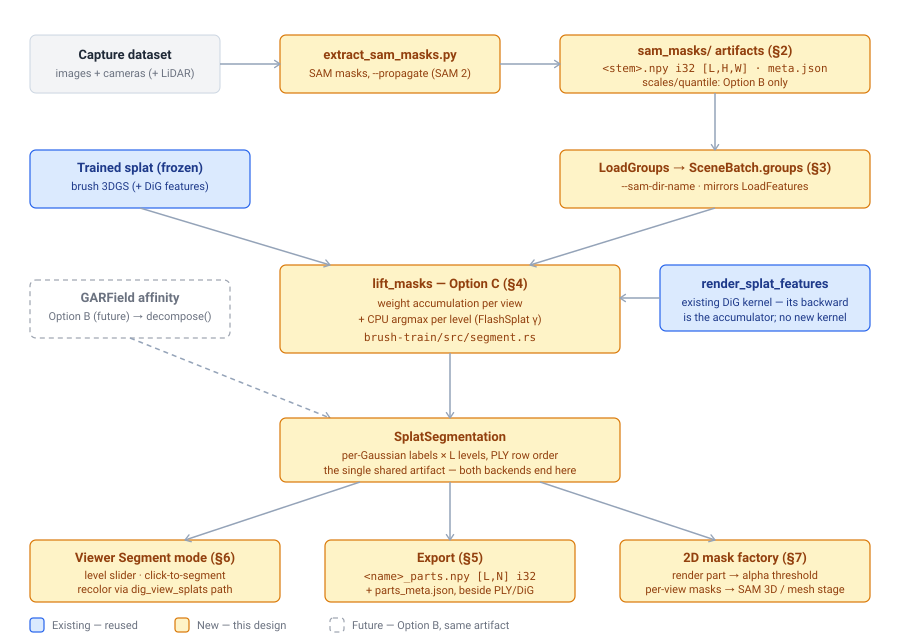

# Segmentation workflow interfaces -- concrete types, flags, artifacts, and viewer surface for segmenting a splat in Brush

**Status:** Draft for review
**Last updated:** 2026-07-12 (Brush citations verified against `main` @ `14e4c0e2`)
**Goal:** Pin down the *interfaces* — Rust types, CLI flags, on-disk artifacts, and viewer interactions — for the splat-segmentation workflow so implementation can start. The backend decision itself is already made in [garfield-port-plan.md](../garfield-port/garfield-port-plan.md): **Option C (training-free mask lifting) is the first milestone**, with Option B (learned GARField affinity) as the later target. Both backends must produce the same artifacts through the same surface; this doc is that surface.

> **TL;DR** — Everything downstream consumes one artifact: per-Gaussian part labels at a few nested granularity levels (`SplatSegmentation`, exported as `<name>_parts.npy` `[L, N]` int32 in PLY row order). Upstream, the only new data dependency is per-view SAM mask-id maps (`sam_masks/<stem>.npy`, int32 `[L, H, W]`) produced by a new offline script. In between, Option C needs **zero new kernels**: the per-(Gaussian, mask) blending-weight accumulator is exactly the gradient of the existing DiG feature render (`render_splat_features`) with a one-hot mask image as the upstream gradient, followed by a CPU argmax. The viewer gets a "Segment view" toggle + level slider beside the existing DINO feature view, click-to-segment as an O(1) label lookup on a picked Gaussian, and a "part masks" export that renders a selected part through the dataset cameras (the R2R2R mask-factory pattern).



## 1. Scope and the one design rule

In scope: every interface the segmentation workflow crosses —

1. the offline SAM mask artifacts and the script that writes them (§2),
2. the Rust dataset loader surface (§3),
3. the segmentation core: the `SplatSegmentation` artifact and the Option C `lift_masks` entry point (§4),
4. process/CLI flags and exports (§5),
5. the viewer "Segment" mode (§6),
6. the 2D mask factory (§7).

Out of scope: the Option B training internals (affinity module, contrastive loss, refine coupling — all specified in the GARField doc §3.2–3.4), image-space segmentation for the mesh/asset pipeline (Python-side, [mesh-pipeline-mac-plan.md](../mesh-pipeline-mac/mesh-pipeline-mac-plan.md)), and mesh-catalog matching.

**The one design rule:** backends are *functions that produce a `SplatSegmentation`*, not a trait. Option C is a post-training pass on a frozen splat; Option B is a decomposition of a trained affinity field. Both end at the same struct, and everything downstream (viewer, exports, mask factory) takes only that struct plus the splats. No `SegmentationBackend` trait until a second backend actually exists — the shared *data type* is the interface.

| Consumer | What it reads | Interface |
|---|---|---|
| Viewer Segment mode | labels at one level | `SplatSegmentation` + recolor path (§6) |
| R2R2R / sim import | labels beside DiG features | `<name>_parts.npy` + existing `<name>_dig_features.npy` (§5) |
| Mesh stage (per-part SAM 3D) | per-view binary masks of a part | mask factory (§7) |
| Catalog matching (future) | pooled DiG features per part | `parts.npy` row-aligned with DiG export |

## 2. Offline artifacts: `scripts/extract_sam_masks.py`

New script beside `convert_lidar_depth_tiff.py`, mirroring the DiG extractor conventions (per-view `.npy` cache named by image stem). Inputs: a Brush dataset dir (COLMAP/nerfstudio) and optionally its LiDAR depth dir. Writes `<dataset>/sam_masks/`:

| File | Shape / format | Meaning |
|---|---|---|
| `<image_stem>.npy` | int32 `[L, H, W]`, C-order | Per-pixel instance ID at each granularity level; level `0` = coarsest. `-1` = no mask. This *is* the "per-pixel ordered mask list" of the GARField doc §3.1, materialized as `L` nested layers. |
| `scales.npy` | f32 `[num_masks]` | Metric 3D scale per mask (LiDAR back-projection). **Option B only**; Option C ignores it. |
| `quantile.json` | JSON | Fitted scale `QuantileTransformer` params. Option B only. |
| `meta.json` | JSON | `{sam_model, thresholds, levels, id_space, scale_source, max_scale, propagated}` |

Flags: `--sam-model` (ViT-H default), reference thresholds as flags, `--levels` (default 3), and `--propagate` — run SAM 2 video propagation over the capture sequence so instance IDs are **cross-view-consistent** (`id_space: "global"`). Without `--propagate`, IDs are per-view (`id_space: "per_view"`) and Option C falls back to per-object binary solves (FlashSplat's inconsistency-tolerant mode); multi-object single-solve labeling requires global IDs. The loader does not care which; `meta.json` records it and `lift_masks` asserts what it needs.

Mask hygiene lives in the script, not in Rust: 3×3 erosion, area sort, nesting (a pixel's level-`l` ID must be contained in its level-`l-1` mask).

## 3. Dataset loader surface (Rust)

Mirror the DiG feature path exactly — one new lazy loader, one field on `SceneView`/`SceneBatch`, one CLI arg:

```rust
// crates/brush-dataset/src/load_groups.rs  (template: load_features.rs)
pub struct LoadGroups { /* vfs + path, like LoadFeatures */ }

impl LoadGroups {
    /// Load the mask-id map as i32 [L, H, W] TensorData plus the level count.
    pub async fn load(&self) -> Result<(TensorData, usize), LoadGroupsError>;
}
```

The npy decoder is `decode_npy_f32_3d` (`crates/brush-dataset/src/load_features.rs:62`) generalized to `<i4` — same header parsing, different dtype check.

```rust
// crates/brush-dataset/src/scene.rs:19 — SceneView gains:
pub groups: Option<LoadGroups>,

// crates/brush-dataset/src/scene.rs:164 — SceneBatch gains:
/// Optional `[L, H, W]` i32 mask-id map plus its level count `L`.
pub groups: Option<(TensorData, usize)>,
```

```rust
// crates/brush-dataset/src/config.rs (beside features_dir_name, :67)
/// Directory (relative to the dataset root) with per-view SAM mask-id maps.
#[arg(long, help_heading = "Load options", default_value = "sam_masks")]
pub sam_dir_name: String,
```

Wiring in `train_stream.rs` follows the `features_dir` resolution at `crates/brush-process/src/train_stream.rs:237`.

## 4. Segmentation core: `crates/brush-train/src/segment.rs`

New module beside `dig.rs`. Two public types and one entry point:

```rust
/// Per-Gaussian part labels at nested granularity levels.
/// Row order is the splats' current row order — identical to a PLY and
/// DiG sidecar exported at the same step (the invariant DigExport documents).
pub struct SplatSegmentation {
    /// `levels[l][g]` = label of gaussian `g` at level `l`; -1 = unlabeled.
    /// `levels[0]` is coarsest. CPU-side: labels are read far more often
    /// than written, and every consumer (viewer LUT, npy export, mask
    /// factory selection) wants host memory.
    pub levels: Vec<Vec<i32>>,
}

impl SplatSegmentation {
    pub fn num_levels(&self) -> usize;
    pub fn num_splats(&self) -> usize;
    /// O(1) lookup backing click-to-segment.
    pub fn label(&self, level: usize, gaussian: usize) -> i32;
    /// Gaussian indices of one part (for isolation, export, mask render).
    pub fn part_indices(&self, level: usize, label: i32) -> Vec<u32>;
}

pub struct MaskLiftConfig {
    /// FlashSplat background-softening bias on the argmax (default 0.0).
    pub gamma: f32,
    /// Mask-id channels accumulated per render pass (memory bound).
    pub chunk: usize,
}

/// Option C: training-free FlashSplat-style lifting on a frozen splat.
/// One accumulation render per view, then a CPU argmax per level.
pub async fn lift_masks(
    splats: &Splats,
    views: &[SceneView],          // camera + groups; views without groups skipped
    config: &MaskLiftConfig,
    device: &Device,
) -> Result<SplatSegmentation, LiftError>;
```

**Implementation note — the accumulator needs no new kernel.** The quantity Option C needs is, per Gaussian `g` and mask `m`: `W[g][m] = Σ_pixels∈m w_g(pixel)` (blending-weight mass inside each mask). That is exactly the gradient of the existing DiG feature render with respect to its per-Gaussian features when the upstream gradient image is the one-hot mask map:

```rust
// features: zeros [N, M_chunk], require_grad — dummy values, only the graph matters
let feat_img = render_splat_features(transforms, raw_opacities, features, cam, size, mode).await;
let pseudo_loss = (feat_img * onehot_mask_img).sum();   // [h, w, M_chunk] one-hot from batch.groups
let grads = pseudo_loss.backward();
// features.grad() == W[g][m] for this view's chunk — scatter-add done by the
// existing CAS-atomic feature backward (render_features.rs), forward-only per view.
```

Chunk over mask IDs (`config.chunk`, one extra channel reserved for the `-1` background bin) when the global instance count exceeds the kernel's comfortable feature width. Accumulate `W` across views on device, read back once, then per level: `label[g] = argmax_m W[g][m]` with `gamma` biasing the background bin. Nested levels reuse the same per-view renders — only the one-hot changes. The rendered image is alpha-normalized, which reweights but does not reorder the per-pixel argmax evidence; acceptable for v1, revisit only if boundaries look wrong.

**Option B mapping (later, no interface change):** `GarfieldModule` gains `decompose(scale) -> SplatSegmentation` (decode + HDBSCAN, GARField doc §3.5); the continuous scale axis is sampled at `L` slider stops to fill `levels`. Everything in §5–§7 is untouched.

## 5. Process flags and exports

```rust
// crates/brush-process/src/config.rs — ProcessConfig gains:
/// Run training-free mask lifting on the final splats and write
/// `<name>_parts.npy` beside the PLY (requires --sam-dir-name data).
#[arg(long, help_heading = "Process options", default_value = "false")]
pub segment: bool,
/// FlashSplat background-softening bias for --segment.
#[arg(long, help_heading = "Process options", default_value = "0.0")]
pub segment_gamma: f32,
```

Export path (in `train_stream.rs`, beside `export_dig` at `crates/brush-process/src/train_stream.rs:708`):

| Artifact | Format | Notes |
|---|---|---|
| `<name>_parts.npy` | int32 `[L, N]` | PLY row order; level 0 coarsest. The GARField doc's `[N]` artifact, stacked per level. |
| `<name>_parts_meta.json` | JSON | `{backend: "mask_lift_v1", levels, gamma, num_parts_per_level, sam_meta: <copy of meta.json>}` — provenance for downstream consumers and for telling B/C outputs apart later. |

Run once at the **final** export, not every `export_every` tick — lifting is seconds-to-minutes and labels a frozen splat; intermediate-step labels serve nothing. Segment-only mode on a pre-trained PLY (skip training entirely) is deferred: it needs a source that carries *both* a PLY and a dataset, which the current `DataSource` doesn't model — noted as an open question (§9).

## 6. Viewer: "Segment" mode

Follows the DINO-view pattern end to end (settings field → checkbox → recolor override → startup flag):

```rust
// apps/brush-app/src/ui/app.rs:162 — AppSettings gains:
pub segment_view: bool,
pub segment_level: usize,

// apps/brush-app/src/ui/scene.rs:655 — beside the DINO checkbox:
//   [x] Segment view        Level [0 ..= L-1] slider
// (shown only when a SplatSegmentation is available on the process)
```

Recolor path — same shape as `dig_view_splats` (`crates/brush-train/src/train.rs:178`): build override splats whose SH0 color is a hash-LUT of the label (`label == -1` → dim gray), reusing the existing preview-splat override plumbing at `crates/brush-process/src/train_stream.rs:410`. For Option C the labels are static, so the override is computed once per level change, not every 50 steps; Option B's live-training affinity view later drives the *same* path on a timer.

```rust
// brush-train (beside dig_view_splats):
pub fn segment_view_splats(
    splats: &Splats,
    seg: &SplatSegmentation,
    level: usize,
) -> Option<Splats>;
```

**Click-to-segment** needs one new primitive, then is trivial:

```rust
/// Front-most Gaussian under a screen pixel: CPU ray through means with an
/// opacity/scale gate (v1); a gaussian-id render pass if precision demands.
pub fn pick_gaussian(splats: &SplatsCpuSnapshot, camera: &Camera, pixel: Vec2) -> Option<u32>;
```

Click → `seg.label(level, picked)` → highlight that part (others dimmed) via the same override path. Selection context offers two actions: *export part PLY* (filter rows by `part_indices`) and *export part masks* (§7).

```rust
// apps/brush-cli/src/lib.rs — beside --dino-view:
/// Start the viewer in the Segment view (requires --segment data).
#[arg(long, default_value = "false")]
pub segment_view: bool,
```

## 7. 2D mask factory

Renders a selected part through dataset cameras and thresholds alpha — the R2R2R `dig_pipeline.save_rendered_images` pattern, backend-agnostic because it needs only labels. This is the seam feeding per-view masks to the mesh stage (per-part SAM 3D) and to Option C-as-tracker workflows.

```rust
// crates/brush-train/src/segment.rs
/// Render binary visibility masks of one part through the given cameras:
/// keep only the part's Gaussians, render, threshold alpha.
pub async fn render_part_masks(
    splats: &Splats,
    seg: &SplatSegmentation,
    level: usize,
    label: i32,
    cameras: &[(Camera, glam::UVec2)],
    alpha_threshold: f32,            // default 0.8
    device: &Device,
) -> Result<Vec<image::GrayImage>, LiftError>;
```

Surfaced two ways: the viewer selection action (§6), and a batch flag for headless runs:

```rust
// ProcessConfig:
/// With --segment: render per-view masks for every part at this level into
/// `part_masks/level<l>/<label>/<image_stem>.png` under the export path.
#[arg(long, help_heading = "Process options")]
pub segment_masks_level: Option<u32>,
```

## 8. Phases and verification

| Phase | Work | Verify |
|---|---|---|
| 1. Data | `extract_sam_masks.py` (levels + `--propagate`); `LoadGroups`; `SceneView/SceneBatch.groups`; `--sam-dir-name` | script output round-trips through the Rust loader on `family_room`; nesting invariant holds per pixel |
| 2. Lift | `SplatSegmentation`; accumulation-via-backward; argmax + `gamma`; `lift_masks` | on a trained `family_room` splat: labels partition the Gaussians; rendering each part reproduces its source masks with IoU ≳ 0.8 on held-out views |
| 3. Export | `--segment`, `parts.npy` `[L,N]` + meta beside PLY/DiG sidecars | numpy loads it; row count == PLY vertex count == DiG feature rows |
| 4. Viewer | Segment view + level slider; `pick_gaussian`; click-to-segment; part PLY export | clicking an object isolates it at level 0 and its parts at deeper levels; `--segment-view` starts in the mode |
| 5. Mask factory | `render_part_masks` + `--segment-masks-level` + viewer action | masks are 3D-consistent across all views (no identity swaps by construction); usable as SAM 3D input |

## 9. Risks and open questions

- **Cross-view ID quality gates multi-object lifting.** `--propagate` (SAM 2 on MPS) is the plan of record but unbenchmarked on our captures (same risk as mesh-pipeline §7); the per-view fallback solves objects one at a time. The `id_space` field keeps both paths honest.
- **Alpha-normalized vs raw blending weights.** The reuse trick accumulates normalized weights; FlashSplat's derivation uses raw contributions. Expected to be argmax-equivalent in practice; if part boundaries look wrong, a dedicated forward accumulation kernel (same CAS-atomic scatter shape) is the escape hatch.
- **Mask-id channel width.** A scene with hundreds of global instances × chunked one-hot channels multiplies accumulation passes; `chunk` bounds memory but not pass count. Fine at tabletop scale (tens of instances); revisit for room-scale.
- **Segment-only mode** (lift on an existing PLY without retraining) needs `DataSource` to carry PLY + dataset together — deferred, tracked here.
- **Boundary raggedness** inherits raw SAM quality (no learned smoothing). Mitigation if needed: 3-NN label-vote smoothing pass reusing `grid_knn` (`crates/brush-train/src/dig.rs:249`).

## 10. Glossary

- **Option C / mask lifting** — assigning per-view 2D SAM masks to the Gaussians of an already-trained splat via rendered blending weights; training-free (GARField doc, Option C). The first backend behind these interfaces.
- **Option B / GARField affinity** — the learned per-Gaussian, scale-conditioned affinity field; the later backend, producing the same `SplatSegmentation`.
- **`SplatSegmentation`** — this doc's central artifact: per-Gaussian int labels at `L` nested granularity levels, PLY row order.
- **Blending weight** — a Gaussian's alpha-composited contribution to a pixel; summed inside a mask it measures how much the Gaussian "belongs" to that mask.
- **Mask-id map** — int32 `[L, H, W]` image assigning each pixel its containing SAM mask instance ID per level; `-1` = none.
- **Granularity level** — one layer of the nested SAM mask hierarchy (scene → objects → parts); Option C's discrete stand-in for GARField's continuous scale.
- **Cross-view IDs / `id_space`** — whether mask instance IDs mean the same object in every view (`global`, via SAM 2 video propagation) or are per-image (`per_view`).
- **FlashSplat / γ (gamma)** — closed-form 2D→3D label assignment by per-Gaussian argmax over accumulated weights; γ softens the background bin against mask noise ([arXiv:2409.08270](https://arxiv.org/abs/2409.08270)).
- **DiG** — DINO-embedded Gaussians (merged, PR #28); its feature render kernel, sidecar-export convention, and viewer toggle are the templates every interface here mirrors.
- **`render_splat_features`** — the existing geometry-detached feature rasterizer (`crates/brush-render-bwd/src/features_bwd.rs:419`) whose backward pass doubles as Option C's weight accumulator.
- **Mask factory** — rendering a labeled part through known cameras and thresholding alpha to get per-view binary masks that are 3D-consistent by construction.
- **SAM / SAM 2** — Meta's promptable segmenter (mask source) and its video-propagation successor (cross-view ID source).
- **PLY row order** — the splat ordering shared by the PLY export, DiG sidecars, and `parts.npy`, letting downstream consumers join them by row index.

## 11. Sources & references

**Brush (this repo, verified 2026-07-12 @ `14e4c0e2`):**
- Feature loader template: `crates/brush-dataset/src/load_features.rs` (npy decode at `:62`); `SceneView` `crates/brush-dataset/src/scene.rs:19`, `SceneBatch` `:164`; `--features-dir-name` `crates/brush-dataset/src/config.rs:67`
- DiG module/state (refine + `grid_knn` reuse): `crates/brush-train/src/dig.rs`
- Feature render + backward (the accumulator): `crates/brush-render-bwd/src/features_bwd.rs:419`, `render_features.rs`
- Recolor override path: `crates/brush-train/src/train.rs:178` (`dig_view_splats`), consumed at `crates/brush-process/src/train_stream.rs:410`
- DiG sidecar export convention: `crates/brush-process/src/train_stream.rs:705-740`
- Config seams: `crates/brush-train/src/config.rs:99-129` (DiG flags), `crates/brush-process/src/config.rs:6` (`ProcessConfig`)
- Viewer seams: `apps/brush-app/src/ui/scene.rs:655` (DINO checkbox), `apps/brush-app/src/ui/app.rs:162` (settings), `apps/brush-cli/src/lib.rs` (`--dino-view`)

**Design decisions this doc implements:**
- [garfield-port-plan.md](../garfield-port/garfield-port-plan.md) — Option B/C decision, §3.1 mask artifacts, §3.5–3.6 interfaces-preserved contract, Option C sketch
- [mesh-pipeline-mac-plan.md](../mesh-pipeline-mac/mesh-pipeline-mac-plan.md) — §7 Option C splat-mask route (the mask factory's consumer), SAM 2 propagation plan

**External:** FlashSplat <https://arxiv.org/abs/2409.08270> · SAM 2 <https://github.com/facebookresearch/sam2> · R2R2R `dig_pipeline.save_rendered_images` mask-render pattern (local R2R2R checkout)
