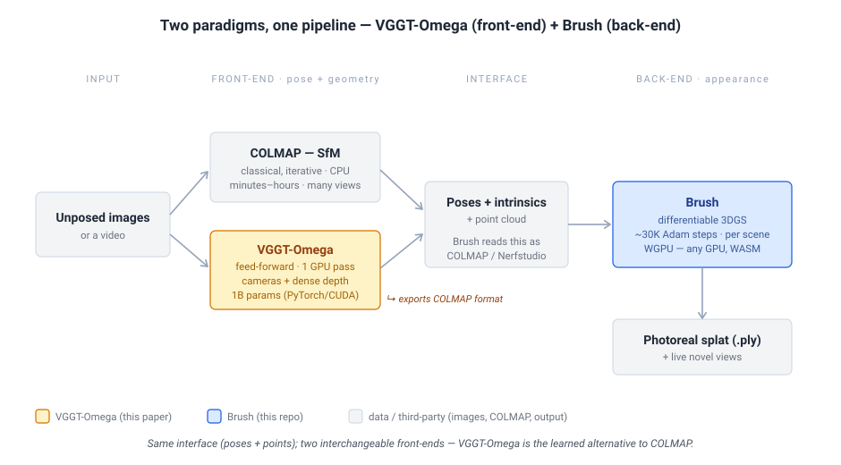

# VGGT-Ω vs. Brush — Comparison & Integration Notes

**Status:** Comparison / scoping notes (not a build plan)
**Last updated:** 2026-06-23
**Goal:** Pin down how the **VGGT-Omega** paper/model relates to **Brush** — competitor, replacement, or
complement — and what wiring the two together would actually involve.

> All **Brush** claims are `file:line`-cited from the local checkout, read 2026-06-23 (line numbers
> drift). All **VGGT-Omega** claims are from the local `facebookresearch/vggt-omega` clone
> (`../../../vggt-omega`, sibling of the `brush` repo) + its README and arXiv 2605.15195, read
> 2026-06-23. See [§10](#10-sources--references).

> Companion to the registration / PlanarGS-port notes in the sibling planning repo: all three are about
> Brush's **geometry front-end and what feeds it**. Registration aligns two *finished* splats; this doc
> is about what produces the *cameras + points* a splat is trained from.

> 📖 New to SfM / feed-forward 3D / 3DGS / pose encodings? Jump to [§9 Glossary](#9-glossary).

*VGGT-Omega and Brush are not the same kind of thing. VGGT-Omega is a **feed-forward geometry
front-end** (a learned alternative to COLMAP); Brush is the **per-scene optimization back-end** that
turns posed images into a photorealistic splat. They meet at one interface: poses + intrinsics + points.
Diagram source: [`vggt-omega-vs-brush.svg`](vggt-omega-vs-brush.svg).*

---

## 1. The one-line answer (read this first)

**They are complementary, not competitors.** They solve *different halves* of the same
image-to-3D pipeline, and the output of one is almost exactly the input of the other.

| | **VGGT-Omega** | **Brush** |
|---|---|---|
| Solves | images → **cameras + geometry** (the SfM/MVS half) | posed images → **photorealistic radiance field** (the rendering half) |
| Method | **feed-forward** transformer, one GPU pass | **per-scene optimization**, ~30K gradient steps |
| Produces | camera poses, intrinsics, dense depth, a point cloud | an optimized 3D-Gaussian splat (`.ply`) + live novel views |
| Does **not** produce | a renderable, view-consistent radiance field / novel-view synthesis | camera poses — it **requires** them as input |

So the interesting question is **not** "which is better"; it's **"should VGGT-Omega become a front-end
for Brush, replacing the COLMAP step Brush depends on today?"**

**Recommendation:** treat VGGT-Omega as an **optional pose/point-cloud front-end** for Brush. Brush
already hard-depends on an external poser (COLMAP / Nerfstudio / RealityCapture) and does **no** pose
estimation or refinement of its own ([§2.2](#22-brush-the-optimization-back-end)). VGGT-Omega fills
exactly that slot, in seconds instead of minutes-to-hours, and — crucially — it can **export COLMAP
format** ([§10](#10-sources--references)), so the cheapest integration needs *zero* Brush code changes.
The decision that remains is **how deep** to integrate ([§6](#6-integration-options--the-real-decision)).

---

## 2. Background: the two systems

### 2.1. VGGT-Omega — the feed-forward front-end

VGGT-Omega (Visual Geometry Grounded Transformer, "Ω" variant; Oxford VGG + Meta AI, arXiv 2605.15195)
is a **single ~1B-parameter transformer** that takes a set of images and predicts scene geometry in
**one forward pass** — no per-scene optimization, no iterative matching.

- **Inputs:** a batch of N images (the demo uses 512-px inputs; a 256-px text-aligned checkpoint also
  exists). N can be 1 to 500+ in a single pass.
- **Outputs** (per frame, from `VGGTOmega.forward`, `vggt_omega/models/vggt_omega.py:35-76`):
  - `pose_enc` — a **9-D camera encoding**: translation (3) + rotation quaternion (4) + vertical/
    horizontal FoV (2). Decoded by `encoding_to_camera` into **extrinsics** (camera-from-world, OpenCV
    convention) and **intrinsics** (`vggt_omega/utils/pose_enc.py:12-52`). The camera head is literally
    a 3-layer MLP onto 9 numbers (`vggt_omega/models/heads/camera_head.py:43-47`).
  - `depth` + `depth_conf` — a **dense per-pixel depth map** and confidence (`depth = exp(logits)`,
    `conf = 1 + exp(logits)`; `vggt_omega/models/heads/dense_head.py:149-158`).
  - `camera_and_register_tokens` — latent camera/register tokens (for downstream/learned use).
  - Optional `text_alignment_embedding` — a CLIP-style embedding (256-px checkpoint only,
    `enable_alignment=True`).
- **Point cloud:** the demo unprojects depth + intrinsics + extrinsics into a **dense, colored point
  cloud** in world coordinates (`demo_gradio.py:75-104`, `unproject_depth_map_to_point_map`), then
  exports a GLB; an `export` extra pulls in `pycolmap` to write **COLMAP-format** output
  (`pyproject.toml`).
- **Footprint:** PyTorch + CUDA, benchmarked on an **A100**; peak GPU memory scales from **6 GB (1
  frame) to ~43 GB (500 frames)** (README runtime table). Needs the gated HuggingFace checkpoint.

The mental model: **a learned, amortized replacement for Structure-from-Motion.** It does in one
GPU pass what COLMAP does with iterative feature-matching and bundle adjustment — and additionally
hands you dense depth.

### 2.2. Brush — the optimization back-end

Brush is a pure-**Rust**, **WGPU/WebGPU** 3D-Gaussian-splatting **trainer + renderer + viewer**, built on
the **Burn** ML framework. It is cross-platform to a degree the Python 3DGS/SfM stack is not:
macOS/Windows/Linux, AMD/Nvidia/Intel, **Android**, and **in-browser via WASM** — with no CUDA dependency
(`README.md`).

What it does and needs:

- **Requires precomputed cameras.** Brush ingests **COLMAP** (binary/text), **Nerfstudio**
  `transforms.json`, or RealityCapture; it tries them in that order
  (`crates/brush-dataset/src/formats/mod.rs:56-72`). The COLMAP camera/pose/point structs live in
  `crates/colmap-reader/src/lib.rs` (`ColmapCamera` `:76-82`, `Image` w/ `quat`+`tvec` `:85-99`,
  `Point3D` `:102-114`); the runtime camera is `Camera` (`crates/brush-render/src/camera.rs:11-19`).
- **Does no pose estimation and no pose refinement.** Cameras are read once and held **frozen** for the
  entire run — the training step takes `batch.camera` read-only and optimizes splats only
  (`crates/brush-train/src/train.rs:167`). There is no SfM, no bundle adjustment, no learned poser
  anywhere in the tree.
- **Initializes** splats from the **COLMAP sparse point cloud** (`Point3D` → position + RGB→SH;
  `crates/brush-dataset/src/formats/colmap.rs:254-289`) or, if none, from **random** points sampled in
  the camera frustums (`crates/brush-train/src/splat_init.rs:54-128`).
- **Optimizes** with Adam for **~30K iterations by default** (`crates/brush-train/src/config.rs:9`),
  densifying/pruning splats periodically (`refine_every`, `:59`). Top-level orchestration "folder of
  images → trained splat" is `crates/brush-process` (`create_process`, `src/lib.rs:97-115`).
- **Outputs** a `.ply` splat and an interactive, real-time renderer (also a `.ply`/`.zip` viewer).

The mental model: **a differentiable renderer that fits appearance**, given that someone else already
told it where the cameras are.

---

## 3. Head-to-head

| Dimension | **VGGT-Omega** | **Brush** |
|---|---|---|
| **Role in pipeline** | front-end: pose + geometry estimation | back-end: appearance optimization + rendering |
| **Paradigm** | feed-forward inference (amortized, learned) | per-scene gradient-descent optimization |
| **Per-scene runtime** | seconds (one forward pass) | minutes (~30K Adam steps) |
| **Needs camera poses?** | **no — it predicts them** | **yes — hard input requirement** |
| **Primary output** | cameras, intrinsics, dense depth, point cloud | optimized 3DGS splat + real-time novel views |
| **Novel-view quality** | point cloud / depth only (not a radiance field) | photorealistic, view-consistent |
| **Language / stack** | Python, PyTorch | Rust, Burn |
| **Compute** | **CUDA only**; A100-class; 6–43 GB VRAM | **WGPU**; any GPU; **WASM + Android**; no CUDA |
| **Weights** | ~1B params, gated checkpoint | none — it's an optimizer, not a pretrained net |
| **Scales to** | many input frames in one pass (500+) | one scene per training run |
| **Maturity for this repo** | external model, would be a new dependency | the repo itself |

**The complementarity is the whole point:** VGGT-Omega is fast but produces *geometry*, not a
photorealistic renderable; Brush produces a photorealistic renderable but needs geometry handed to it.
Chained, `images → VGGT-Omega → Brush → splat` is a plausible **COLMAP-free** capture-to-splat path.

---

## 4. The front-end landscape: on-device, server, or offline

§1–§3 frame the pose slot as "COLMAP **or** VGGT-Omega," but in practice there are **three** ways to
fill it. A capture app like **SplatKing** — on-device COLMAP-format export on an **iPhone 16 Pro Max**
using **ARKit + the rear LiDAR** — is a first-class third option. It is *not* a competitor to
VGGT-Omega so much as a different route into the same slot.

*Three interchangeable front-ends, one slot. SplatKing's edge is **metric scale** (LiDAR) and no server;
its limits are **range** and **pose drift**. Source: [`front-end-landscape.svg`](front-end-landscape.svg).*

| | COLMAP (classic) | VGGT-Omega | **SplatKing (ARKit + LiDAR)** |
|---|---|---|---|
| Runs | offline, desktop CPU | server GPU (CUDA) | **on-device iPhone, real time** |
| Per-scene time | minutes–hours | seconds | real-time during capture |
| Poses from | feature matching + bundle adjustment | learned, 1 net pass | visual-inertial SLAM (+ LiDAR) |
| Pose accuracy | **high** (sub-pixel BA) | medium (feed-forward) | medium (VIO drift) |
| Metric scale | ✗ up-to-scale | ✗ up-to-scale | **✓ (LiDAR → real units)** |
| Range limit | none (image-based) | none (image-based) | **~5 m (LiDAR)** |
| Point cloud | sparse | dense, noisy | LiDAR depth: metric, close-range |
| Feeds Brush | ✓ today | needs [PR1/PR3](vggt-omega-integration-plan.md) | **✓ today (already COLMAP)** |

**The headline: SplatKing already feeds Brush today, with zero integration** — it emits COLMAP, and
Brush auto-detects COLMAP (`crates/brush-dataset/src/formats/mod.rs:56-72`). The VGGT-Omega PR chain
adds *another* front-end; it does not block or replace the SplatKing path.

### 4.1. What "COLMAP on device" means (it changes the analysis)

Two readings, and they imply different pose quality:
- **Real on-device COLMAP SfM** (feature matching + bundle adjustment) → poses are bundle-adjusted and
  good, but compute/thermal-limited (fewer frames, possibly truncated BA). LiDAR then mainly supplies
  metric scale + a clean init cloud.
- **ARKit VIO exported *as* COLMAP** (far more common on iPhone, and what the LiDAR involvement implies)
  → poses come from real-time visual-inertial SLAM, which **drifts** and is **not** sub-pixel; "COLMAP"
  is just the file format.

Most LiDAR iPhone apps are the second kind; which one SplatKing is sets the "pose accuracy" row above.

### 4.2. SplatKing-specific concerns

- **LiDAR is close-range only.** ARKit depth is [256×192](https://developer.apple.com/documentation/arkit/ardepthdata),
  IR direct-time-of-flight, best under ~3 m (no official max range; ~5 m is the commonly-observed
  practical limit — [Luetzenburg et al. 2021](https://doi.org/10.1038/s41598-021-01763-9)); it also
  fails on **glass/mirror/dark/specular** surfaces and **washes out in sunlight**.
  Beyond range, geometry and scale fall back to vision-only → **scale drift** and a sparse/empty init
  cloud out there. *This is exactly the gap VGGT-Omega fills* (image-only, no hard range limit) — but
  VGGT lacks metric scale, so you'd **anchor it with LiDAR**, not swap.
- **Pose error passes straight through (the multiplier).** Brush **freezes poses**
  (`crates/brush-train/src/train.rs:167`), so ARKit drift becomes permanent blur/ghosting/floaters —
  Brush won't fix it. Contributing sources on iPhone: **VIO drift** over the trajectory, **rolling
  shutter**, **OIS/autofocus changing intrinsics frame-to-frame**, and **camera/IMU/LiDAR time-sync**.
- **Metric scale is SplatKing's unique win.** LiDAR gives real-world units; COLMAP and VGGT-Omega are
  both only up-to-scale. Matters for measurement, physics, and robotics downstream.

### 4.3. What this changes

- **Pose refinement (plan [PR5](vggt-omega-integration-plan.md)) is the highest-leverage Brush feature
  for on-device capture — not a "stretch."** Offline COLMAP is sub-pixel, so freezing poses is fine;
  ARKit poses are not, so refining them *during* training is the biggest quality lever. Reorder PR5
  ahead of the VGGT work if SplatKing is your primary capture path.
- **LiDAR is a strong metric init cloud** — cleaner than COLMAP-sparse *and* than VGGT-dense at close
  range (the [PR4](vggt-omega-integration-plan.md) init path, with a better source).
- **Fuse, don't choose.** LiDAR anchors VGGT-Omega's missing scale; VGGT-Omega fills LiDAR's far-range
  gap; VGGT poses can **cross-check** ARKit poses (disagreement flags drift).
- **Convention gotcha.** ARKit is Y-up / right-handed (camera looks down −Z); COLMAP is Y-down / +Z. The
  exporter must get that inversion right — the same silent `w2c→c2w` trap as the rest of
  [§7](#7-gaps-mismatches--risks).

---

## 5. Where they meet — the integration surface

VGGT-Omega's outputs map almost 1:1 onto what Brush's loader already expects:

| Brush expects (from COLMAP/Nerfstudio) | VGGT-Omega provides | Notes |
|---|---|---|
| Per-image **extrinsics** (world↔camera) | `pose_enc` → extrinsics, camera-from-world, OpenCV (`pose_enc.py:12-52`) | COLMAP is also world-to-camera → **conventions line up** via the COLMAP bridge |
| Per-image **intrinsics** (focal, principal pt) | intrinsics from FoV: `fx,fy`, `cx=W/2, cy=H/2` (`pose_enc.py:40-50`) | VGGT-Omega assumes a **centered pinhole, no distortion**; Brush supports richer distortion but pinhole is the common case |
| **Sparse point cloud** for init (`Point3D`: xyz+rgb) | **dense** unprojected depth points (xyz+rgb) (`demo_gradio.py:75-104`) | VGGT's cloud is *much denser*; subsample, or let Brush's existing subsampling handle it |
| Format on disk | **COLMAP export** via `pycolmap` (`pyproject.toml` `export` extra) | the zero-code bridge — write COLMAP, point Brush at the folder |

**The bridge in one sentence:** VGGT-Omega can emit COLMAP-format `cameras` + `images` + `points3D`,
and Brush already reads COLMAP-format `cameras` + `images` + `points3D`. Everything else is depth of
integration and polish.

---

## 6. Integration options — the real decision

Three depths, cheapest first. These are *not* mutually exclusive — (A) is the spike that de-risks (B/C).

| Option | What you do | Brush code | Effort | When it's right |
|---|---|---|---|---|
| **A. Shell-out / COLMAP export** *(recommended first step)* | Run VGGT-Omega offline, `pycolmap`-export to a COLMAP folder, run Brush on it unchanged | **none** | ~hours (scripting) | Validate quality end-to-end before writing any Rust |
| **B. Native `vggt.rs` loader** | Add `crates/brush-dataset/src/formats/vggt.rs` that reads VGGT-Omega output (its `.pt`/npz/JSON) directly into Brush's `Camera` + `Point3D`; add to the format-detection order (`formats/mod.rs:56-72`) | small, additive | days | A smooth "drop VGGT output → train" UX without a COLMAP round-trip |
| **C. Deep / in-engine** | Run VGGT-Omega inference from inside the pipeline (e.g. ONNX/candle), or use its **dense depth** to seed/regularize Brush init & geometry | substantial; new inference dep; cross-platform questions | weeks+ | A true one-binary "images in, splat out"; or depth-supervised training |

**Recommendation:** do **A** to prove the chain and judge VGGT-Omega's pose accuracy on real scenes,
then **B** for ergonomics. Defer **C** — running a 1B CUDA transformer inside Brush directly fights
Brush's "no-CUDA, runs-everywhere-incl-WASM" identity (`README.md`), so it needs its own justification.

---

## 7. Gaps, mismatches & risks

- **Coordinate/convention drift (top risk, fails silently).** Extrinsics, quaternion handedness,
  world-vs-camera direction, and Y-up/Z-up must match Brush's expectations exactly. Routing through
  **COLMAP export** is the safest path because Brush's COLMAP reader already encodes the right
  convention (`colmap.rs:196-201` inverts w2c→c2w). A native loader (Option B) must reproduce that
  inversion precisely. *Guard:* render a VGGT-posed scene in Brush and check it's not mirrored/rotated.
- **Intrinsics are centered-pinhole only.** VGGT-Omega emits `cx=W/2, cy=H/2` and no distortion
  (`pose_enc.py:40-50`). Fine for most phone/web capture; lossy for fisheye/wide-angle where Brush's
  richer distortion models (`colmap.rs:304-380`) would otherwise help.
- **Dense vs. sparse init.** VGGT's per-pixel cloud is far denser than a COLMAP sparse cloud. Brush can
  subsample, but un-subsampled dense init changes densification dynamics — tune or downsample.
- **Pose accuracy is now load-bearing.** Brush **never refines poses** (`train.rs:167`), so whatever
  VGGT-Omega predicts is final. Classical COLMAP poses are bundle-adjusted to sub-pixel; a feed-forward
  net may be slightly off, and Brush won't fix it. (This is also the argument for a future
  *pose-refinement* feature in Brush — orthogonal, but VGGT integration raises its value.)
- **Scale & metricity.** Confirm whether VGGT-Omega's translations are metric or up-to-scale, and
  whether multi-batch runs share a consistent global frame/scale before feeding Brush.
- **Compute & licensing reality.** VGGT-Omega is **CUDA + gated A100-class checkpoint**; Brush is
  CUDA-free and runs in a browser. They can't share a runtime today — which is exactly why Option A/B
  (offline front-end) fits and Option C does not.

---

## 8. Open questions / investigation TODOs

- [ ] Run **Option A** on a real capture: are VGGT-Omega poses good enough that Brush converges to
      COLMAP-comparable quality? (The decision hinges on this.)
- [ ] Are VGGT-Omega extrinsics **metric** or up-to-scale? Consistent global frame across a multi-frame
      batch?
- [ ] Best init: VGGT **dense depth cloud** (subsampled) vs. letting Brush random-init — measure
      convergence/quality.
- [ ] Does the `pycolmap` export round-trip *losslessly* into Brush's COLMAP reader (camera model,
      point colors→SH)?
- [ ] Is there value in **depth-supervised** Brush training using `depth` + `depth_conf` (Option C
      territory)? Brush has no depth loss today.
- [ ] What's the `text_alignment_embedding` good for in a Brush context (semantic/text-driven selection)
      — anything, or out of scope?

---

## 9. Glossary

Grouped by area. **(VGGT)** marks VGGT-Omega-specific terms; **(Brush)** marks Brush-specific ones.

### Reconstruction pipeline
- **SfM (Structure-from-Motion)** — recovering camera poses (and a sparse point cloud) from overlapping
  images by feature-matching + bundle adjustment. What **COLMAP** does, and what VGGT-Omega replaces.
- **MVS (Multi-View Stereo)** — densifying SfM geometry into dense depth/points. VGGT-Omega's dense depth
  output is MVS-like.
- **COLMAP** — the standard open-source SfM/MVS tool; Brush's default pose source. Both Brush and
  VGGT-Omega's exporter speak its file format, which is the integration bridge.
- **Bundle adjustment** — the iterative nonlinear refinement that makes classical SfM poses sub-pixel
  accurate. VGGT-Omega has no equivalent (it's one forward pass); Brush has none either (poses frozen).
- **Feed-forward / amortized inference** — predicting the answer in a single network pass, vs. optimizing
  per input. VGGT-Omega is feed-forward; Brush is per-scene optimization. **(VGGT)**

### Cameras & geometry
- **Extrinsics** — a camera's pose (rotation + translation) in the world frame. VGGT-Omega outputs
  *camera-from-world* (OpenCV); COLMAP is also world-to-camera, so they align.
- **Intrinsics** — focal length + principal point (the pinhole matrix `K`). VGGT-Omega derives `K` from
  predicted FoV and assumes the principal point is image-centered with no lens distortion.
- **Pose encoding (9-D)** — VGGT-Omega's compact camera representation: translation (3) + quaternion (4) +
  vertical & horizontal FoV (2), decoded into extrinsics + intrinsics. **(VGGT)**
- **Depth map / depth confidence** — VGGT-Omega's per-pixel distance-to-surface and a per-pixel
  reliability score; unprojecting depth gives a dense colored point cloud. **(VGGT)**
- **Unprojection** — turning a pixel + its depth + intrinsics/extrinsics into a 3D world point.
- **Point cloud (sparse vs. dense)** — COLMAP yields a *sparse* cloud (matched keypoints); VGGT-Omega
  yields a *dense* one (every pixel). Brush uses the cloud to **initialize** splats.

### Gaussian splatting (Brush)
- **3DGS / Gaussian splatting** — representing a scene as many 3D Gaussians (position, covariance,
  opacity, color) rendered by differentiable rasterization. Brush trains and renders these. **(Brush)**
- **Splat** — one such Gaussian (or, loosely, the whole model). Brush's output is a `.ply` of splats.
  **(Brush)**
- **Spherical Harmonics (SH)** — the basis Brush stores *view-dependent color* in; the COLMAP point
  RGB seeds the lowest (DC) SH band at init. **(Brush)**
- **Densification / refinement** — Brush periodically splitting/cloning/pruning splats during training
  (`refine_every`) to add detail where needed. **(Brush)**
- **Burn / WGPU / WASM** — Brush's Rust ML framework / cross-platform GPU API / browser compilation
  target. Together they're why Brush runs without CUDA, everywhere — and why embedding a 1B CUDA model
  (Option C) is awkward. **(Brush)**
- **Pose refinement** — jointly optimizing camera poses *during* splat training. Brush does **not** do
  this (poses are frozen) — which is why front-end pose accuracy matters, and why it's the top lever for
  drift-prone on-device captures ([§4.3](#43-what-this-changes)).

### On-device capture (SplatKing / ARKit)
- **SplatKing** — the user's iPhone capture app: runs on an **iPhone 16 Pro Max**, producing
  COLMAP-format output **on-device** with ARKit + the rear LiDAR. A third front-end for Brush's pose slot
  ([§4](#4-the-front-end-landscape-on-device-server-or-offline)).
- **ARKit** — Apple's AR framework; supplies a real-time camera pose, per-frame intrinsics, and (on Pro
  devices) LiDAR depth.
- **Visual-inertial odometry (VIO) / SLAM** — real-time pose from fused camera + IMU. Fast and
  on-device, but **drifts** over a trajectory (no global bundle adjustment) — why on-device poses are
  less accurate than offline COLMAP.
- **LiDAR (dToF)** — the iPhone Pro's direct-time-of-flight depth sensor (ARKit depth ~256×192). Metric
  depth at **close range** (best <~3 m, ~5 m max); fails on glass/dark/specular surfaces and in sunlight.
- **Metric scale** — geometry in real-world units. LiDAR provides it; SfM/COLMAP and VGGT-Omega are only
  **up-to-scale** (an unknown global scale factor).
- **Rolling shutter** — phone sensors expose scanlines sequentially; fast motion warps the effective
  per-line pose, breaking the one-pose-per-image assumption.
- **OIS / autofocus drift** — optical image stabilization and autofocus move the lens, so intrinsics can
  shift frame-to-frame; capture apps often lock AE/AF to keep them stable.

---

## 10. Sources & references

### How these claims were derived
**Brush** `file:line` claims are from this worktree, read **2026-06-23** (line numbers drift).
**VGGT-Omega** claims are from the local clone at `../../../vggt-omega` (sibling of `brush` in
`robotics_research/`) plus its README and arXiv page, read **2026-06-23**.

### Brush (this repo)
- `crates/brush-dataset/src/formats/mod.rs:56-72` — supported formats + detection order (COLMAP →
  Nerfstudio → RealityCapture).
- `crates/colmap-reader/src/lib.rs` — `ColmapCamera` (`:76-82`), `Image` (`quat`+`tvec`, `:85-99`),
  `Point3D` (`:102-114`).
- `crates/brush-render/src/camera.rs:11-19` — runtime `Camera` struct.
- `crates/brush-dataset/src/formats/colmap.rs` — COLMAP parse; w2c→c2w (`:196-201`); point RGB→SH
  (`:254-289`); camera-model build incl. distortion (`:304-380`).
- `crates/brush-train/src/splat_init.rs:54-128` — random splat init (when no point cloud);
  `estimate_scene_scale` (`:24-47`).
- `crates/brush-train/src/config.rs:9` — `total_train_iters` default 30,000; `refine_every` (`:59`).
- `crates/brush-train/src/train.rs:167` — training step takes `batch.camera` **read-only** (no pose
  optimization).
- `crates/brush-process/src/lib.rs:97-115` — `create_process`, the "folder → trained splat" entry point.
- `README.md`, `Cargo.toml` — Rust/Burn/WGPU stack, cross-platform (incl. WASM/Android), no CUDA.

### VGGT-Omega (`facebookresearch/vggt-omega`, local clone)
- `vggt_omega/models/vggt_omega.py:35-76` — `forward`; the full prediction dict (`pose_enc`, `depth`,
  `depth_conf`, `camera_and_register_tokens`, optional text-alignment).
- `vggt_omega/utils/pose_enc.py:12-52` — 9-D pose encoding; `encoding_to_camera` → extrinsics
  (camera-from-world, OpenCV) + intrinsics (centered pinhole, `cx=W/2, cy=H/2`, no distortion).
- `vggt_omega/models/heads/camera_head.py:43-47` — camera head MLP → 9 numbers.
- `vggt_omega/models/heads/dense_head.py:149-158` — `depth = exp(logits)`, `conf = 1 + exp(logits)`,
  fp32.
- `demo_gradio.py:75-104` — `unproject_depth_map_to_point_map`: dense colored world-point cloud.
- `pyproject.toml` — deps (numpy<2, Pillow, einops, safetensors, opencv); `export` extra =
  `pycolmap>=3.10.0` (**COLMAP export**, the integration bridge); `requirements.txt` (torch≥2.3, CUDA).
- `README.md` — Oxford VGG + Meta AI; checkpoints `VGGT-Omega-1B-512` and `-1B-256-Text-Alignment`
  (gated); A100 runtime/memory table (6 GB @ 1 frame → ~43 GB @ 500 frames); arXiv **2605.15195**.

### External
- **VGGT-Omega** paper — [arxiv.org/abs/2605.15195](https://arxiv.org/abs/2605.15195) ·
  project page [vggt-omega.github.io](http://vggt-omega.github.io/) ·
  repo [github.com/facebookresearch/vggt-omega](https://github.com/facebookresearch/vggt-omega).
- **VGGT** (the base architecture) — Wang et al., "VGGT: Visual Geometry Grounded Transformer," CVPR 2025
  — [github.com/facebookresearch/vggt](https://github.com/facebookresearch/vggt).
- **3D Gaussian Splatting** (what Brush optimizes) — Kerbl et al., SIGGRAPH 2023 —
  [repo-sam.inria.fr/fungraph/3d-gaussian-splatting](https://repo-sam.inria.fr/fungraph/3d-gaussian-splatting/).
- **COLMAP** (the front-end VGGT-Omega would replace) — Schönberger & Frahm, CVPR 2016 —
  [colmap.github.io](https://colmap.github.io/).

### External (on-device capture / ARKit + LiDAR)
- **ARKit scene depth** (the LiDAR depth API SplatKing builds on) — Apple Developer docs:
  [`ARDepthData`](https://developer.apple.com/documentation/arkit/ardepthdata) (a `depthMap` +
  `confidenceMap`) and [`ARFrame.sceneDepth`](https://developer.apple.com/documentation/arkit/arframe/scenedepth).
  LiDAR depth is fused with the RGB image and delivered at **256×192, 60 fps** — Apple WWDC20,
  ["Explore ARKit 4"](https://developer.apple.com/videos/play/wwdc2020/10611/).
- **ARKit camera pose & intrinsics** —
  [`ARCamera.intrinsics`](https://developer.apple.com/documentation/arkit/arcamera/intrinsics)
  (per-frame intrinsic matrix; can shift with OIS/autofocus) and
  [`ARCamera.transform`](https://developer.apple.com/documentation/arkit/arcamera/transform)
  (the visual-inertial world pose). ARKit uses a right-handed coordinate space with the camera looking
  down −Z — the convention difference to reconcile against COLMAP.
- **iPhone LiDAR range & accuracy** — Luetzenburg, Kroon & Bjørk, "Evaluation of the Apple iPhone 12 Pro
  LiDAR for an Application in Geosciences," *Scientific Reports* **11**, 22221 (2021),
  [doi:10.1038/s41598-021-01763-9](https://doi.org/10.1038/s41598-021-01763-9) — documents close-range
  strength (±1 cm for objects > 10 cm) and the sensor's **range limitations**. Apple publishes no
  official max range; **~5 m is the commonly-observed practical limit**. See also an indoor
  LiDAR-vs-terrestrial-scanner comparison,
  [*South African Journal of Geomatics* (2024)](https://www.tandfonline.com/doi/full/10.1080/16874048.2024.2408839).
