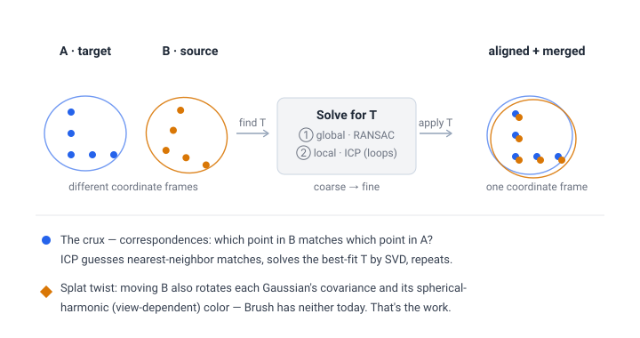
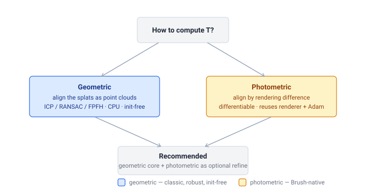
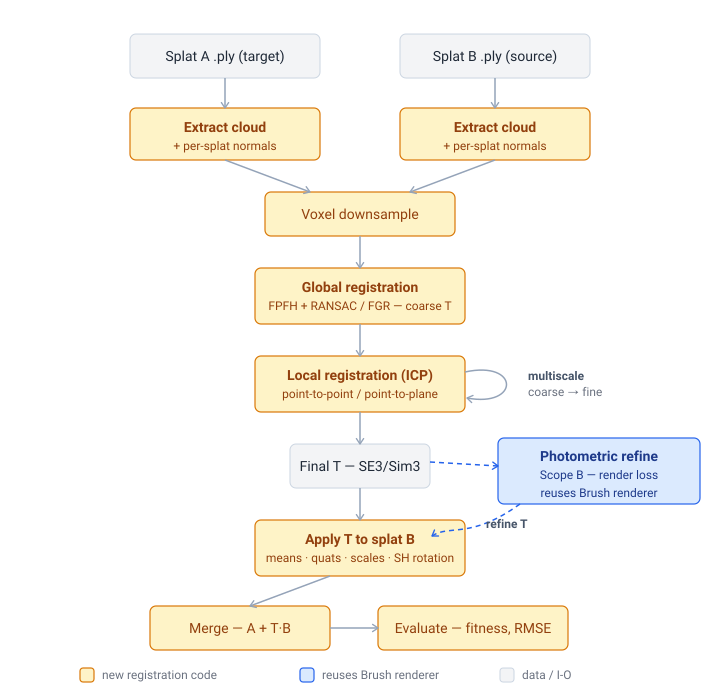
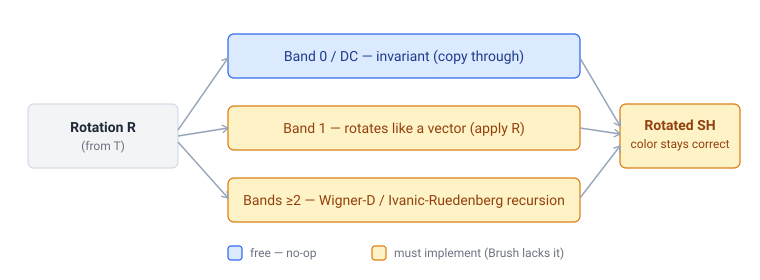
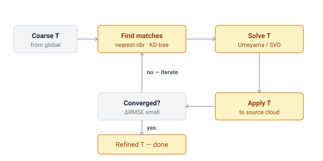

# Adding Splat Registration to Brush — Working Document

**Status:** Draft / planning
**Last updated:** 2026-06-23
**Goal:** Add **Gaussian-splat registration** (align two independently-trained splats into one
coordinate frame, then merge) to the Brush Rust/WebGPU engine — the capability provided by
[GaussianSplattingRegistration](https://github.com/erikszasz/GaussianSplattingRegistration)
(a Python/Open3D/Qt desktop tool), but built natively in Rust.

> Companion to [`docs/planargs-port-plan.md`](../docs/planargs-port-plan.md). Same conventions:
> effort numbers are for **one strong engineer** comfortable with Rust, 3D geometry, and 3DGS;
> ranges are wide on purpose; all Brush/external claims are backed by `file:line` citations in
> [§12](#12-sources--references), derived from the local `brush` checkout and the
> `erikszasz/GaussianSplattingRegistration` GitHub tree read on 2026-06-23.

> **Note on scope vs. PlanarGS.** Registration is *orthogonal* to the PlanarGS port. PlanarGS is
> about **surface-reconstruction quality during training**; registration is about **aligning two
> already-finished splats**. They share almost no code. This can land independently.

> 📖 New to the registration vocabulary (ICP, FPFH, RANSAC, Umeyama, SH rotation)? Jump to
> [§13 Glossary](#13-glossary).

*The whole idea in one picture; the rest of the doc is detail. (Diagrams live in [`diagrams/`](diagrams/) as portable SVG + PNG.)*

---

## 1. The one decision that drives everything

Registration is not one feature; it is three layers, and only the middle one has a real fork in it:

1. **The splat-aware rigid transform** — apply a transform `T` to a splat *correctly* (rotate means,
   orientations, **and spherical-harmonics**). Small, exact, must-have, and **Brush-specific**.
2. **The alignment solver** — *compute* `T`: a coarse global init + a fine local (ICP) refine,
   optionally multiscale. This is the layer with the strategic decision.
3. **The app surface** — load two splats, co-display them, drive the solve, merge, evaluate. UI/CLI glue.

**The decision (layer 2): geometric or photometric objective?**

| Objective | What it optimizes | Needs | Brush fit |
|---|---|---|---|
| **Geometric** (what the reference tool does) | distance between the two splats *as point clouds* (ICP/RANSAC/FPFH) | a KD-tree + SVD; runs on CPU; init-free for the global stage | new infra, but classic & robust |
| **Photometric** (Brush's superpower) | difference between *rendered images* of B (posed in A's frame) and A | a decent initial `T` + shared/overlapping cameras; reuses the **existing differentiable renderer + Adam** | almost free to wire, but needs init and views |

**Recommendation: build the geometric pipeline as the core, expose photometric as an optional
refinement layer.** Geometric is the robust, well-understood, initialization-free path and is a
faithful Rust analogue of the reference tool. Photometric refinement is the thing Brush can do that
the reference tool barely can — Brush *is* a differentiable splat optimizer, so once a coarse `T`
exists you can optimize the 6–7 DoF transform with the training stack you already have. Treat it as
the differentiator, not the foundation (it can't bootstrap itself from an arbitrary pose).

*The central decision: a geometric CPU core, with photometric refine as Brush's optional differentiator.*

**Sub-decision (geometric core): CPU or GPU?** → **CPU first.** Registration runs on *downsampled*
clouds (thousands of points, not millions), so it is cheap; mature pure-Rust crates exist
(`nalgebra` for SVD/Umeyama, `kiddo` for KD-trees); and pure-Rust CPU code keeps Brush's
cross-platform promise, **including WASM**, intact. Move hot loops to CubeCL only if profiling demands it.

### Scopes

| Scope | What you build | Estimate |
|---|---|---|
| **A (recommended)** | Geometric registration, CPU: splat↔point-cloud, splat-aware transform (incl. SH rotation), local ICP (point-to-point + point-to-plane), global init (FPFH+RANSAC or FGR), multiscale, voxel downsample, merge, eval. CLI + minimal viewer hook. | **~4–5 weeks** |
| **B** | A + **differentiable photometric refinement** (optimize `T` against rendering loss, reusing renderer + autodiff). | **+1–2 weeks** |
| **C** | B + **HEM Gaussian-mixture downsampling** (structure-preserving multiscale, the reference tool's C++ extension) + GPU correspondence for large scenes. | **+3–4 weeks** |

This document plans **Scope A**, with B sketched in [§9](#9-the-photometric-refinement-opportunity-brush-native) and C deferred.

---

## 2. License & provenance (much lighter than PlanarGS — but read this)

Unlike the PlanarGS port, **there is no non-commercial-license gate here.** The algorithms are
decades-old and patent-free, and the heavy lifting can ride on permissively-licensed crates.

| Component | License | Implication |
|---|---|---|
| **Brush itself** | Apache-2.0 | ✅ permissive |
| **ICP, RANSAC, FPFH, Umeyama/Kabsch, FGR** (the algorithms) | public domain (academic methods) | ✅ implement from papers/textbooks; not copyrightable |
| **Open3D** (the reference tool's engine) | MIT | ✅ fine to read for reference / reimplement equivalently |
| **`nalgebra`, `kiddo`, `glam`** (likely Rust deps) | Apache-2.0 / MIT | ✅ permissive |
| **`erikszasz/GaussianSplattingRegistration` itself** | **no `LICENSE` file in the repo tree** (as read 2026-06-23) | ⚠️ "all rights reserved" by default — **do not copy its source.** Reimplement from the algorithm descriptions / Open3D docs. We never need its code. |
| **HEM likelihood** (Scope C only) | based on Preiner 2014 (academic) + **Inria hierarchical-3DGS** likelihood (may be non-commercial) | ⚠️ only relevant if you build HEM; verify the Inria-likelihood license then. Voxel downsampling is a clean, unencumbered substitute for Scopes A/B. |

**Action:** implement clean from algorithm descriptions and MIT-licensed references; do **not**
translate the reference repo's (unlicensed) Python/C++. This keeps everything under Brush's Apache-2.0.

---

## 3. Background: the two tools

### GaussianSplattingRegistration (`erikszasz/GaussianSplattingRegistration`)
- **Python + PySide6 (Qt) desktop GUI**, ~80% Python / ~20% C++. Engine: **Open3D 0.16**; viewer
  uses a **gsplat** rasterizer; `e3nn` and `pybind11` deps. *(`requirements.txt`)*
- **It does not train splats.** It takes two *already-trained* Gaussian point clouds and computes the
  rigid transform that aligns them, then merges. (In-app training is on its *Planned features* list.)
- Pipeline, all via Open3D: **global** registration — RANSAC on FPFH features
  (`qt_ransac_registrator.py`) and Fast Global Registration (`qt_fgr_registrator.py`); **local** —
  ICP variants (`qt_local_registrator.py`); **multiscale** coarse-to-fine
  (`qt_multiscale_registrator.py`); **HEM Gaussian-mixture downsampling** — a pybind11 **C++ extension**
  (`src/cpp_ext/`) for structure-preserving multiscale; **merge** and **evaluation** tabs.

### Brush (this repo)
- Pure Rust, `burn` (tensor + autodiff), `wgpu`/WebGPU, CubeCL→WGSL kernels, `egui` viewer.
  Cross-platform incl. **WASM/Android**. *(`README.md`, `Cargo.toml`)*
- **A trainer + renderer + viewer.** `posed images → one optimized splat`. It loads/exports `.ply`,
  plays `.zip`/delta-frame **animations**, and views a **single** splat model.
- **It has zero registration code** — no ICP, RANSAC, feature matching, KD-tree, or "align two splats"
  notion anywhere in `crates/` (verified by search 2026-06-23).

> **"Isn't this just showing multiple splats in one view?"** No. Co-displaying and merging two splats
> is the *easy ~10%* (concatenate tensors — [§7 M1](#m1--splat-transform-merge--co-display-1-week)).
> The substance is **solving for `T`** — global init + ICP refine ([§7 M2–M3](#7-phased-plan)) — which
> Brush does not do at all. The interactive co-display is real work too, but it's UX, not the algorithm.

---

## 4. The core problem & the splat-specific wrinkle

**Given** two trained splats A (target) and B (source), **find** `T ∈ SE(3)` (rigid) or `Sim(3)`
(rigid + uniform scale, for differently-scaled reconstructions) that best aligns B to A; then apply
`T` to B and optionally concatenate into one model.

Transforming a *point cloud* is trivial; transforming a *splat* is not. A Brush splat is a packed
`transforms` tensor `[N,10]` = means(3) + rotation-quat(4) + log-scales(3), plus `sh_coeffs [N,K,3]`
and `raw_opacities [N]` *(`crates/brush-render/src/gaussian_splats.rs:57-74`)*. Applying `T=(R,t,s)`:

| Field (location) | Transform |
|---|---|
| means — `transforms[:,0:3]` | `s·R·mean + t` |
| rotation quat — `transforms[:,3:7]` | `q_R ⊗ q` (left-compose with R) |
| log-scales — `transforms[:,7:10]` | `+ ln(s)` for similarity; unchanged for rigid |
| opacity — `raw_opacities` | unchanged |
| **SH coeffs** — `sh_coeffs[:,:,c]` | **rotate by R, per band** ← the crux |
| min_scale (`module(skip)`) | recompute or drop; not exported |

**SH rotation is the genuinely splat-specific piece and Brush has none** (`sh.rs` has degree/encoding
helpers only — `crates/brush-render/src/sh.rs`). View-dependent color is stored as real spherical
harmonics; rotating the splat without rotating the SH leaves highlights pointing the wrong way. This
is exactly why the reference tool depends on `e3nn` (SO(3)-equivariant SH rotation). See
[§8](#8-the-crux-the-splat-aware-transform--the-icp-core) for the staged approach.

---

## 5. Gap analysis — what Brush is missing

| Registration needs | In Brush today? | Work |
|---|---|---|
| Load two `.ply` splats independently | ⚠️ loads one (`load_splat_from_ply`) | reuse loader, hold two models |
| Splat data model (means/quat/scale/SH/opacity) | ✅ `Splats` struct | reuse |
| Apply rigid/Sim3 transform to means + quats + scales | ❌ no | new (small) |
| **SH rotation under R** | ❌ no | **new — the crux** |
| Merge two splats into one | ⚠️ `Tensor::cat` exists; no merge fn | new (trivial) |
| Per-splat normal (for point-to-plane / FPFH) | ❌ no | new: derive from quat + smallest-scale axis |
| **KD-tree / nearest-neighbour search** | ❌ no (no spatial index, no `kiddo`/`nalgebra`) | new dep + wrapper |
| **SVD / Umeyama** (closed-form ICP step) | ❌ no (`glam` only; no general SVD) | new dep (`nalgebra`) |
| Local ICP (point-to-point, point-to-plane) | ❌ no | new |
| Global init (FPFH+RANSAC or FGR) | ❌ no | new (heaviest classic piece) |
| Voxel downsample | ❌ no | new (easy) |
| Multiscale coarse-to-fine driver | ❌ no | new (orchestration) |
| Registration metrics (fitness, inlier RMSE) | ❌ no | new (easy) |
| Co-display two splats / show merge | ⚠️ single-model viewer | viewer hook (UX) |
| Differentiable photometric refine | ✅ renderer+autodiff exist | wire a transform-only optimization (Scope B) |
| HEM Gaussian-mixture downsample | ❌ no | Scope C / defer |

**Net-new dependencies:** `nalgebra` (SVD/Umeyama, robust solves) and `kiddo` (KD-tree). Both are
Apache/MIT and WASM-friendly. Today the workspace has only `glam 0.30` for math (`Cargo.toml`).

---

## 6. Component → crate mapping

A new leaf crate keeps the renderer/trainer clean. Suggested: **`crates/brush-register`**.

| Piece | Brush target |
|---|---|
| Splat-aware transform (means/quat/scale) + Sim3 | `crates/brush-render/src/gaussian_splats.rs` (method on `Splats`) |
| **SH rotation** | `crates/brush-render/src/sh.rs` (new `rotate_sh`) |
| Splat merge (concat) | `crates/brush-render/src/gaussian_splats.rs` (`Splats::concat`) |
| Point-cloud extraction + per-splat normals | new `crates/brush-register/src/cloud.rs` |
| KD-tree / NN wrapper | new `crates/brush-register/src/nn.rs` (`kiddo`) |
| Local ICP (p2p, p2pl) + Umeyama | new `crates/brush-register/src/icp.rs` (`nalgebra`) |
| Global (FPFH + RANSAC / FGR) | new `crates/brush-register/src/global.rs` |
| Downsample (voxel; HEM later) | new `crates/brush-register/src/downsample.rs` |
| Multiscale driver + metrics | new `crates/brush-register/src/lib.rs` |
| Differentiable refine (Scope B) | `crates/brush-train` (reuse Adam/render) + `brush-register` glue |
| CLI `register` subcommand | `apps/brush-cli/src/{main.rs,lib.rs}`, `crates/brush-process/src/config.rs` |
| Viewer "Register" panel (load 2, run, merge, save) | `apps/brush-app/src/ui/` |
| `.ply` load/export of inputs & result | reuse `crates/brush-serde/src/{import.rs,export.rs}` |

---

## 7. Phased plan

The phases below build this pipeline (Scope A solid; the Scope B refine is dashed):

### M0 — Spike & decision (≈3–5 days)
- Confirm **geometric-core** decision and the CPU choice; pick deps (`nalgebra`, `kiddo`).
- Stand up `crates/brush-register` skeleton + a tiny synthetic fixture: take one `.ply`, apply a
  known `T`, and make "recover `T`" the end-to-end test target (ground-truth error is exact).
- Decide the UX surface for v1: **CLI first** (`brush register a.ply b.ply -o merged.ply`), viewer panel after.
- **Deliverable:** crate skeleton; failing round-trip fixture; deps approved.

### M1 — Splat transform, merge & co-display (≈1 week)
- `Splats::transform(Sim3)` — means, quats, scales ([§4](#4-the-core-problem--the-splat-specific-wrinkle) table). **Defer full SH** to M-crux: start band-0-only (DC, invariant) + band-1 (rotates as a vector) so color is *approximately* right.
- `Splats::concat(other)` — align SH degree (`with_sh_degree`, `gaussian_splats.rs:146`) then `Tensor::cat` transforms / sh / opacities (`:177` shows the cat pattern).
- Viewer: render two splats in one scene (two passes, or pre-concat) so a user *sees* A+B and the merge.
- **Deliverable:** load two `.ply`s, apply a manual matrix, see + save the merged result. (This alone replicates the reference tool's "manual transform + merge".)

### M2 — Local registration: ICP (≈1 week) ⚠️ core
- Point-cloud extraction (means, optional opacity/scale filtering); per-splat normal from quat +
  smallest-scale axis (the splat already encodes orientation — same idea PlanarGS uses).
- KD-tree (`nn.rs`); nearest-neighbour correspondences.
- **Point-to-point ICP** via Umeyama (SVD of the 3×3 cross-covariance — `nalgebra`); add **point-to-plane**
  (linearized, uses target normals — usually converges faster/tighter).
- Convergence + metrics: inlier RMSE, fitness (inlier fraction), max-correspondence-distance gating.
- **Deliverable:** ICP recovers the known `T` on the fixture to tight tolerance, given a coarse init.

### M3 — Global registration (≈1–1.5 weeks) — heaviest classic piece
- FPFH features (normals → SPFH → FPFH histograms) on downsampled clouds; feature matching; **RANSAC**
  with edge-length + normal pruning → coarse `T` **without any initial guess**.
- Alternative/also: **FGR** (graduated non-convexity over correspondences; no RANSAC loop) — often
  faster, fewer knobs. Pick one for v1 (FGR is less code; RANSAC matches the reference tool exactly).
- **Deliverable:** global → local chain aligns two splats from *arbitrary* relative poses on a real scene.

### M4 — Multiscale, downsample, CLI/UI, eval (≈1–1.5 weeks)
- Voxel downsample; multiscale driver (register coarse → seed finer → repeat).
- `brush register` CLI subcommand (method, voxel sizes, thresholds, output path) wired through
  `brush-process` config; **viewer "Register" panel** (load two, pick method, run, slider/preview, merge, save).
- Evaluation surface (fitness, RMSE, overlap).
- **Deliverable:** end-to-end registration from the CLI **and** the viewer; metrics reported; merged `.ply` out.

**Rollup (Scope A, M0–M4): ~4–5 weeks.** Scope B adds [§9](#9-the-photometric-refinement-opportunity-brush-native) (+1–2 wks).

---

## 8. The crux: the splat-aware transform & the ICP core

### 8a. SH rotation (the splat-specific must-have)
Rotating a splat by `R` requires rotating its real-SH color coefficients band-by-band:
- **Band 0** (DC): invariant — copy through. *(A band-0-only first cut already gives correct base color;
  only view-dependent highlights are wrong — acceptable for a first demo on near-diffuse scenes.)*
- **Band 1**: the 3 coeffs transform like a vector — apply `R` (with Brush's SH axis/normalization
  convention — verify against `sh.rs`/the WGSL SH eval).
- **Bands ≥2**: real Wigner-D / SH rotation matrices (Ivanic–Ruedenberg recurrence, built up from the
  band-1 rotation). Well-trodden in graphics PRT; ~100–150 LOC, fully unit-testable in isolation
  (rotate, render, compare; or rotate-by-identity = no-op; rotate-then-inverse = identity).

**Risk:** SH **basis convention mismatch** (ordering, sign, normalization, Y-up vs Z-up) silently
produces wrong colors with no error. Mitigate by deriving the rotation in Brush's exact convention and
testing `rotate(R)` against re-rendering a known splat from a rotated camera.

### 8b. ICP / Umeyama (the solver core)
- **Correspondences:** target KD-tree, query source means each iteration, reject beyond a distance
  threshold (and optionally by normal compatibility).
- **Point-to-point step:** Umeyama/Kabsch — center both sets, SVD the 3×3 cross-covariance `H=Σpᵀq`,
  `R=V·diag(1,1,det(VUᵀ))·Uᵀ`, `t=μ_q−R·μ_p`; add a scale term for Sim3. `nalgebra` provides the SVD.
- **Point-to-plane step:** minimize `Σ((R·pᵢ+t−qᵢ)·nᵢ)²`; linearize rotation (small-angle) → 6×6 normal
  equations per iteration; tighter fits on surface-like splats (which these are).

Everything here is classic and CPU; the only "new physics" for Brush is **8a**.

---

## 9. The photometric-refinement opportunity (Brush-native, Scope B)

Brush's unique angle: it is *already* a differentiable splat optimizer, so registration can be posed
as a tiny optimization the reference tool can't easily do.

- Parameterize `T` by 6 (SE3) or 7 (Sim3) values; make `Splats::transform` differentiable w.r.t. them.
- For cameras observing the overlap, render transformed-B and minimize a **photometric loss** vs. A's
  appearance (or vs. A's input images), with **Adam** — reusing `brush-train`'s loop and the existing
  renderer/autodiff wholesale.
- Use it **only as a final refine** after geometric init (it is non-convex — it cannot find a global
  alignment from an arbitrary pose).
- **Caveat:** needs overlapping/shared cameras and meaningful appearance overlap; if A and B have no
  common views this degrades to geometric-only. Gate it behind "cameras available."

This is the strongest reason to do registration *in Brush* specifically rather than shelling out to Open3D.

> **Prior art:** [*PhotoReg: Photometrically Registering 3D Gaussian Splatting Models*](https://arxiv.org/abs/2410.05044)
> does exactly this — registers 3DGS models by minimizing a rendering loss. It validates the approach as
> published, viable work rather than a speculative idea; read it before building the refine.

---

## 10. Risks & unknowns

- **SH rotation correctness ([§8a](#8a-sh-rotation-the-splat-specific-must-have))** — the top technical
  risk; convention mismatches fail silently. Unit-test in isolation before trusting end-to-end.
- **Global registration robustness** — FPFH+RANSAC has many knobs (voxel size, feature radius, RANSAC
  thresholds) and can fail on low-overlap or symmetric scenes. Budget tuning time; expose the knobs.
- **No spatial index / linear-algebra infra today** — adds `nalgebra` + `kiddo`. Confirm both build on
  **all** Brush targets (native + **WASM** + Android) before committing; this is the cross-platform risk.
- **Splat point clouds aren't LiDAR** — density follows *visual* importance, not surface geometry;
  opacity/scale weighting and normal-from-smallest-axis quality matter. Plan to filter low-opacity splats.
- **Scale ambiguity** — two SfM reconstructions can differ in absolute scale; decide early whether v1 is
  rigid (SE3) or similarity (Sim3). Recommend **Sim3** to be safe; it's a small delta in Umeyama.
- **Coordinate conventions** — world/camera frame, Y-up vs Z-up, quat handedness; one transpose/sign flip
  yields a plausible-but-wrong alignment with no crash. The "apply known `T`, recover it" fixture is the guard.
- **Viewer multi-model** — interactive co-display ("watch B snap onto A") needs the scene to hold two
  splats or re-concat live; current viewer is single-model. UX work, not algorithmic.
- **HEM (Scope C)** is genuinely involved (hierarchical EM over Gaussians; the reference tool needed a
  C++ extension and still calls it "extremely slow" for large scenes). Voxel downsampling first; only
  revisit HEM if quality demands it — and check the Inria-likelihood license then ([§2](#2-license--provenance-much-lighter-than-planargs--but-read-this)).

---

## 11. Open questions / investigation TODOs

- [ ] v1 transform class: **SE3 or Sim3**? (recommend Sim3.)
- [ ] v1 global method: **FPFH+RANSAC** (matches reference) or **FGR** (less code)?
- [ ] v1 surface: **CLI-first**, viewer panel second — confirm.
- [ ] Confirm `nalgebra` + `kiddo` build on WASM/Android (the cross-platform gate).
- [ ] Brush's exact **real-SH convention** (ordering/sign/normalization) — read `sh.rs` + the WGSL SH eval.
- [ ] Per-splat **normal** quality from the smallest-scale axis — good enough for point-to-plane/FPFH, or estimate from k-NN?
- [ ] Do we need **interactive** co-display in v1, or is "CLI in → merged `.ply` out, view result" enough?
- [ ] Pursue **photometric refine** (Scope B) now or after geometric ships?

---

## 12. Sources & references

### How these claims were derived
Brush `file:line` claims are from **this checkout, read 2026-06-23**; line numbers may drift.
External claims are from the **`erikszasz/GaussianSplattingRegistration` GitHub tree + README +
`requirements.txt`, read 2026-06-23** (default branch `master`).

### Brush (extend these)
- `crates/brush-render/src/gaussian_splats.rs` — `Splats` struct + packed `transforms [N,10]` layout
  (`:57-74`), `from_raw` (`:114`), `with_sh_degree` (`:146`), `Tensor::cat` pattern (`:177`).
- `crates/brush-render/src/sh.rs` — SH degree/encoding helpers; **no rotation** (add `rotate_sh`).
- `crates/brush-serde/src/import.rs` — `load_splat_from_ply` (`:170`), `stream_splat_from_ply` (`:183`),
  `parse_ply` (`:288`); `crates/brush-serde/src/export.rs` — `.ply` export.
- `crates/brush-dataset/src/formats/mod.rs:2,102` — splat-from-ply load path.
- `apps/brush-cli/src/{main.rs,lib.rs}`, `apps/brush-app/src/ui/`, `crates/brush-process/src/{config.rs,lib.rs}`.
- `Cargo.toml` — workspace math deps are **`glam 0.30` only** (no `nalgebra`/KD-tree yet).
- Search 2026-06-23: **no** registration/ICP/RANSAC/feature-matching code anywhere in `crates/`.

### GaussianSplattingRegistration (`erikszasz/GaussianSplattingRegistration`, branch `master`)
- Repo: https://github.com/erikszasz/GaussianSplattingRegistration (the user-supplied URL; upstream is
  https://github.com/DarkTemplar91/GaussianSplattingRegistration per its README clone instructions).
- `src/gui/workers/registration/qt_{ransac,fgr,local,multiscale}_registrator.py` — RANSAC / FGR / ICP /
  multiscale workers; `src/utils/{global,local}_registration_util.py`; `src/controllers/registration_controller.py`.
- `src/gui/tabs/{global_registration,local_registration,multi_scale_registration,merger,evaluation,gaussian_mixture}_tab.py`.
- `src/cpp_ext/` (pybind11) — HEM Gaussian-mixture downsampler (`gaussian.hpp`, `mixture.hpp`, `mixturelevel.hpp`).
- `requirements.txt` — `open3d==0.16.0`, `e3nn==0.5.1`, `pybind11`, `pyside6`, `lpips`, (`gsplat` commented).
- README — "Planned features: Train Gaussian Splats in the application" (confirms it is **registration-only**);
  HEM references Preiner 2014 (CLOP) + Inria hierarchical-3D-gaussians likelihood; **no `LICENSE` file present in the tree.**

### Algorithms / methods (implement from these — not from the reference repo's code)
- **ICP** — Besl & McKay, "A Method for Registration of 3-D Shapes," IEEE PAMI 1992 —
  [ieeexplore.ieee.org/document/121791](https://ieeexplore.ieee.org/document/121791) (DOI 10.1109/34.121791).
- **Point-to-plane ICP** — Chen & Medioni, "Object modelling by registration of multiple range images,"
  Image and Vision Computing 1992 — [doi.org/10.1016/0262-8856(92)90066-C](https://doi.org/10.1016/0262-8856(92)90066-C).
- **Generalized-ICP** (a variant the reference tool exposes) — Segal, Hähnel & Thrun, RSS 2009 —
  [roboticsproceedings.org/rss05/p21.pdf](https://www.roboticsproceedings.org/rss05/p21.pdf).
- **Umeyama** — "Least-Squares Estimation of Transformation Parameters Between Two Point Patterns,"
  IEEE PAMI 1991 — [ieeexplore.ieee.org/document/88573](https://ieeexplore.ieee.org/document/88573/) (DOI 10.1109/34.88573).
- **FPFH** — Rusu, Blodow & Beetz, "Fast Point Feature Histograms (FPFH) for 3D registration," ICRA 2009 —
  [doi.org/10.1109/ROBOT.2009.5152473](https://doi.org/10.1109/ROBOT.2009.5152473).
- **Fast Global Registration** — Zhou, Park & Koltun, ECCV 2016 —
  [project page](https://vladlen.info/publications/fast-global-registration/) ·
  [PDF](http://vladlen.info/papers/fast-global-registration.pdf) ·
  [code (isl-org)](https://github.com/isl-org/FastGlobalRegistration).
- **Open3D** registration pipeline (MIT; reference for equivalent behavior) —
  [open3d.org/docs/0.16.0](https://www.open3d.org/docs/0.16.0/).
- **Real spherical-harmonic rotation** — Ivanic & Ruedenberg, "Rotation Matrices for Real Spherical
  Harmonics. Direct Determination by Recursion," J. Phys. Chem. 1996 —
  [pubs.acs.org/doi/10.1021/jp953350u](https://pubs.acs.org/doi/10.1021/jp953350u) (DOI 10.1021/jp953350u;
  corrections 1998). Reference implementation: **e3nn** — [github.com/e3nn/e3nn](https://github.com/e3nn/e3nn)
  (the SO(3)/SH-rotation library the reference tool depends on for exactly this).
- **HEM / Gaussian-mixture downsampling** (Scope C only) — Preiner et al., "Continuous Projection for Fast
  L1 Reconstruction," SIGGRAPH 2014 —
  [cg.tuwien.ac.at/…/preiner2014clop](https://www.cg.tuwien.ac.at/research/publications/2014/preiner2014clop/);
  the per-Gaussian likelihood the reference tool borrows is from Inria's **Hierarchical 3D Gaussians** —
  [repo-sam.inria.fr/fungraph/hierarchical-3d-gaussians](https://repo-sam.inria.fr/fungraph/hierarchical-3d-gaussians/)
  (check its license before porting — see [§2](#2-license--provenance-much-lighter-than-planargs--but-read-this)).

### Prior art — splat registration specifically
- **PhotoReg: Photometrically Registering 3D Gaussian Splatting Models** —
  [arxiv.org/abs/2410.05044](https://arxiv.org/abs/2410.05044). Directly validates the Scope B
  photometric-refinement idea ([§9](#9-the-photometric-refinement-opportunity-brush-native)): register
  3DGS models by minimizing a rendering loss. Read before building the differentiable refine.
- **3D Gaussian Splatting** (the representation being registered) — Kerbl et al., SIGGRAPH 2023 —
  [repo-sam.inria.fr/fungraph/3d-gaussian-splatting](https://repo-sam.inria.fr/fungraph/3d-gaussian-splatting/).

### Rust crates likely needed
- `nalgebra` (SVD / Umeyama, linear solves) — [nalgebra.org](https://nalgebra.org) ·
  `kiddo` (KD-tree) — [github.com/sdd/kiddo](https://github.com/sdd/kiddo) ·
  `glam` (already a workspace dep) — [github.com/bitshifter/glam-rs](https://github.com/bitshifter/glam-rs).

---

## 13. Glossary

Grouped by where each term shows up. **(splat)** marks the Gaussian-splat-specific entries — the parts
that make this more than classic point-cloud registration.

### Problem & transforms
- **Registration** — solving for the transform `T` that places one splat into another's coordinate frame.
- **Alignment** — the *result* of registration (the two splats sharing one frame).
- **Source / Target** — the moving splat (B, gets transformed) vs. the fixed reference splat (A). Also "moving / fixed."
- **Rigid transform / SE(3)** — rotation + translation only (6 DoF); preserves all distances.
- **Similarity transform / Sim(3)** — rigid + one uniform scale (7 DoF); needed when two reconstructions differ in absolute size.
- **Scale ambiguity** — SfM/COLMAP recover geometry only up to an unknown global scale, so two reconstructions of the same scene can be sized differently → prefer Sim(3).
- **Correspondence** — a matched pair "point *i* in B ↔ point *j* in A." The unknown that makes registration hard (the chicken-and-egg).
- **Overlap** — the fraction of the two splats imaging the same surface; low overlap makes global registration fail.

### The solver
- **Global registration** — coarse alignment from *any* initial pose, via feature matching; needs no initial guess.
- **Local registration** — fine refinement that requires a roughly-correct starting `T`.
- **ICP (Iterative Closest Point)** — the standard local method: guess correspondences by nearest neighbor → solve `T` → repeat until convergence.
- **Point-to-point ICP** — ICP minimizing squared distance between matched points.
- **Point-to-plane ICP** — ICP minimizing each source point's distance to the *tangent plane* at its target match (needs normals); usually converges faster and tighter.
- **Generalized-ICP (GICP)** — ICP that models each point's local covariance ("plane-to-plane"); an ICP variant the reference tool exposes.
- **Umeyama / Kabsch** — the closed-form least-squares solution for the best rigid/similarity transform *given* correspondences, via SVD.
- **SVD (singular value decomposition)** — the matrix factorization at the heart of Umeyama; provided by `nalgebra`.
- **KD-tree** — spatial index for fast nearest-neighbor queries (run every ICP iteration); `kiddo` in Rust.
- **Convergence** — ICP stopping when the change in `T` / inlier RMSE between iterations drops below a threshold.

### Global-registration machinery
- **Feature descriptor** — a vector summarizing the local shape around a point so similar geometry can be matched across clouds.
- **FPFH (Fast Point Feature Histograms)** — the standard fast descriptor: histograms of angular relationships among a point's neighbors (needs normals).
- **RANSAC** — robust search: repeatedly sample candidate correspondences, fit `T`, keep the `T` with the most inliers.
- **FGR (Fast Global Registration)** — global alignment without a RANSAC loop; optimizes over correspondences with graduated non-convexity. Fewer knobs.
- **Inlier / fitness / inlier RMSE** — a correspondence consistent with `T` (inlier); the inlier fraction (fitness); the RMS distance over inliers (RMSE) — the quality metrics.

### Multiscale & downsampling
- **Multiscale / coarse-to-fine** — register on heavily downsampled clouds first, then refine on denser ones; faster and dodges local minima.
- **Voxel downsampling** — reduce points by keeping one representative per 3D grid cell. Simple and unencumbered (the Scope A default).
- **HEM (Hierarchical Expectation-Maximization)** — structure-preserving downsampling that merges Gaussians into a coarser Gaussian mixture (the reference tool's C++ extension; Scope C).
- **Gaussian Mixture Model (GMM)** — a set of weighted Gaussians representing a density; HEM builds a hierarchy of these.

### Splat-specific
- **Splat / 3DGS** — a scene as many 3D Gaussians, each with position, covariance (orientation + scale), opacity, and color.
- **Covariance (quaternion + scale)** — a Gaussian's shape/orientation; in Brush a rotation quaternion + 3 log-scales (`transforms[:,3:10]`). **(splat — must be rotated by `R`)**
- **Spherical Harmonics (SH)** — the basis Brush uses to store *view-dependent* color per Gaussian (`sh_coeffs`). **(splat)**
- **SH rotation / Wigner-D** — rotating the SH coefficients so view-dependent color stays correct after the splat is rotated: band 0 invariant, band 1 vector-like, higher bands via the Ivanic-Ruedenberg recursion. **(splat — Brush lacks it; this is the crux)**
- **Geometric registration** — aligning the splats as point clouds (the classic pipeline above).
- **Photometric registration** — aligning by minimizing the *rendering* difference between the splats; Brush-native because its renderer is differentiable (see PhotoReg, §12). **(splat)**
- **Merge** — concatenating A and transformed-B into one splat model (`Tensor::cat`). The easy final step.
